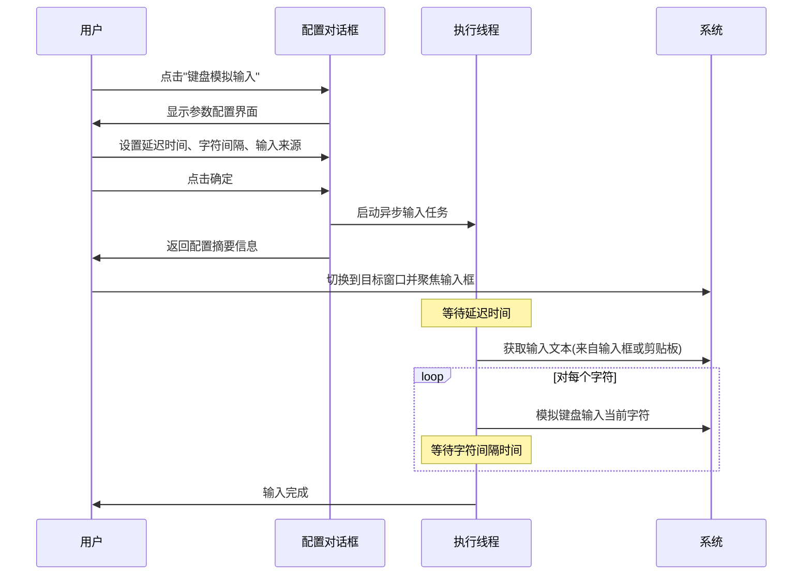

# 添加自动化操作分类与键盘模拟输入功能设计

## 功能概述

为字符串格式化和编解码工具添加"自动化操作"分类,并在此分类下实现"键盘模拟输入"功能。该功能用于解决测试环境中无法复制粘贴的场景,如密码输入框、确认文本框等。

## 业务场景

### 目标用户痛点
- 测试环境的密码输入框又长又复杂,且禁用了复制粘贴功能
- 签名确认前需要输入大段确认文字,但目标输入框不允许粘贴
- 需要在特定应用中批量输入格式化文本,但该应用限制了剪贴板访问

### 解决方案价值
通过模拟键盘逐字符输入的方式,绕过应用层面的粘贴限制,实现自动化文本输入,提高测试效率。

## 功能需求

### 新增操作分类
在现有的"编解码"、"格式化"、"哈希"分类基础上,新增"自动化操作"分类。

| 分类属性 | 说明 |
|---------|------|
| 枚举标识 | AUTOMATION |
| 显示名称 | 自动化操作 |
| 用途 | 包含系统级自动化功能,如键盘模拟、鼠标操作等 |

### 键盘模拟输入功能

#### 核心能力
自动化模拟键盘输入,将文本逐字符发送到系统焦点窗口。

#### 配置参数

| 参数名称 | 类型 | 取值范围 | 默认值 | 说明 |
|---------|------|---------|--------|------|
| 延迟输入时间 | 整数(秒) | 0-60 | 3 | 点击确定后延迟多少秒开始输入,用于切换到目标窗口 |
| 字符间隔 | 整数(毫秒) | 0-1000 | 100 | 每输入一个字符后的等待时间,模拟真实打字速度 |
| 输入来源 | 单选 | 输入框内容 / 剪贴板内容 | 输入框内容 | 选择从工具输入框或系统剪贴板获取文本 |

#### 输入文本来源

**选项一:输入框内容**
- 使用工具主界面输入框中的文本作为输入源
- 适用场景:文本内容需要预览、编辑或格式化后再输入

**选项二:剪贴板内容**
- 实时读取系统剪贴板中的文本内容
- 适用场景:文本内容从外部应用复制而来,无需在工具中编辑
- 容错处理:剪贴板中无文本数据时,提示用户并中止操作

#### 执行流程

#### 字符处理策略

| 字符类型 | 处理方式 | 技术原因 |
|---------|---------|---------|
| 普通字符 | 通过剪贴板方式输入 | 避免特殊字符、多语言字符的键码映射问题,提高准确性 |
| 换行符(\n) | 模拟按下Enter键 | 保持文本格式,支持多行输入 |
| 制表符(\t) | 模拟按下Tab键 | 保持缩进格式 |

#### 用户交互设计

**主界面布局调整**
针对键盘模拟输入功能,需要对主界面进行特殊处理:
- 保留输入框区域:用户可在此输入或粘贴待输入的文本
- 隐藏输出框区域:因为文本是输入到外部应用,不需要在工具内显示输出
- 隐藏表达式框区域:此功能不涉及表达式处理
- 仅显示:操作树 + 输入框 + 日志区域

**配置对话框布局**
- 模态对话框,标题为"自动化输入配置"
- 垂直布局,从上到下依次包含:
  - 延迟时间选择器(数字微调框)
  - 字符间隔选择器(数字微调框)
  - 输入来源单选按钮组
  - 确定/取消按钮

**执行结果反馈**
在主界面日志区域显示配置摘要,包括:
- 启动提示:"自动化输入已启动,请切换到目标窗口..."
- 配置信息:延迟时间、字符间隔、输入来源、输入长度

**错误处理与提示**

| 错误场景 | 提示信息 | 用户操作建议 |
|---------|---------|-------------|
| 用户点击取消 | 操作已取消 | 无 |
| 输入框为空且选择输入框来源 | 没有要输入的文本 | 在输入框中输入文本或选择剪贴板来源 |
| 剪贴板无文本且选择剪贴板来源 | 剪贴板中没有文本数据 | 先复制文本到剪贴板 |
| 自动化输入执行失败 | 自动化输入执行失败: [具体错误信息] | 根据错误信息排查,如检查系统权限、Robot类可用性 |

## 架构设计

### 分类扩展点

现有架构通过 `OperationCategory` 枚举管理操作分类,通过 `OperationFactory` 进行操作注册和查询。

**分类定义**
在 `OperationCategory` 枚举中添加新的枚举值:
- 枚举常量:AUTOMATION
- 显示名称:"自动化操作"

**分类展示**
UI层通过 `OperationFactory.getOperationsByCategory()` 方法获取分类下的操作列表,在左侧操作树中展示。

### UI自适应布局设计

**布局判断逻辑**
UI需要根据操作特性动态调整界面布局:

| 操作类型 | 输入框 | 表达式框 | 输出框 | 判断依据 |
|---------|--------|---------|--------|----------|
| 编解码/哈希操作 | 显示 | 隐藏 | 显示 | 默认行为 |
| JSON/XML格式化 | 显示 | 显示 | 显示 | 通过类名判断(JsonFormatOperation/XmlFormatOperation) |
| 自动化操作 | 显示 | 隐藏 | 隐藏 | 通过分类判断(category == AUTOMATION) |

**实现策略**
- 扩展现有的 `updateExpressionPanelVisibility()` 方法
- 新增 `updateOutputPanelVisibility()` 方法
- 根据操作的 `getCategory()` 返回值判断是否为自动化操作
- 自动化操作隐藏输出面板,其他操作正常显示

### 操作实现架构

**接口契约**
所有操作必须实现 `Operation` 接口,包含三个核心方法:

| 方法 | 返回值 | 职责 |
|-----|--------|------|
| execute(String input) | String | 执行操作逻辑,返回结果文本 |
| getCategory() | OperationCategory | 返回操作所属分类 |
| getDisplayName() | String | 返回操作在UI中的显示名称 |

**键盘模拟输入实现**
- 实现类:AutoInputOperation
- 分类归属:AUTOMATION
- 显示名称:"键盘模拟输入"

**execute方法行为**
与其他操作不同,键盘模拟输入的execute方法不进行文本转换,而是:
1. 弹出配置对话框获取用户参数
2. 启动异步线程执行输入任务(避免阻塞UI)
3. 立即返回配置摘要信息供UI展示

### 系统级自动化技术

**核心技术组件**
- java.awt.Robot:用于模拟键盘事件
- java.awt.Toolkit.getSystemClipboard():用于访问系统剪贴板
- java.util.concurrent.TimeUnit:用于线程休眠控制

**线程模型**
- 配置对话框在UI主线程中模态显示
- 自动化输入任务通过 SwingUtilities.invokeLater() 在新线程中异步执行
- 避免长时间操作阻塞Swing事件分发线程

### 注册与集成

**工厂注册**
在 `OperationFactory` 的静态初始化块中注册 `AutoInputOperation` 实例,使其可被工厂查询和创建。

**UI集成**
- 左侧操作树自动根据分类枚举生成树节点
- 选中"键盘模拟输入"节点时,主界面操作下拉框同步更新
- 点击执行按钮时,调用 `AutoInputOperation.execute()` 方法
- UI需要根据操作类型动态调整布局:
  - 判断操作是否属于自动化分类
  - 自动化操作隐藏输出框区域,仅显示输入框
  - 其他操作正常显示输入框和输出框

## 非功能需求

### 性能要求
- 配置对话框响应时间 < 200ms
- 字符输入精度:按设定间隔±5ms
- 剪贴板读取时间 < 100ms

### 兼容性要求
- 支持 Windows、Linux、macOS 操作系统
- 依赖 java.awt.Robot,需要系统授予自动化权限
- 支持 ASCII 字符、Unicode 字符(包括中文)

### 安全性考量
- 不记录或存储用户输入的敏感文本
- 不监听或拦截其他应用的键盘事件
- 用户需主动触发,不自动启动

### 可用性要求
- 配置参数提供合理默认值(延迟3秒,间隔100ms)
- 延迟时间足够用户切换窗口
- 字符间隔默认值模拟正常打字速度,避免触发防机器人机制

## 风险与限制

### 技术限制
- Robot 类在某些系统环境下可能因权限限制无法使用(如无头服务器)
- 目标应用若实现了输入速率检测,可能仍会被识别为自动化输入
- 剪贴板内容会被逐字符复制,可能影响用户剪贴板使用体验

### 潜在风险
- 用户设置延迟时间过短,未切换到目标窗口时开始输入
- 用户在输入过程中移动鼠标或操作键盘,可能干扰输入流程
- 长文本输入时,用户无法中途取消(需通过任务管理器结束进程)

### 缓解措施
- 配置对话框提供明确提示:"请在点击确定后立即切换到目标窗口"
- 默认延迟时间设为3秒,给用户充足准备时间
- 在输出区域显示配置信息,包括输入长度,让用户预估耗时

## 测试要点

### 功能测试场景

| 测试场景 | 输入条件 | 预期结果 |
|---------|---------|---------|
| 基本输入流程 | 输入框填写"Hello",延迟3秒,间隔100ms,来源为输入框 | 延迟3秒后在目标窗口逐字符输入"Hello" |
| 剪贴板来源输入 | 剪贴板内容为"Test",选择剪贴板来源 | 输入剪贴板中的"Test" |
| 多行文本输入 | 输入包含换行符的文本 | 正确模拟Enter键,保持多行格式 |
| 特殊字符输入 | 输入包含Tab、空格、标点的文本 | 所有字符正确输入 |
| 中文输入 | 输入中文文本"测试文本" | 中文字符正确输入 |
| 取消操作 | 点击配置对话框"取消"按钮 | 返回"操作已取消",不执行输入 |
| 空输入检测 | 输入框为空,来源为输入框 | 提示"没有要输入的文本" |
| 空剪贴板检测 | 剪贴板无文本,来源为剪贴板 | 提示"剪贴板中没有文本数据" |

### 边界测试

| 边界条件 | 测试值 | 预期行为 |
|---------|--------|---------|
| 延迟时间最小值 | 0秒 | 立即开始输入 |
| 延迟时间最大值 | 60秒 | 延迟60秒后开始输入 |
| 字符间隔最小值 | 0毫秒 | 连续快速输入 |
| 字符间隔最大值 | 1000毫秒 | 每秒输入一个字符 |
| 超长文本 | 1000字符 | 全部字符正确输入,耗时符合预期 |

### 集成测试
- 验证操作在左侧树中正确分类到"自动化操作"节点
- 验证选择该操作后,表达式输入面板正确隐藏
- 验证选择该操作后,输出框区域正确隐藏
- 验证execute方法返回的摘要信息正确显示在日志区域
- 验证切换到其他操作后,输出框恢复显示

### 性能测试
- 1000字符,间隔100ms,总耗时应约为100秒
- 配置对话框打开到显示完成时间 < 200ms

## 实施优先级

| 任务 | 优先级 | 依赖关系 |
|-----|--------|---------|
| 在 OperationCategory 添加 AUTOMATION 枚举 | P0 | 无 |
| 实现 AutoInputOperation 核心逻辑 | P0 | 依赖分类定义 |
| 实现配置对话框 UI | P0 | 依赖核心逻辑类 |
| 在 OperationFactory 注册操作 | P0 | 依赖操作实现 |
| UI层实现输出框动态隐藏逻辑 | P0 | 依赖分类定义 |
| 异常处理与用户提示 | P1 | 依赖核心功能 |
| 测试验证 | P1 | 依赖所有功能完成 |

## 扩展性考虑

### 未来可扩展功能方向
- 支持快捷键触发(如Ctrl+Shift+V触发自动输入)
- 支持输入进度展示和中途取消
- 支持随机字符间隔,更逼真模拟人工输入
- 支持鼠标位置自动定位到输入框
- 支持输入模板和历史记录管理

### 同分类潜在功能
"自动化操作"分类下未来可添加:
- 鼠标点击模拟
- 屏幕截图与OCR识别
- 窗口管理操作
- 系统剪贴板历史管理
