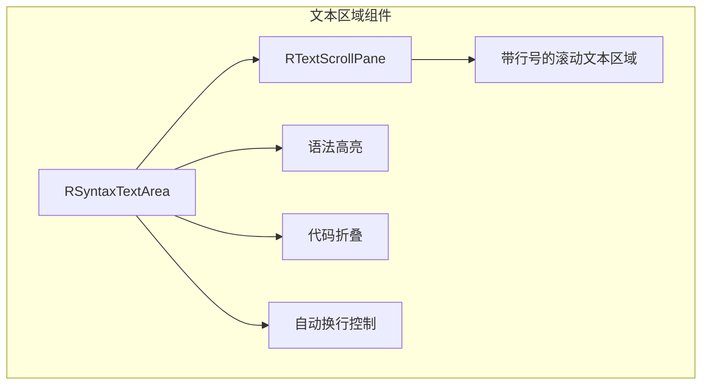
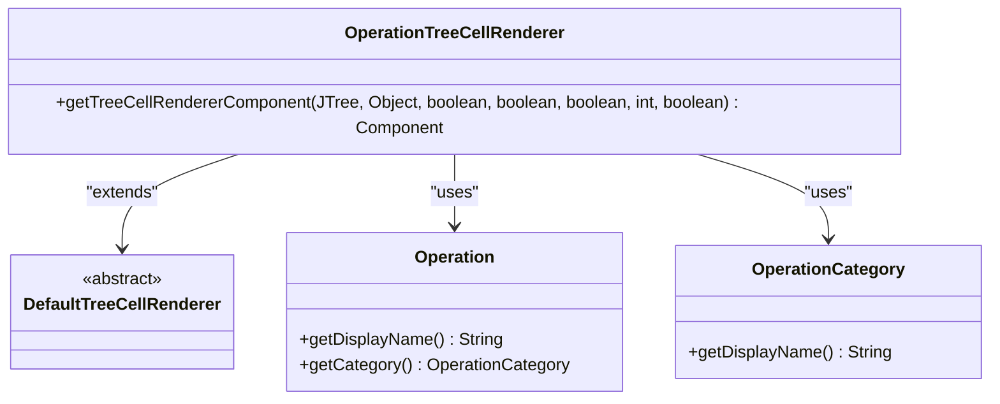
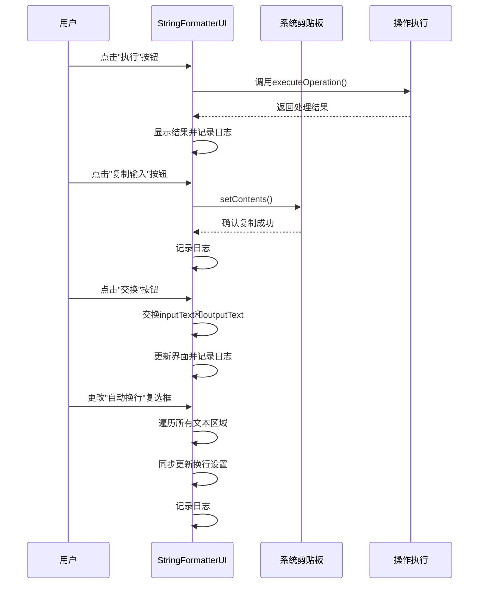

# UI特性

<cite>
**Referenced Files in This Document**   
- [StringFormatterUI.java](file://src/main/java/org/oxff/ui/StringFormatterUI.java)
- [OperationTreeCellRenderer.java](file://src/main/java/org/oxff/ui/OperationTreeCellRenderer.java)
- [Operation.java](file://src/main/java/org/oxff/operation/Operation.java)
- [OperationFactory.java](file://src/main/java/org/oxff/core/OperationFactory.java)
- [OperationCategory.java](file://src/main/java/org/oxff/core/OperationCategory.java)
</cite>

## Table of Contents
1. [三面板布局结构](#三面板布局结构)
2. [JSplitPane可调节窗口分割](#jsplitpane可调节窗口分割)
3. [RSyntaxTextArea语法高亮与行号功能](#rsyntaxtextarea语法高亮与行号功能)
4. [OperationTreeCellRenderer自定义渲染](#operationtreecellrenderer自定义渲染)
5. [交互设计与事件监听机制](#交互设计与事件监听机制)

## 三面板布局结构

StringFormatterUI类实现了清晰的三面板布局结构，将用户界面划分为输入区、表达式区和输出区三个主要功能区域。这种布局设计遵循了直观的信息流原则，使用户能够轻松地进行字符串格式化和编解码操作。

输入区位于界面的左上部分，提供了一个专门的文本区域用于输入待处理的原始字符串。表达式区位于界面的左下部分，专门用于输入XPath或JSONPath表达式，支持对XML和JSON数据进行精确的元素提取和过滤。输出区位于界面的右侧，显示经过选定操作处理后的结果。

这种三面板布局通过嵌套的JSplitPane组件实现，形成了一个主水平分割（左侧操作面板与右侧内容面板）和多个垂直分割（输入区与表达式/输出区）的复合布局结构。当用户选择不同的操作类型时，系统会智能地调整布局：对于需要表达式输入的JSON和XML格式化操作，表达式区会自动显示；对于其他操作，则会隐藏表达式区以最大化输出区域的空间。

**Section sources**
- [StringFormatterUI.java](file://src/main/java/org/oxff/ui/StringFormatterUI.java#L64-L259)

## JSplitPane可调节窗口分割

StringFormatterUI类充分利用了JSplitPane组件来实现可调节的窗口分割功能，为用户提供了高度可定制的界面布局体验。系统采用了多层嵌套的JSplitPane结构，构建了一个灵活且响应式的用户界面。

主分割面板（mainSplitPane）采用水平分割模式，将界面分为左右两个主要区域：左侧30%用于显示操作分类树，右侧70%用于主要内容展示。在右侧内容区域，系统进一步使用垂直分割面板（expressionSplitPane）将空间划分为上下两部分：上部40%分配给输入区，下部60%分配给表达式和输出区。

最精妙的设计体现在outputExpressionSplitPane中，这是一个水平分割面板，将下部区域再次分为左右两半，分别容纳表达式区和输出区。每个分割面板都设置了适当的分割条大小（10像素）和初始分割位置，确保了良好的视觉平衡。用户可以通过拖动分割条自由调整各个面板的大小，满足不同场景下的使用需求。

**Section sources**
- [StringFormatterUI.java](file://src/main/java/org/oxff/ui/StringFormatterUI.java#L64-L259)

## RSyntaxTextArea语法高亮与行号功能

StringFormatterUI类集成了RSyntaxTextArea组件，为输入、表达式和输出区域提供了专业的文本编辑功能。与普通的JTextArea相比，RSyntaxTextArea带来了语法高亮、行号显示和代码折叠等高级特性，极大地提升了用户体验。

输入区和输出区的RSyntaxTextArea配置为等宽字体显示，便于查看格式化后的文本内容。输入区的文本区域支持代码折叠功能，方便用户处理大型文档。表达式区的RSyntaxTextArea则配置为自动换行模式，并设置了专门的工具提示，指导用户如何输入XPath或JSONPath表达式。

所有文本区域都通过RTextScrollPane进行包装，从而自动显示行号。这不仅有助于用户定位文本位置，还在处理多行数据时提供了重要的参考信息。输入区和输出区默认禁用自动换行，以保持数据的原始格式；而表达式区则启用自动换行，便于用户查看和编辑多行表达式。

**Diagram sources**
- [StringFormatterUI.java](file://src/main/java/org/oxff/ui/StringFormatterUI.java#L130-L133)
- [StringFormatterUI.java](file://src/main/java/org/oxff/ui/StringFormatterUI.java#L165-L168)
- [StringFormatterUI.java](file://src/main/java/org/oxff/ui/StringFormatterUI.java#L218-L221)

**Section sources**
- [StringFormatterUI.java](file://src/main/java/org/oxff/ui/StringFormatterUI.java#L127-L133)
- [StringFormatterUI.java](file://src/main/java/org/oxff/ui/StringFormatterUI.java#L162-L168)
- [StringFormatterUI.java](file://src/main/java/org/oxff/ui/StringFormatterUI.java#L215-L221)

## OperationTreeCellRenderer自定义渲染

OperationTreeCellRenderer类实现了对操作分类树的自定义渲染，显著提升了用户界面的可用性和信息丰富度。该类继承自DefaultTreeCellRenderer，重写了getTreeCellRendererComponent方法，实现了针对不同类型节点的差异化显示。

对于操作节点（Operation实例），渲染器会显示操作的友好名称（通过getDisplayName方法获取），并在工具提示中显示其所属的分类信息。这种设计使得用户无需展开分类节点即可了解操作的完整信息。对于分类节点，渲染器会显示分类的中文名称，并为每个分类提供相应的工具提示，帮助用户理解不同分类的用途。

自定义渲染器的应用使得操作树不仅是一个功能选择器，更成为一个信息展示平台。用户可以通过悬停在不同节点上来获取额外的上下文信息，这种渐进式的信息披露方式降低了用户的学习成本，提高了操作效率。

**Diagram sources**
- [OperationTreeCellRenderer.java](file://src/main/java/org/oxff/ui/OperationTreeCellRenderer.java#L15-L41)
- [Operation.java](file://src/main/java/org/oxff/operation/Operation.java#L20-L26)
- [OperationCategory.java](file://src/main/java/org/oxff/core/OperationCategory.java#L15-L18)

**Section sources**
- [OperationTreeCellRenderer.java](file://src/main/java/org/oxff/ui/OperationTreeCellRenderer.java#L15-L41)

## 交互设计与事件监听机制

StringFormatterUI类实现了丰富的交互设计，包括自动换行、快捷键支持、剪贴板集成和内容交换按钮等功能，并通过事件监听器机制实现了这些功能的后台工作流程。

自动换行功能通过wrapCheckBox复选框控制，当状态改变时，事件监听器会同步更新所有三个文本区域（输入、表达式、输出）的换行设置。剪贴板集成功能通过复制和粘贴按钮实现，分别监听用户的复制输入、粘贴输入和复制输出操作，利用系统剪贴板进行数据交换。

内容交换按钮（swapButton）实现了输入区和输出区内容的快速互换，这一功能在需要对比原始数据和处理结果时特别有用。所有按钮的事件监听都在setupEventListeners方法中集中配置，通过Lambda表达式实现了简洁的回调处理。

快捷键支持通过setMnemonic方法配置，为常用操作提供了键盘加速：Ctrl+E执行操作、Ctrl+C复制输入、Ctrl+V粘贴输入、Ctrl+Shift+C复制输出、Ctrl+Shift+X清空输入。此外，系统还为两个文本区域配置了Ctrl+A全选功能，进一步提升了操作效率。

**Diagram sources**
- [StringFormatterUI.java](file://src/main/java/org/oxff/ui/StringFormatterUI.java#L322-L390)
- [StringFormatterUI.java](file://src/main/java/org/oxff/ui/StringFormatterUI.java#L395-L451)
- [StringFormatterUI.java](file://src/main/java/org/oxff/ui/StringFormatterUI.java#L456-L489)

**Section sources**
- [StringFormatterUI.java](file://src/main/java/org/oxff/ui/StringFormatterUI.java#L322-L390)
- [StringFormatterUI.java](file://src/main/java/org/oxff/ui/StringFormatterUI.java#L395-L451)
- [StringFormatterUI.java](file://src/main/java/org/oxff/ui/StringFormatterUI.java#L456-L489)