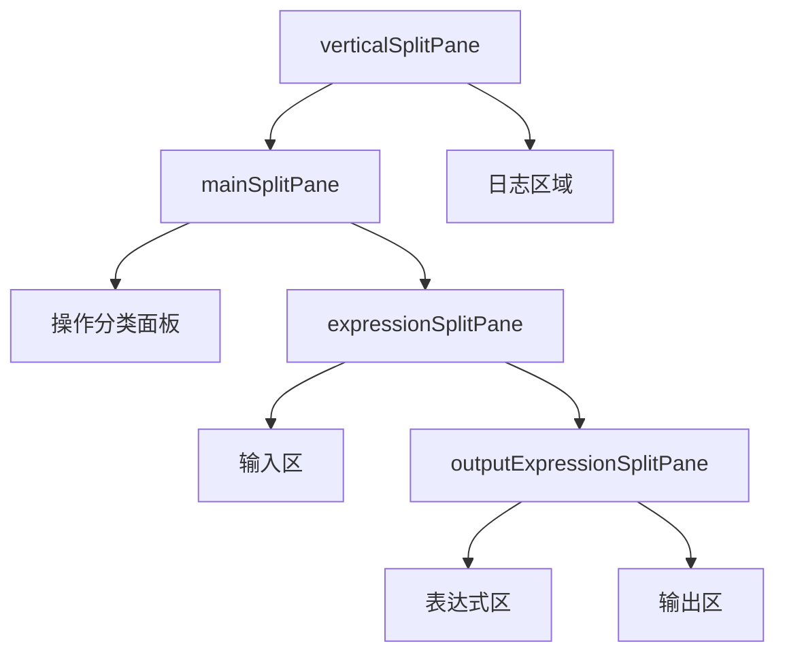
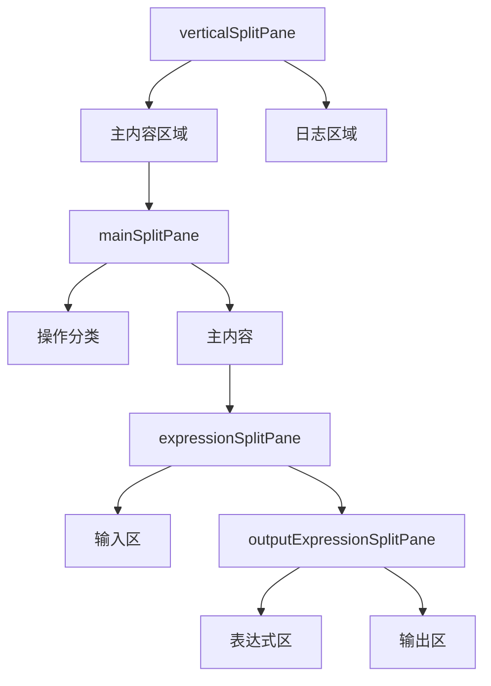

# 三面板布局结构

<cite>
**Referenced Files in This Document**   
- [StringFormatterUI.java](file://src/main/java/org/oxff/ui/StringFormatterUI.java)
- [Operation.java](file://src/main/java/org/oxff/operation/Operation.java)
- [OperationFactory.java](file://src/main/java/org/oxff/core/OperationFactory.java)
- [OperationCategory.java](file://src/main/java/org/oxff/core/OperationCategory.java)
- [OperationTreeCellRenderer.java](file://src/main/java/org/oxff/ui/OperationTreeCellRenderer.java)
- [Main.java](file://src/main/java/org/oxff/Main.java)
</cite>

## Table of Contents
1. [三面板布局结构](#三面板布局结构)
2. [核心组件](#核心组件)
3. [布局嵌套关系](#布局嵌套关系)
4. [权重设置与用户体验](#权重设置与用户体验)
5. [分割策略分析](#分割策略分析)
6. [设计决策与可用性](#设计决策与可用性)

## 核心组件

`StringFormatterUI`类是实现三面板布局的核心组件，通过`JSplitPane`组件构建了输入区、表达式区和输出区的可调节分割布局。该类定义了多个`JSplitPane`实例，包括`mainSplitPane`、`expressionSplitPane`和`outputExpressionSplitPane`，这些分割面板共同协作创建了灵活的用户界面。

**Section sources**
- [StringFormatterUI.java](file://src/main/java/org/oxff/ui/StringFormatterUI.java#L29-L513)

## 布局嵌套关系

三面板布局采用了多层嵌套的`JSplitPane`结构，形成了复杂的组件层次。`mainSplitPane`作为最外层的水平分割面板，将界面分为左侧的操作分类面板和右侧的主内容区域。主内容区域由`expressionSplitPane`实现垂直分割，上部为输入区，下部为表达式与输出区的组合。

在下部区域，`outputExpressionSplitPane`作为水平分割面板，将空间分配给表达式区和输出区。这种嵌套结构允许用户独立调节各区域的大小，同时保持了整体布局的协调性。当选择特定操作（如JSON或XML格式化）时，表达式区会动态显示或隐藏，通过`updateExpressionPanelVisibility`方法控制`outputExpressionSplitPane`的左组件。

**Diagram sources**
- [StringFormatterUI.java](file://src/main/java/org/oxff/ui/StringFormatterUI.java#L64-L259)

**Section sources**
- [StringFormatterUI.java](file://src/main/java/org/oxff/ui/StringFormatterUI.java#L64-L259)

## 权重设置与用户体验

布局权重设置（`setResizeWeight`）对用户体验有重要影响。`mainSplitPane`的`setResizeWeight(0.3)`设置使左侧操作分类面板占据30%的空间，右侧主内容区域占据70%，这种比例分配确保了操作选择的便捷性，同时为主内容区域留出足够空间。

`expressionSplitPane`的`setResizeWeight(0.4)`设置将输入区和下部区域的比例设为40:60，考虑到用户通常需要更多空间查看处理结果。`outputExpressionSplitPane`的`setResizeWeight(0.5)`设置则在表达式区和输出区之间实现了均衡分配，便于用户同时编辑表达式和查看结果。

这些权重设置不仅定义了初始布局比例，还决定了在窗口大小调整时各区域的相对变化速度。权重值较大的区域在窗口拉伸时会获得更多的空间增长，这种智能的尺寸分配机制提升了界面的响应性和可用性。

**Section sources**
- [StringFormatterUI.java](file://src/main/java/org/oxff/ui/StringFormatterUI.java#L64-L259)

## 分割策略分析

界面采用了垂直与水平分割相结合的策略。`verticalSplitPane`作为最外层的垂直分割面板，将主内容区域与日志区域分离，`setResizeWeight(0.8)`的设置使主内容区域占据80%的高度，突出了主要功能区域的重要性。

水平分割策略在`mainSplitPane`和`outputExpressionSplitPane`中得到应用，实现了左右布局。`mainSplitPane`的水平分割将导航与内容分离，符合用户从左到右的操作习惯。`outputExpressionSplitPane`的水平分割则支持并排查看表达式和输出结果，便于对比和验证。

所有分割面板的`setDividerSize`均设置为8-10像素，提供了足够的拖拽区域，同时避免了分割条占用过多视觉空间。这种精细的尺寸控制确保了界面的美观性和操作的便捷性。

**Diagram sources**
- [StringFormatterUI.java](file://src/main/java/org/oxff/ui/StringFormatterUI.java#L64-L259)

**Section sources**
- [StringFormatterUI.java](file://src/main/java/org/oxff/ui/StringFormatterUI.java#L64-L259)

## 设计决策与可用性

三面板布局的设计决策显著提升了工具的可用性。通过将操作分类、输入、表达式和输出分离到不同的可调节面板中，用户可以自定义工作空间，适应不同的任务需求。例如，在处理复杂JSON数据时，用户可以扩大输出区以更好地查看格式化结果。

动态显示/隐藏表达式区的设计体现了对特定操作需求的考虑。只有在执行JSON或XML格式化等需要表达式输入的操作时，表达式区才会显示，避免了界面的冗余和混乱。这种上下文感知的界面设计提高了操作的直观性。

自动换行功能通过`wrapCheckBox`统一控制所有文本区域的换行行为，确保了操作的一致性。快捷键支持（如Ctrl+E执行、Ctrl+C复制）进一步提升了操作效率，使高级用户能够快速完成任务。

整体布局的层次结构清晰，从左到右、从上到下的信息流符合用户的自然阅读习惯，降低了学习成本，提高了工具的易用性。

**Section sources**
- [StringFormatterUI.java](file://src/main/java/org/oxff/ui/StringFormatterUI.java#L64-L259)
- [StringFormatterUI.java](file://src/main/java/org/oxff/ui/StringFormatterUI.java#L322-L390)
- [StringFormatterUI.java](file://src/main/java/org/oxff/ui/StringFormatterUI.java#L456-L489)