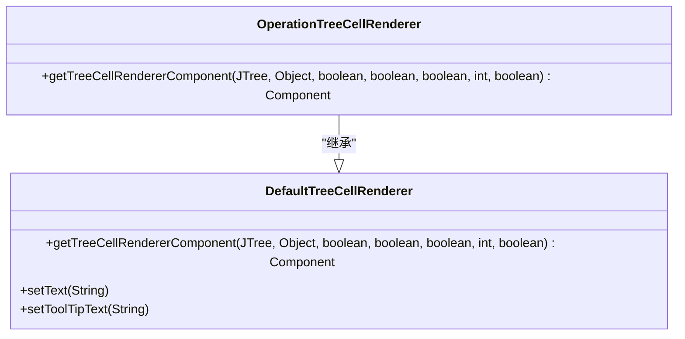
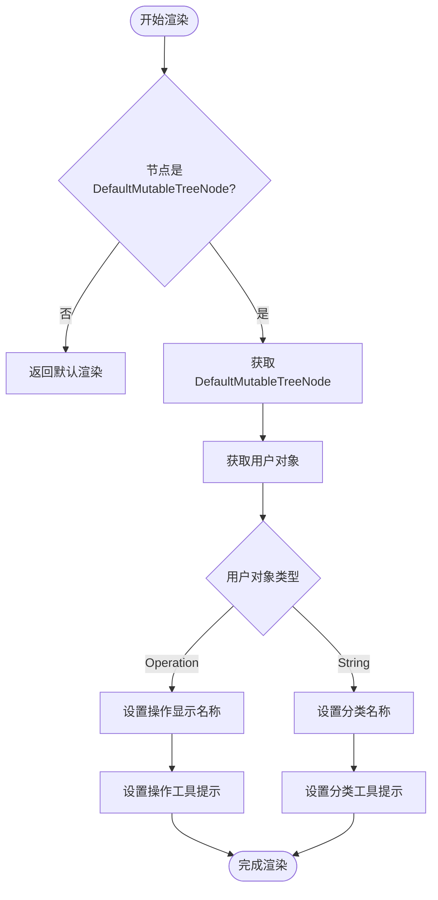
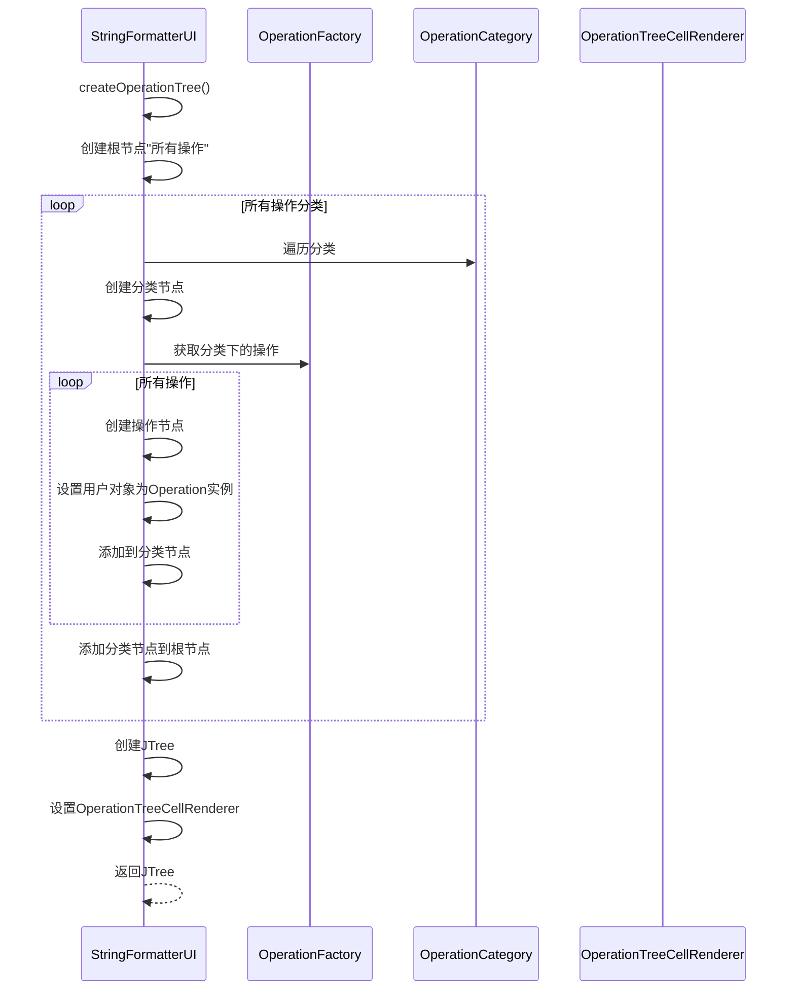
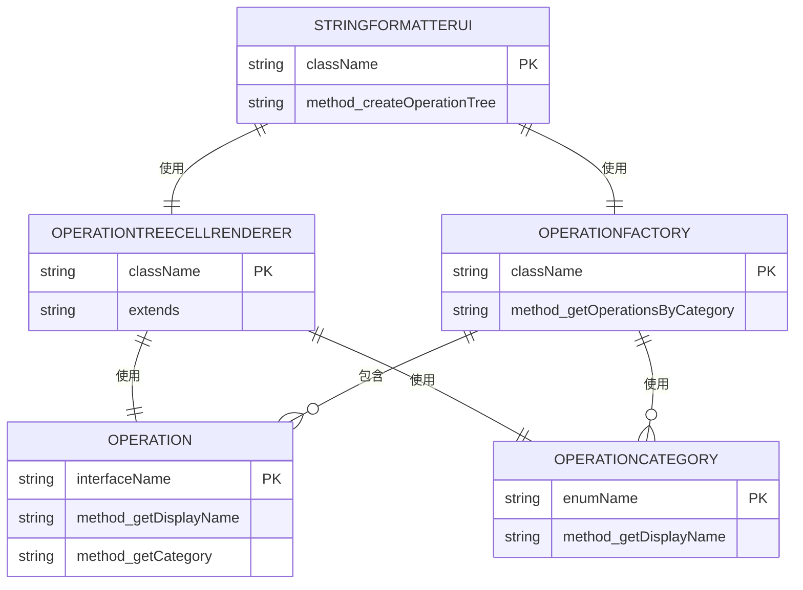

# 操作分类树自定义渲染

<cite>
**Referenced Files in This Document**   
- [OperationTreeCellRenderer.java](file://src/main/java/org/oxff/ui/OperationTreeCellRenderer.java)
- [StringFormatterUI.java](file://src/main/java/org/oxff/ui/StringFormatterUI.java)
- [Operation.java](file://src/main/java/org/oxff/operation/Operation.java)
- [OperationCategory.java](file://src/main/java/org/oxff/core/OperationCategory.java)
- [OperationFactory.java](file://src/main/java/org/oxff/core/OperationFactory.java)
</cite>

## 目录
1. [简介](#简介)
2. [核心组件](#核心组件)
3. [架构概述](#架构概述)
4. [详细组件分析](#详细组件分析)
5. [依赖分析](#依赖分析)
6. [结论](#结论)

## 简介
本文档详细介绍了`OperationTreeCellRenderer`类如何继承`DefaultTreeCellRenderer`并重写`getTreeCellRendererComponent`方法来实现操作分类树的自定义渲染。文档将说明该渲染器如何区分操作节点和分类节点，并分别为`Operation`实例和`String`分类名称设置适当的显示文本和工具提示。同时，文档将描述当节点选中时的视觉反馈机制，以及工具提示如何显示操作的分类信息以增强用户体验。结合`StringFormatterUI.createOperationTree()`方法的调用，说明整个操作树的创建和渲染流程。

## 核心组件
`OperationTreeCellRenderer`类是操作分类树的核心渲染组件，它继承自`DefaultTreeCellRenderer`并重写了`getTreeCellRendererComponent`方法，实现了对操作节点和分类节点的自定义渲染。该类通过检查节点的用户对象类型来区分操作节点和分类节点，并为不同类型的节点设置相应的显示文本和工具提示。

**Section sources**
- [OperationTreeCellRenderer.java](file://src/main/java/org/oxff/ui/OperationTreeCellRenderer.java#L10-L42)

## 架构概述
操作分类树的渲染架构基于Swing的树组件模型，通过`OperationTreeCellRenderer`类实现自定义渲染逻辑。`StringFormatterUI`类负责创建和配置操作树，使用`OperationFactory`获取所有操作，并通过`OperationCategory`枚举组织操作分类。整个架构实现了操作分类的层次化展示和交互式用户体验。

```mermaid
graph TB
subgraph "UI组件"
StringFormatterUI[StringFormatterUI]
OperationTreeCellRenderer[OperationTreeCellRenderer]
JTree[JTree]
end
subgraph "核心逻辑"
OperationFactory[OperationFactory]
OperationCategory[OperationCategory]
Operation[Operation]
end
StringFormatterUI --> OperationTreeCellRenderer : "使用"
StringFormatterUI --> JTree : "创建"
StringFormatterUI --> OperationFactory : "获取操作"
OperationFactory --> OperationCategory : "按分类组织"
OperationFactory --> Operation : "创建实例"
OperationTreeCellRenderer --> Operation : "获取显示名称"
OperationTreeCellRenderer --> OperationCategory : "获取分类信息"
```

**Diagram sources **
- [StringFormatterUI.java](file://src/main/java/org/oxff/ui/StringFormatterUI.java#L297-L317)
- [OperationTreeCellRenderer.java](file://src/main/java/org/oxff/ui/OperationTreeCellRenderer.java#L13-L42)

## 详细组件分析

### OperationTreeCellRenderer分析
`OperationTreeCellRenderer`类继承自`DefaultTreeCellRenderer`，通过重写`getTreeCellRendererComponent`方法实现自定义渲染逻辑。该方法首先调用父类的实现来设置基本的渲染属性，然后根据节点类型进行特定的文本和工具提示设置。

#### 类结构分析


**Diagram sources **
- [OperationTreeCellRenderer.java](file://src/main/java/org/oxff/ui/OperationTreeCellRenderer.java#L13-L42)

#### 渲染流程分析


**Diagram sources **
- [OperationTreeCellRenderer.java](file://src/main/java/org/oxff/ui/OperationTreeCellRenderer.java#L15-L41)

### StringFormatterUI分析
`StringFormatterUI`类负责创建和管理操作分类树的完整UI。它通过`createOperationTree`方法构建树结构，并设置`OperationTreeCellRenderer`作为渲染器。该类还处理树节点的选择事件，实现操作选择与UI其他组件的联动。

#### 操作树创建流程


**Diagram sources **
- [StringFormatterUI.java](file://src/main/java/org/oxff/ui/StringFormatterUI.java#L297-L317)
- [OperationTreeCellRenderer.java](file://src/main/java/org/oxff/ui/OperationTreeCellRenderer.java#L13-L42)

## 依赖分析
操作分类树渲染系统涉及多个组件之间的紧密协作。`OperationTreeCellRenderer`依赖于`Operation`接口和`OperationCategory`枚举来获取操作的显示名称和分类信息。`StringFormatterUI`依赖于`OperationFactory`来获取所有操作实例，并使用`OperationTreeCellRenderer`进行节点渲染。



**Diagram sources **
- [OperationTreeCellRenderer.java](file://src/main/java/org/oxff/ui/OperationTreeCellRenderer.java#L10-L42)
- [StringFormatterUI.java](file://src/main/java/org/oxff/ui/StringFormatterUI.java#L297-L317)
- [Operation.java](file://src/main/java/org/oxff/operation/Operation.java#L1-L26)
- [OperationCategory.java](file://src/main/java/org/oxff/core/OperationCategory.java#L1-L20)
- [OperationFactory.java](file://src/main/java/org/oxff/core/OperationFactory.java#L1-L60)

## 结论
`OperationTreeCellRenderer`类通过继承`DefaultTreeCellRenderer`并重写`getTreeCellRendererComponent`方法，实现了操作分类树的自定义渲染。该渲染器能够准确区分操作节点和分类节点，并为不同类型的节点设置适当的显示文本和工具提示。当用户选择操作节点时，系统会自动更新主界面的操作选择框，实现了良好的用户体验。整个操作树的创建和渲染流程通过`StringFormatterUI.createOperationTree()`方法协调完成，展示了清晰的组件职责划分和良好的代码组织结构。