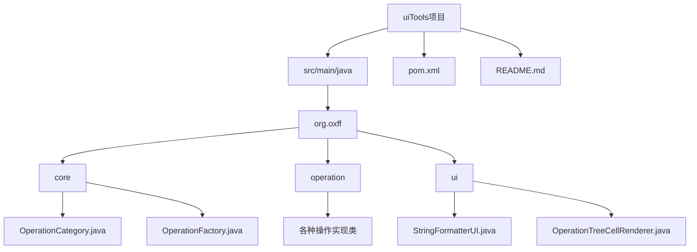
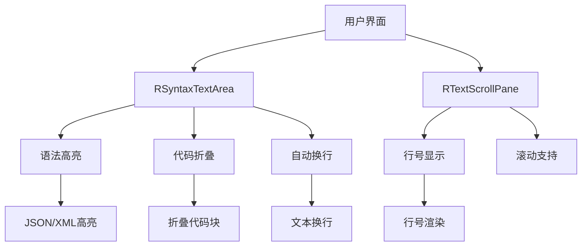
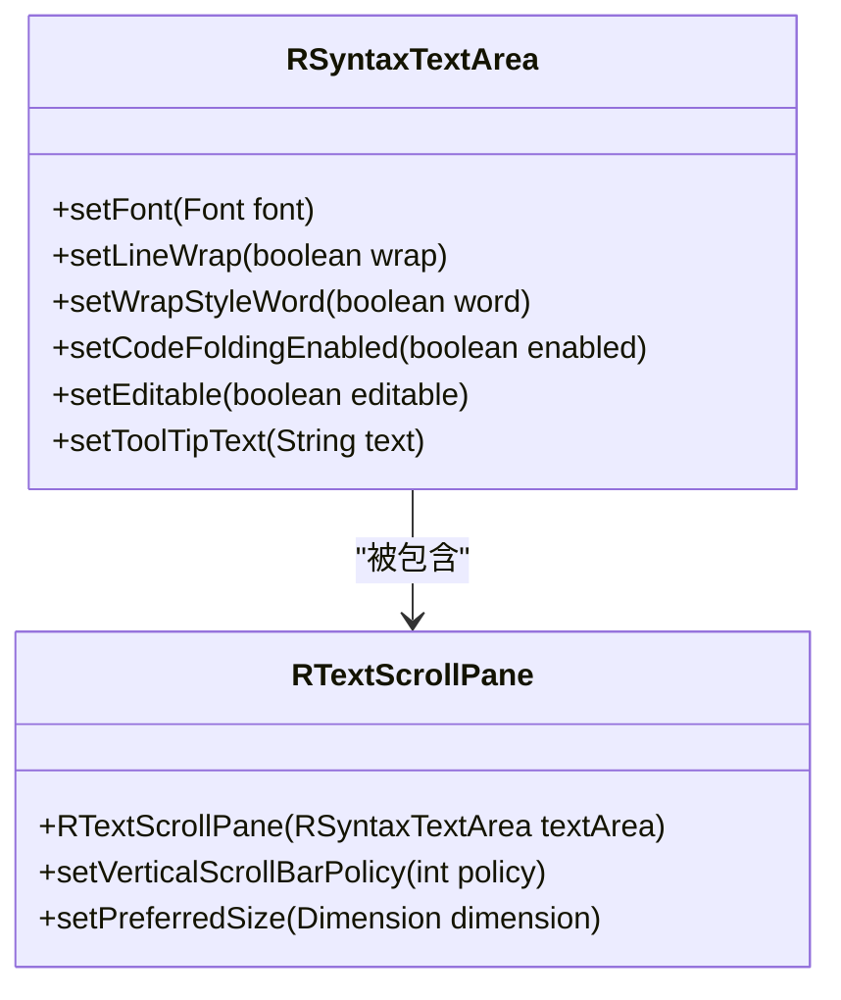
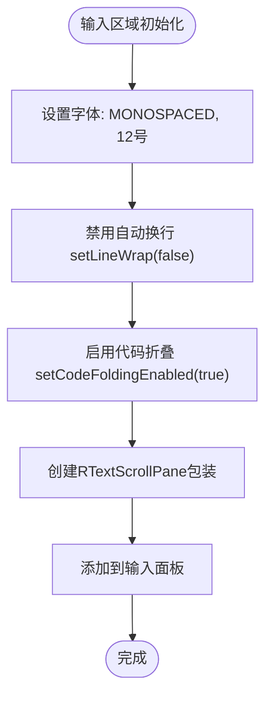
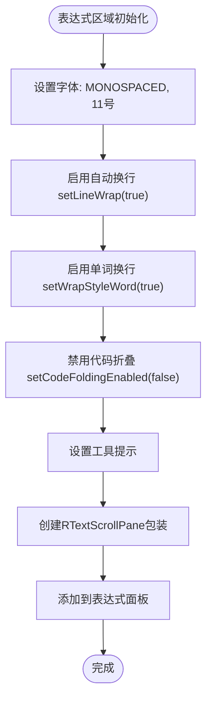
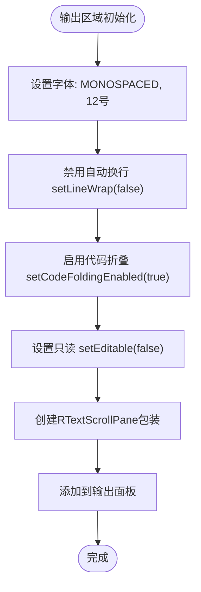
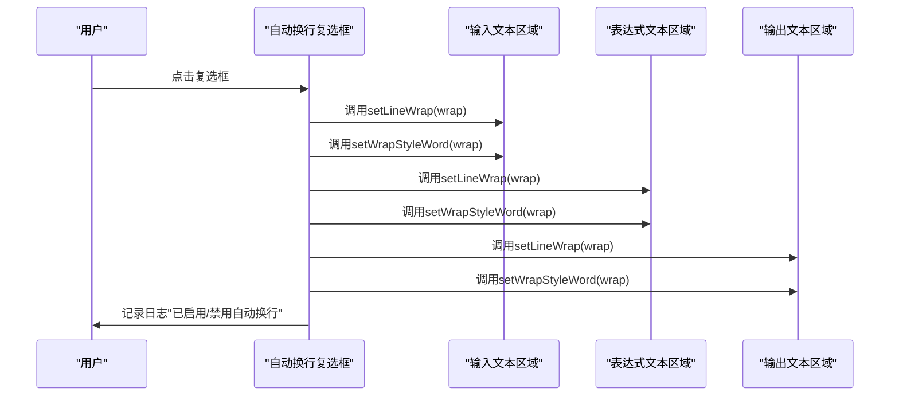
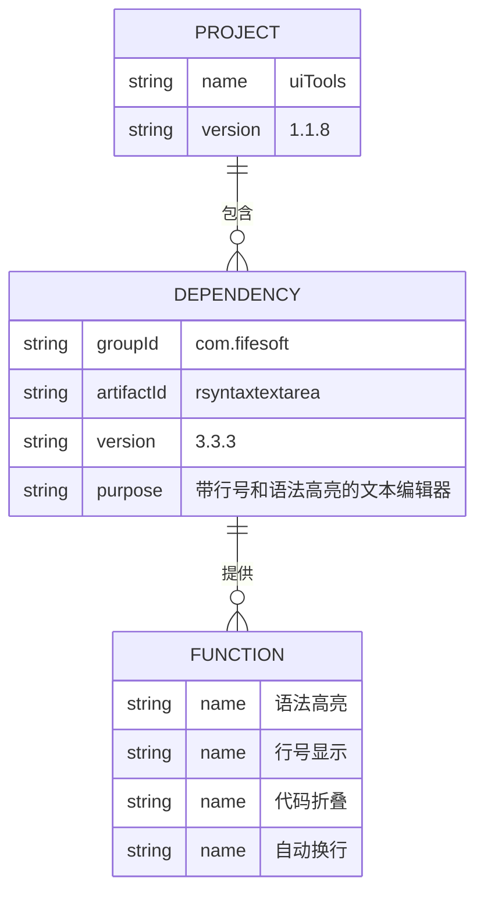

# 语法高亮与行号功能

<cite>
**本文档引用文件**   
- [StringFormatterUI.java](file://src/main/java/org/oxff/ui/StringFormatterUI.java)
- [pom.xml](file://pom.xml)
</cite>

## 目录
1. [简介](#简介)
2. [项目结构](#项目结构)
3. [核心组件](#核心组件)
4. [架构概述](#架构概述)
5. [详细组件分析](#详细组件分析)
6. [依赖分析](#依赖分析)
7. [性能考虑](#性能考虑)
8. [故障排除指南](#故障排除指南)
9. [结论](#结论)

## 简介
本文档详细阐述了uiTools应用程序中语法高亮与行号功能的实现机制。重点介绍如何通过RSyntaxTextArea和RTextScrollPane组件为输入、表达式和输出区域提供专业的代码编辑体验。文档解释了RSyntaxTextArea的setCodeFoldingEnabled、setLineWrap等方法的使用，以及RTextScrollPane如何自动提供行号显示。同时说明了不同文本区域的字体设置差异及其设计考虑。

**Section sources**
- [StringFormatterUI.java](file://src/main/java/org/oxff/ui/StringFormatterUI.java#L29-L513)

## 项目结构
uiTools项目采用标准的Maven项目结构，主要包含源代码、配置文件和依赖管理文件。核心功能实现在src/main/java目录下，分为core、operation和ui三个包，分别处理核心逻辑、具体操作实现和用户界面。

**Diagram sources **
- [StringFormatterUI.java](file://src/main/java/org/oxff/ui/StringFormatterUI.java#L29-L513)

**Section sources**
- [StringFormatterUI.java](file://src/main/java/org/oxff/ui/StringFormatterUI.java#L29-L513)

## 核心组件
本节分析实现语法高亮与行号功能的核心组件，包括RSyntaxTextArea和RTextScrollPane的集成与配置。

**Section sources**
- [StringFormatterUI.java](file://src/main/java/org/oxff/ui/StringFormatterUI.java#L29-L513)
- [pom.xml](file://pom.xml#L38-L41)

## 架构概述
uiTools的文本编辑功能架构基于RSyntaxTextArea组件构建，通过RTextScrollPane提供行号显示，实现了专业的代码编辑体验。

**Diagram sources **
- [StringFormatterUI.java](file://src/main/java/org/oxff/ui/StringFormatterUI.java#L29-L513)

## 详细组件分析

### RSyntaxTextArea组件分析
RSyntaxTextArea是实现语法高亮功能的核心组件，为输入、表达式和输出区域提供了专业的代码编辑体验。

#### 组件初始化与配置

**Diagram sources **
- [StringFormatterUI.java](file://src/main/java/org/oxff/ui/StringFormatterUI.java#L148-L175)
- [StringFormatterUI.java](file://src/main/java/org/oxff/ui/StringFormatterUI.java#L196-L225)

#### 输入区域配置
输入区域使用RSyntaxTextArea组件，配置了特定的字体和代码折叠功能，但禁用了自动换行。

**Diagram sources **
- [StringFormatterUI.java](file://src/main/java/org/oxff/ui/StringFormatterUI.java#L148-L155)

#### 表达式区域配置
表达式区域专门用于输入XPath/JSONPath表达式，配置了较小的字体和启用的自动换行功能。

**Diagram sources **
- [StringFormatterUI.java](file://src/main/java/org/oxff/ui/StringFormatterUI.java#L174-L182)

#### 输出区域配置
输出区域用于显示处理结果，配置为只读模式，并启用了代码折叠功能。

**Diagram sources **
- [StringFormatterUI.java](file://src/main/java/org/oxff/ui/StringFormatterUI.java#L196-L203)

#### 自动换行功能实现
自动换行功能通过复选框控制，统一管理所有文本区域的换行设置。

**Diagram sources **
- [StringFormatterUI.java](file://src/main/java/org/oxff/ui/StringFormatterUI.java#L380-L388)

**Section sources**
- [StringFormatterUI.java](file://src/main/java/org/oxff/ui/StringFormatterUI.java#L29-L513)

## 依赖分析
uiTools项目通过Maven依赖管理引入了RSyntaxTextArea库，实现了专业的文本编辑功能。

**Diagram sources **
- [pom.xml](file://pom.xml#L38-L41)

**Section sources**
- [pom.xml](file://pom.xml#L1-L106)

## 性能考虑
RSyntaxTextArea组件在提供丰富功能的同时，也考虑了性能优化。代码折叠功能可以有效管理大型文档的显示，而语法高亮仅对可见区域进行渲染，确保了良好的响应性能。自动换行功能的批量设置避免了重复的UI更新，提高了用户体验。

## 故障排除指南
当遇到语法高亮或行号显示问题时，应首先检查RSyntaxTextArea和RTextScrollPane的正确集成。确保RTextScrollPane正确包装了RSyntaxTextArea实例，并且相关依赖已正确引入。如果自动换行功能失效，检查事件监听器是否正确注册到复选框组件。

**Section sources**
- [StringFormatterUI.java](file://src/main/java/org/oxff/ui/StringFormatterUI.java#L380-L388)

## 结论
uiTools通过集成RSyntaxTextArea和RTextScrollPane组件，成功实现了专业的语法高亮与行号显示功能。不同文本区域的差异化配置满足了各种使用场景的需求，为用户提供了优秀的代码编辑体验。自动换行功能的统一管理简化了用户操作，而Maven依赖管理确保了组件的稳定性和可维护性。