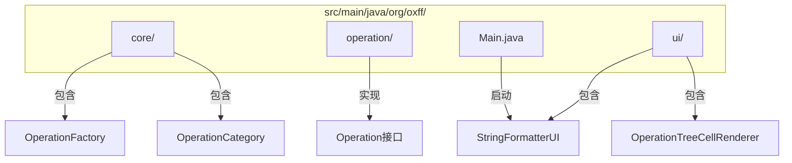
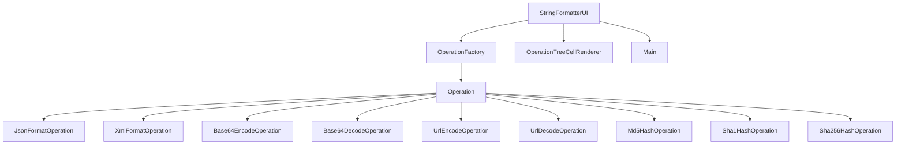
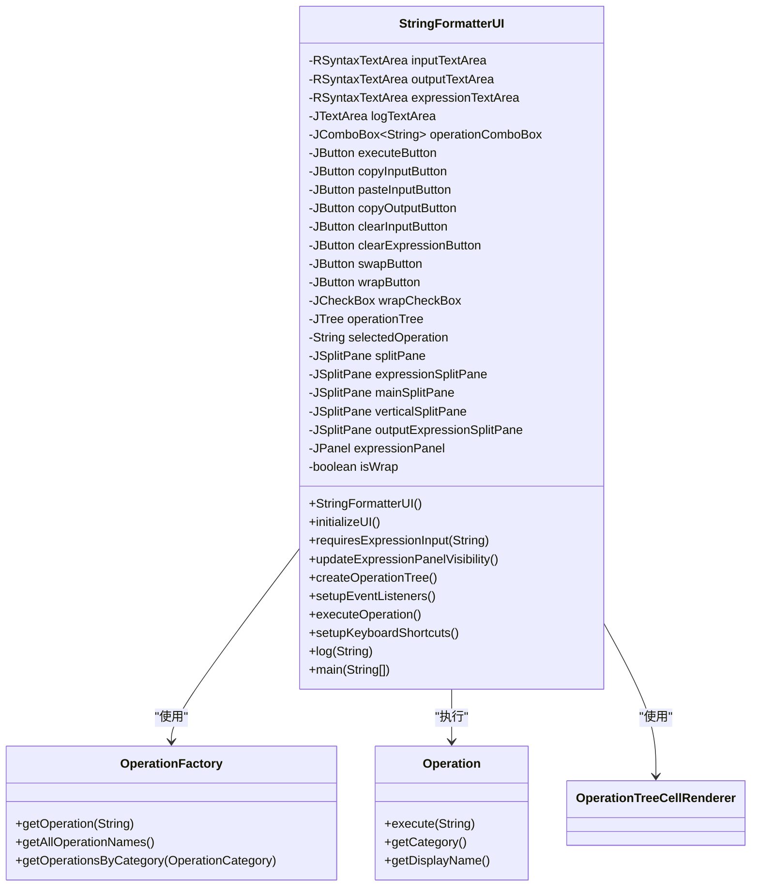
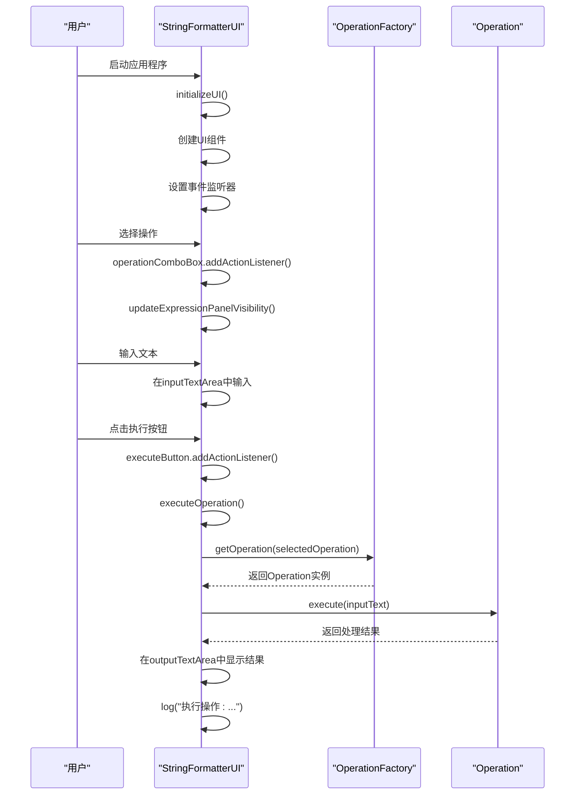
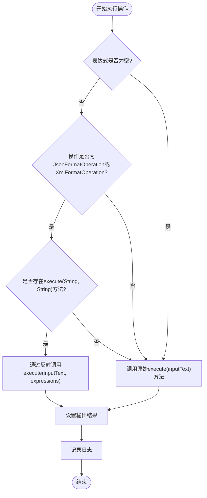
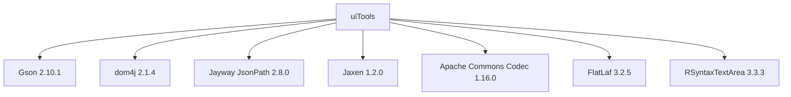

# 使用指南

<cite>
**Referenced Files in This Document**   
- [StringFormatterUI.java](file://src/main/java/org/oxff/ui/StringFormatterUI.java)
- [Operation.java](file://src/main/java/org/oxff/operation/Operation.java)
- [JsonFormatOperation.java](file://src/main/java/org/oxff/operation/JsonFormatOperation.java)
- [XmlFormatOperation.java](file://src/main/java/org/oxff/operation/XmlFormatOperation.java)
- [OperationFactory.java](file://src/main/java/org/oxff/core/OperationFactory.java)
- [OperationCategory.java](file://src/main/java/org/oxff/core/OperationCategory.java)
- [Main.java](file://src/main/java/org/oxff/Main.java)
- [OperationTreeCellRenderer.java](file://src/main/java/org/oxff/ui/OperationTreeCellRenderer.java)
- [README.md](file://README.md)
</cite>

## 目录
1. [简介](#简介)
2. [项目结构](#项目结构)
3. [核心组件](#核心组件)
4. [架构概述](#架构概述)
5. [详细组件分析](#详细组件分析)
6. [依赖分析](#依赖分析)
7. [性能考虑](#性能考虑)
8. [故障排除指南](#故障排除指南)
9. [结论](#结论)

## 简介
uiTools是一款功能强大的基于Java Swing的图形界面工具，用于处理各种字符串格式化、编解码操作，以及XML/JSON数据的XPath和JSONPath表达式提取。本使用指南将详细介绍用户与uiTools交互的完整工作流，从启动应用开始，逐步说明如何选择操作、输入文本、使用表达式（XPath/JSONPath）、执行处理并查看结果。重点介绍UI的关键功能，如三面板布局、剪贴板操作（复制/粘贴）、内容交换、自动换行控制等。

**Section sources**
- [README.md](file://README.md#L1-L260)

## 项目结构
uiTools项目采用模块化设计，主要分为四个核心包：core、operation、ui和主入口点。core包包含核心类（操作工厂、操作分类），operation包包含各种操作的具体实现，ui包包含用户界面组件，Main.java作为程序入口点。

**Diagram sources **
- [Main.java](file://src/main/java/org/oxff/Main.java#L1-L27)
- [StringFormatterUI.java](file://src/main/java/org/oxff/ui/StringFormatterUI.java#L1-L514)

**Section sources**
- [StringFormatterUI.java](file://src/main/java/org/oxff/ui/StringFormatterUI.java#L1-L514)
- [README.md](file://README.md#L1-L260)

## 核心组件
uiTools的核心组件包括StringFormatterUI（用户界面）、Operation接口（操作契约）、OperationFactory（操作工厂）和各种具体操作实现。StringFormatterUI负责构建用户界面和处理用户交互，Operation接口定义了所有操作的契约，OperationFactory负责创建和管理操作实例，具体操作实现则提供了各种格式化、编解码和哈希功能。

**Section sources**
- [StringFormatterUI.java](file://src/main/java/org/oxff/ui/StringFormatterUI.java#L1-L514)
- [Operation.java](file://src/main/java/org/oxff/operation/Operation.java#L1-L26)
- [OperationFactory.java](file://src/main/java/org/oxff/core/OperationFactory.java#L1-L61)

## 架构概述
uiTools采用典型的MVC（Model-View-Controller）架构模式，其中Operation接口及其实现构成了Model层，StringFormatterUI构成了View层，而事件监听器和操作执行逻辑构成了Controller层。这种架构模式实现了关注点分离，使得代码更易于维护和扩展。

**Diagram sources **
- [StringFormatterUI.java](file://src/main/java/org/oxff/ui/StringFormatterUI.java#L1-L514)
- [Operation.java](file://src/main/java/org/oxff/operation/Operation.java#L1-L26)
- [OperationFactory.java](file://src/main/java/org/oxff/core/OperationFactory.java#L1-L61)

## 详细组件分析

### StringFormatterUI分析
StringFormatterUI是uiTools的核心用户界面组件，负责构建和管理整个应用程序的UI。它采用三面板布局设计，左侧为操作分类树，中间为输入区域，右侧为输出区域。通过JSplitPane组件实现了灵活的布局调整，用户可以根据需要调整各面板的大小。

#### 类图

**Diagram sources **
- [StringFormatterUI.java](file://src/main/java/org/oxff/ui/StringFormatterUI.java#L1-L514)
- [OperationFactory.java](file://src/main/java/org/oxff/core/OperationFactory.java#L1-L61)
- [Operation.java](file://src/main/java/org/oxff/operation/Operation.java#L1-L26)
- [OperationTreeCellRenderer.java](file://src/main/java/org/oxff/ui/OperationTreeCellRenderer.java#L1-L43)

**Section sources**
- [StringFormatterUI.java](file://src/main/java/org/oxff/ui/StringFormatterUI.java#L1-L514)

### 操作执行流程分析
用户与uiTools的交互流程从启动应用开始，经过选择操作、输入文本、执行处理到查看结果。这个流程通过事件驱动的方式实现，每个用户操作都会触发相应的事件监听器，进而执行相应的业务逻辑。

#### 序列图

**Diagram sources **
- [StringFormatterUI.java](file://src/main/java/org/oxff/ui/StringFormatterUI.java#L1-L514)
- [OperationFactory.java](file://src/main/java/org/oxff/core/OperationFactory.java#L1-L61)
- [Operation.java](file://src/main/java/org/oxff/operation/Operation.java#L1-L26)

**Section sources**
- [StringFormatterUI.java](file://src/main/java/org/oxff/ui/StringFormatterUI.java#L1-L514)

### 表达式处理逻辑分析
对于支持XPath/JSONPath表达式的操作（如JSON格式化和XML格式化），uiTools采用反射机制动态调用带有表达式参数的execute方法。如果目标操作没有实现带表达式参数的方法，则回退到原始的execute方法。

#### 流程图

**Diagram sources **
- [StringFormatterUI.java](file://src/main/java/org/oxff/ui/StringFormatterUI.java#L1-L514)
- [JsonFormatOperation.java](file://src/main/java/org/oxff/operation/JsonFormatOperation.java#L1-L123)
- [XmlFormatOperation.java](file://src/main/java/org/oxff/operation/XmlFormatOperation.java#L1-L127)

**Section sources**
- [StringFormatterUI.java](file://src/main/java/org/oxff/ui/StringFormatterUI.java#L1-L514)

## 依赖分析
uiTools项目依赖于多个第三方库，包括Gson（JSON处理）、dom4j（XML处理）、Jayway JsonPath（JSONPath表达式处理）、Jaxen（XPath表达式处理）、Apache Commons Codec（编解码操作）、FlatLaf（现代化界面主题）和RSyntaxTextArea（语法高亮编辑器）。这些依赖通过Maven进行管理，确保了项目的可维护性和可扩展性。

**Diagram sources **
- [pom.xml](file://pom.xml#L1-L100)
- [dependency-reduced-pom.xml](file://dependency-reduced-pom.xml#L1-L100)

**Section sources**
- [README.md](file://README.md#L1-L260)

## 性能考虑
uiTools在设计时考虑了性能因素，特别是在处理大型文本输入时。通过使用RSyntaxTextArea组件，实现了语法高亮和代码折叠功能，同时保持了良好的响应性能。对于耗时的操作，如哈希计算和格式化，uiTools在主线程中执行，确保了用户界面的流畅性。此外，通过合理使用SwingUtilities.invokeLater()，避免了UI线程阻塞。

**Section sources**
- [StringFormatterUI.java](file://src/main/java/org/oxff/ui/StringFormatterUI.java#L1-L514)
- [README.md](file://README.md#L1-L260)

## 故障排除指南
当使用uiTools时，可能会遇到一些常见问题。例如，XPath表达式返回空结果可能是由于XML格式不正确或XPath语法有误；JSONPath表达式报错可能是由于JSON格式无效；程序无法启动可能是由于Java版本不兼容或JAR文件损坏；表达式输入区域不可见可能是由于未选择支持表达式的操作。

**Section sources**
- [README.md](file://README.md#L1-L260)

## 结论
uiTools是一款功能强大且易于使用的字符串处理工具，通过直观的图形界面和丰富的功能集，为开发者提供了便捷的字符串格式化、编解码和数据提取能力。其模块化的设计和清晰的架构使得代码易于维护和扩展，而丰富的快捷键支持和用户友好的界面设计则提升了用户体验。通过本使用指南，用户可以全面了解uiTools的工作流程和核心功能，从而更高效地利用该工具进行开发工作。