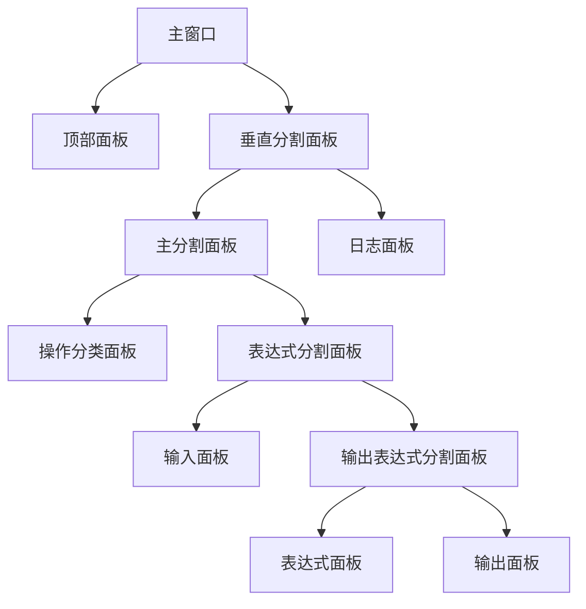
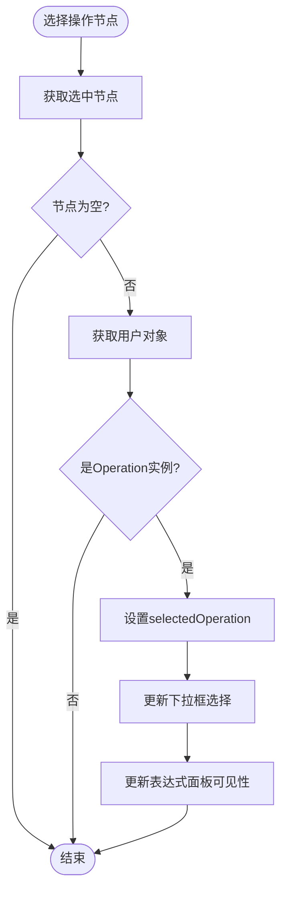
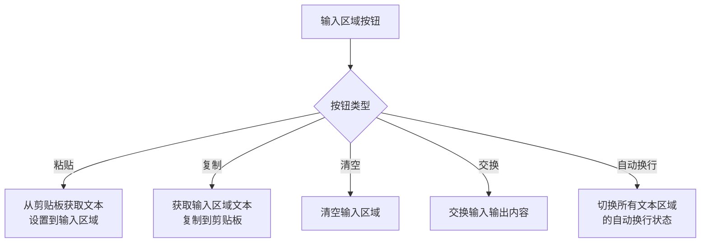
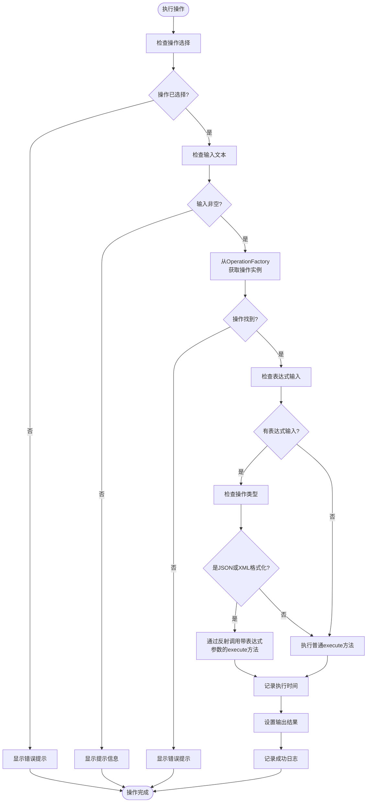

# 基础操作流程

<cite>
**Referenced Files in This Document**   
- [StringFormatterUI.java](file://src/main/java/org/oxff/ui/StringFormatterUI.java)
- [OperationFactory.java](file://src/main/java/org/oxff/core/OperationFactory.java)
- [JsonFormatOperation.java](file://src/main/java/org/oxff/operation/JsonFormatOperation.java)
- [Operation.java](file://src/main/java/org/oxff/operation/Operation.java)
- [OperationCategory.java](file://src/main/java/org/oxff/core/OperationCategory.java)
</cite>

## 目录
1. [简介](#简介)
2. [用户界面布局](#用户界面布局)
3. [操作选择机制](#操作选择机制)
4. [输入处理流程](#输入处理流程)
5. [执行操作流程](#执行操作流程)
6. [输出结果展示](#输出结果展示)
7. [典型使用场景示例](#典型使用场景示例)
8. [快捷键支持](#快捷键支持)

## 简介
本指南详细说明了字符串格式化工具的完整工作流程，从应用启动到完成文本处理的全过程。文档重点介绍了如何通过操作分类树或下拉框选择操作、在输入区域粘贴或输入文本、点击执行按钮或使用快捷键触发处理，以及查看输出结果的完整流程。通过分析StringFormatterUI类中的initializeUI和executeOperation方法实现逻辑，解释了UI组件的初始化顺序和事件触发机制。

**Section sources**
- [StringFormatterUI.java](file://src/main/java/org/oxff/ui/StringFormatterUI.java#L29-L513)

## 用户界面布局
应用程序启动后，StringFormatterUI类的构造函数会调用initializeUI方法来初始化用户界面。界面采用分层布局设计，主要由以下几个区域组成：

1. **顶部操作面板**：包含操作选择下拉框和执行按钮
2. **左侧操作分类树**：按分类组织所有可用操作
3. **主内容区域**：包含输入、表达式和输出三个文本区域
4. **底部日志面板**：显示操作执行日志

界面布局采用Swing的BorderLayout和JSplitPane组件实现，确保各区域可以灵活调整大小。



**Diagram sources**
- [StringFormatterUI.java](file://src/main/java/org/oxff/ui/StringFormatterUI.java#L64-L259)

**Section sources**
- [StringFormatterUI.java](file://src/main/java/org/oxff/ui/StringFormatterUI.java#L64-L259)

## 操作选择机制
用户可以通过两种方式选择要执行的操作：

### 操作分类树选择
左侧的JTree组件显示了所有可用操作的层次结构。操作按分类组织，包括"编解码"、"格式化"、"哈希"和"自动化操作"四大类。每个分类下包含具体的操作项。

当用户在操作分类树中选择一个操作节点时，会触发TreeSelectionListener事件，该事件会：
1. 获取选中节点的用户对象（即Operation实例）
2. 设置selectedOperation变量为选中操作的显示名称
3. 更新顶部操作下拉框的选择项
4. 根据操作类型决定是否显示表达式输入区域



**Diagram sources**
- [StringFormatterUI.java](file://src/main/java/org/oxff/ui/StringFormatterUI.java#L297-L317)
- [StringFormatterUI.java](file://src/main/java/org/oxff/ui/StringFormatterUI.java#L266-L279)

**Section sources**
- [StringFormatterUI.java](file://src/main/java/org/oxff/ui/StringFormatterUI.java#L297-L317)
- [StringFormatterUI.java](file://src/main/java/org/oxff/ui/StringFormatterUI.java#L266-L279)

### 下拉框选择
顶部的操作下拉框（JComboBox）提供了另一种选择操作的方式。下拉框中的选项由OperationFactory.getAllOperationNames()方法提供，该方法返回所有操作的显示名称数组。

当下拉框的选择发生变化时，会触发ActionListener事件，该事件会：
1. 获取选中的操作名称
2. 设置selectedOperation变量
3. 调用updateExpressionPanelVisibility方法更新表达式面板的可见性

## 输入处理流程
输入区域提供了多种文本输入和处理方式：

### 文本输入
用户可以直接在输入文本区域（RSyntaxTextArea）中输入或粘贴需要处理的文本。该区域支持语法高亮和代码折叠功能，便于查看复杂文本内容。

### 按钮功能
输入区域提供了多个功能按钮：
- **粘贴**：从系统剪贴板粘贴文本到输入区域
- **复制**：将输入区域的文本复制到系统剪贴板
- **清空**：清空输入区域的所有内容
- **交换**：交换输入和输出区域的内容
- **自动换行**：切换输入、输出和表达式区域的自动换行状态

这些按钮的事件监听器在setupEventListeners方法中设置，通过ActionListener实现相应的功能。



**Diagram sources**
- [StringFormatterUI.java](file://src/main/java/org/oxff/ui/StringFormatterUI.java#L322-L390)

**Section sources**
- [StringFormatterUI.java](file://src/main/java/org/oxff/ui/StringFormatterUI.java#L322-L390)

## 执行操作流程
执行操作是整个工作流程的核心，通过点击"执行"按钮或使用快捷键Ctrl+E触发。

### 事件触发机制
"执行"按钮的ActionListener直接调用executeOperation方法。该方法是处理用户请求的核心逻辑，其执行流程如下：



**Diagram sources**
- [StringFormatterUI.java](file://src/main/java/org/oxff/ui/StringFormatterUI.java#L395-L451)
- [OperationFactory.java](file://src/main/java/org/oxff/core/OperationFactory.java#L49-L59)
- [JsonFormatOperation.java](file://src/main/java/org/oxff/operation/JsonFormatOperation.java#L13-L122)

**Section sources**
- [StringFormatterUI.java](file://src/main/java/org/oxff/ui/StringFormatterUI.java#L395-L451)

### 操作执行逻辑
executeOperation方法的执行逻辑包括以下步骤：
1. 验证是否已选择操作
2. 验证输入文本是否为空
3. 通过OperationFactory.getOperation方法获取对应的操作实例
4. 根据操作类型和是否有表达式输入决定执行方式
5. 记录执行时间并显示结果
6. 更新日志信息

对于支持表达式过滤的JSON和XML格式化操作，系统会通过反射机制调用带有两个参数的execute方法（输入文本和表达式），实现更精细的文本处理。

## 输出结果展示
处理结果会在输出区域显示，该区域具有以下特点：

1. **只读状态**：输出文本区域设置为不可编辑，防止用户意外修改
2. **结果展示**：显示操作执行后的处理结果
3. **复制功能**：提供"复制"按钮，方便用户将结果复制到剪贴板
4. **格式化显示**：支持语法高亮和代码折叠，便于查看复杂结果

输出结果的设置通过outputTextArea.setText(result)完成，同时系统会记录操作日志，包括操作名称、执行时间和是否使用了表达式过滤等信息。

## 典型使用场景示例
### 场景：格式化压缩的JSON字符串
假设用户需要格式化一段压缩的JSON字符串，使其更易读。

#### 初始界面状态
- 输入区域：空
- 操作选择：未选择
- 输出区域：空
- 日志区域："应用程序启动"

#### 操作步骤
1. **选择操作**：在操作分类树中选择"格式化" -> "JSON格式化"，或在下拉框中选择"JSON格式化"
2. **输入文本**：将压缩的JSON字符串粘贴到输入区域
   ```json
   {"name":"张三","age":25,"city":"北京","hobbies":["读书","游泳","编程"]}
   ```
3. **执行操作**：点击"执行"按钮或按Ctrl+E
4. **查看结果**：输出区域显示格式化后的JSON
   ```json
   {
     "name": "张三",
     "age": 25,
     "city": "北京",
     "hobbies": [
       "读书",
       "游泳",
       "编程"
     ]
   }
   ```
5. **日志记录**：日志区域显示"执行操作: JSON格式化 (耗时: Xms)"

#### 界面状态变化
- 输入区域：显示原始压缩JSON
- 操作选择："JSON格式化"
- 输出区域：显示格式化后的JSON
- 日志区域：新增执行日志

此示例展示了从选择操作到查看结果的完整工作流程，体现了工具的核心功能。

## 快捷键支持
为了提高操作效率，系统提供了多种快捷键支持：

- **Ctrl+E**：执行操作
- **Ctrl+C**：复制输入内容
- **Ctrl+V**：粘贴到输入区域
- **Ctrl+Shift+C**：复制输出内容
- **Ctrl+Shift+X**：清空输入内容
- **Ctrl+A**：全选输入或输出区域的内容

快捷键通过setupKeyboardShortcuts方法设置，使用JButton的setMnemonic方法和组件的InputMap/ActionMap机制实现。

**Section sources**
- [StringFormatterUI.java](file://src/main/java/org/oxff/ui/StringFormatterUI.java#L456-L489)