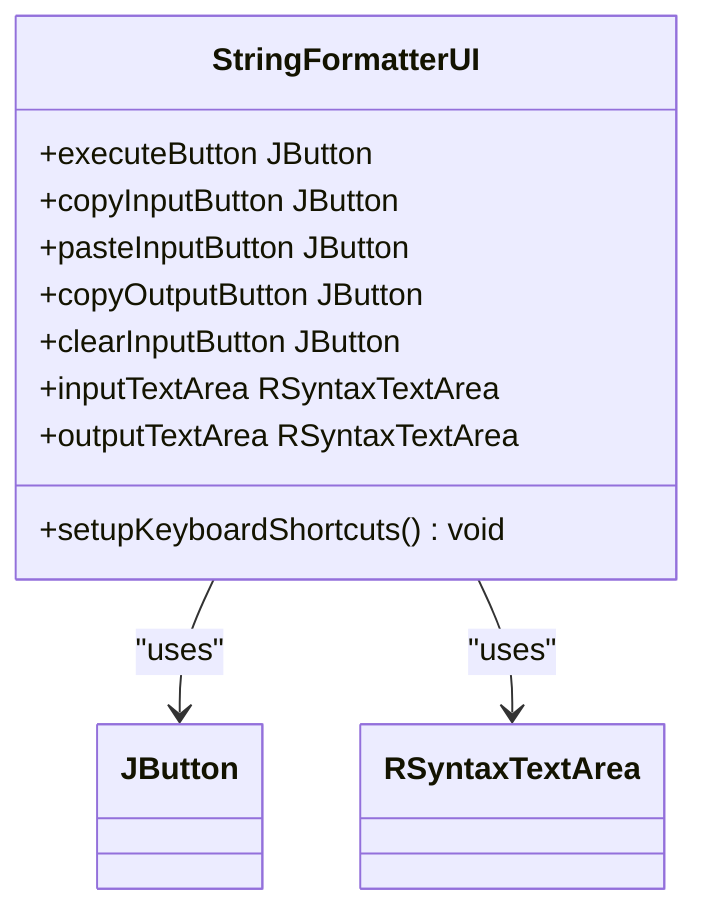
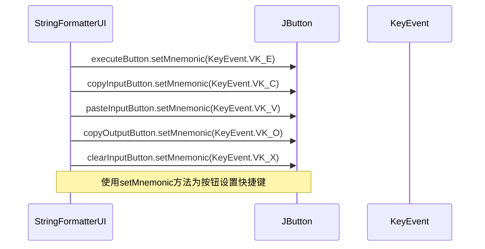
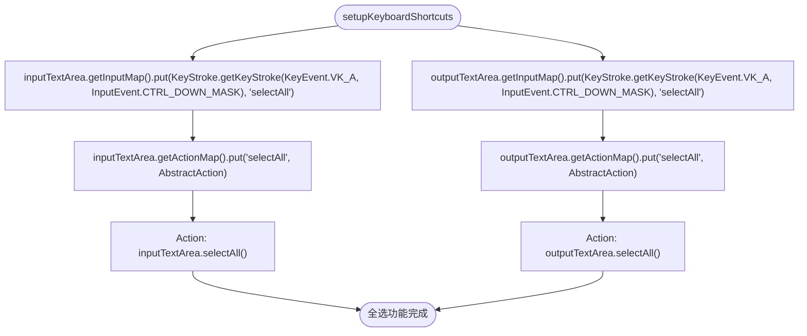

# 快捷键支持

<cite>
**Referenced Files in This Document**   
- [StringFormatterUI.java](file://src/main/java/org/oxff/ui/StringFormatterUI.java)
- [Operation.java](file://src/main/java/org/oxff/operation/Operation.java)
- [OperationFactory.java](file://src/main/java/org/oxff/core/OperationFactory.java)
- [OperationCategory.java](file://src/main/java/org/oxff/core/OperationCategory.java)
</cite>

## 目录
1. [快捷键系统概述](#快捷键系统概述)
2. [快捷键功能详解](#快捷键功能详解)
3. [快捷键实现机制](#快捷键实现机制)
4. [实际使用场景示例](#实际使用场景示例)
5. [设计原则与用户习惯](#设计原则与用户习惯)

## 快捷键系统概述

应用程序的快捷键系统旨在提升用户操作效率，通过键盘快捷方式快速执行常用功能。该系统主要在`StringFormatterUI`类的`setupKeyboardShortcuts`方法中定义，为界面中的各个按钮和文本区域提供了直观的键盘操作支持。快捷键设计遵循了常见的用户习惯，使用户能够快速上手并高效地使用应用程序。

**Section sources**
- [StringFormatterUI.java](file://src/main/java/org/oxff/ui/StringFormatterUI.java#L456-L489)

## 快捷键功能详解

应用程序提供了以下快捷键功能：

- **Ctrl+E**：执行操作 - 触发执行按钮，立即运行选定的字符串处理操作
- **Ctrl+C**：复制输入 - 将输入文本区域的内容复制到系统剪贴板
- **Ctrl+V**：粘贴输入 - 从系统剪贴板粘贴内容到输入文本区域
- **Ctrl+Shift+C**：复制输出 - 将输出文本区域的内容复制到系统剪贴板
- **Ctrl+Shift+X**：清空输入 - 清除输入文本区域的所有内容
- **Ctrl+A**：全选 - 在输入或输出文本区域中选择所有文本内容

这些快捷键覆盖了应用程序中最常用的操作，使用户无需频繁切换到鼠标即可完成大部分任务，显著提升了操作效率。

**Section sources**
- [StringFormatterUI.java](file://src/main/java/org/oxff/ui/StringFormatterUI.java#L456-L489)

## 快捷键实现机制

快捷键系统通过Java Swing框架的`setMnemonic`和`InputMap/ActionMap`机制实现。`setMnemonic`方法用于为按钮设置快捷键，而`InputMap/ActionMap`组合则用于为文本区域等组件定义更复杂的键盘操作。

**Diagram sources**
- [StringFormatterUI.java](file://src/main/java/org/oxff/ui/StringFormatterUI.java#L29-L513)

**Section sources**
- [StringFormatterUI.java](file://src/main/java/org/oxff/ui/StringFormatterUI.java#L456-L489)

### 按钮快捷键绑定

对于按钮组件，使用`setMnemonic`方法直接绑定快捷键：

**Diagram sources**
- [StringFormatterUI.java](file://src/main/java/org/oxff/ui/StringFormatterUI.java#L456-L489)

### 文本区域全选功能

对于文本区域的全选功能，使用`InputMap`和`ActionMap`机制：

**Diagram sources**
- [StringFormatterUI.java](file://src/main/java/org/oxff/ui/StringFormatterUI.java#L456-L489)

**Section sources**
- [StringFormatterUI.java](file://src/main/java/org/oxff/ui/StringFormatterUI.java#L456-L489)

## 实际使用场景示例

快捷键系统在实际使用中能显著提升操作效率。例如，当用户需要对一段JSON文本进行格式化处理时，可以按照以下流程操作：

1. 使用**Ctrl+V**将JSON文本粘贴到输入区域
2. 从操作列表中选择"JSON格式化"操作
3. 按下**Ctrl+E**执行格式化
4. 使用**Ctrl+Shift+C**复制格式化后的结果
5. 在需要使用结果的地方使用系统粘贴功能

整个过程无需鼠标操作，大大提高了工作效率。另一个常见场景是批量处理多个文本：用户可以快速清空输入(**Ctrl+Shift+X**)，粘贴新文本(**Ctrl+V**)，执行操作(**Ctrl+E**)，复制结果(**Ctrl+Shift+C**)，然后重复此流程。

**Section sources**
- [StringFormatterUI.java](file://src/main/java/org/oxff/ui/StringFormatterUI.java#L456-L489)

## 设计原则与用户习惯

快捷键的设计充分考虑了用户的操作习惯和认知模式。首先，采用了与主流应用程序一致的快捷键方案，如**Ctrl+C**、**Ctrl+V**和**Ctrl+A**，降低了用户的学习成本。其次，快捷键的分配遵循了逻辑一致性原则：与输入相关的操作(Copy、Paste、Clear)使用相似的键位模式，而输出相关的操作则通过Shift键进行区分。

此外，快捷键系统还体现了分层设计的思想：简单的按钮操作使用`setMnemonic`机制，而更复杂的文本区域操作则使用`InputMap/ActionMap`机制。这种设计既保证了实现的简洁性，又提供了足够的灵活性来支持复杂的功能需求。

**Section sources**
- [StringFormatterUI.java](file://src/main/java/org/oxff/ui/StringFormatterUI.java#L456-L489)