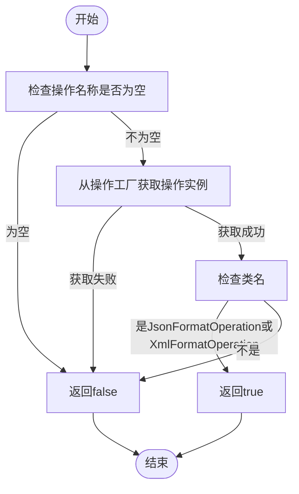
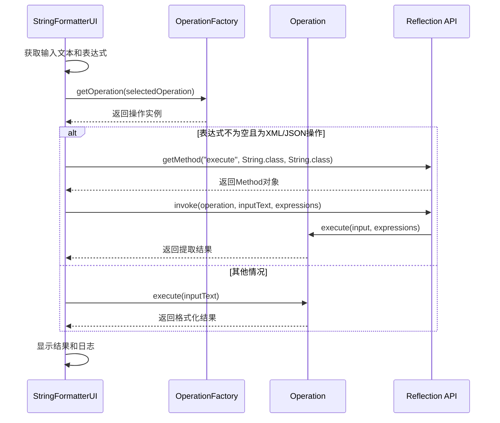

# 表达式使用指南

<cite>
**Referenced Files in This Document**   
- [StringFormatterUI.java](file://src/main/java/org/oxff/ui/StringFormatterUI.java)
- [JsonFormatOperation.java](file://src/main/java/org/oxff/operation/JsonFormatOperation.java)
- [XmlFormatOperation.java](file://src/main/java/org/oxff/operation/XmlFormatOperation.java)
- [README.md](file://README.md)
- [Operation.java](file://src/main/java/org/oxff/operation/Operation.java)
- [OperationFactory.java](file://src/main/java/org/oxff/core/OperationFactory.java)
</cite>

## 目录
1. [XPath和JSONPath表达式使用方法](#xpath和jsonpath表达式使用方法)
2. [expressionTextArea组件动态显示逻辑](#expressiontextarea组件动态显示逻辑)
3. [多表达式批量处理功能](#多表达式批量处理功能)
4. [表达式编写示例](#表达式编写示例)
5. [executeOperation方法中的反射调用机制](#executeoperation方法中的反射调用机制)

## XPath和JSONPath表达式使用方法

XPath和JSONPath是用于在XML和JSON文档中定位和提取数据的强大查询语言。在本工具中，用户可以通过在表达式输入区域输入相应的表达式来精准提取所需数据。

**XPath表达式**用于XML数据提取，支持标准XPath 1.0语法。用户可以使用XPath表达式来选择XML文档中的元素、属性和其他节点。例如，`//book/title`表示选择所有book元素下的title子元素。

**JSONPath表达式**用于JSON数据提取，支持Jayway JSONPath语法。JSONPath类似于XPath，但专为JSON数据结构设计。例如，`$.store.book[*].title`表示从store对象的book数组中提取所有title字段的值。

这些表达式在工具中通过专门的库进行处理：XPath表达式使用Jaxen 1.2.0库处理，而JSONPath表达式使用Jayway JsonPath 2.8.0库处理。用户可以在表达式输入区域输入一个或多个表达式，系统将根据当前选择的操作类型自动应用相应的表达式引擎。

**Section sources**
- [README.md](file://README.md#L40-L90)
- [StringFormatterUI.java](file://src/main/java/org/oxff/ui/StringFormatterUI.java#L174-L198)

## expressionTextArea组件动态显示逻辑

expressionTextArea组件的动态显示逻辑通过`requiresExpressionInput`和`updateExpressionPanelVisibility`两个方法实现，确保该组件仅在选择JSON或XML格式化操作时才显示。

`requiresExpressionInput`方法负责判断指定操作是否需要表达式输入。该方法首先通过操作名称从操作工厂获取对应的操作实例，然后检查该操作的类名是否为`JsonFormatOperation`或`XmlFormatOperation`。只有这两种操作需要表达式输入，其他操作则不需要。



**Diagram sources**
- [StringFormatterUI.java](file://src/main/java/org/oxff/ui/StringFormatterUI.java#L266-L279)

`updateExpressionPanelVisibility`方法根据`requiresExpressionInput`方法的返回结果来更新表达式面板的可见性。如果需要表达式输入，则将表达式面板设置为分割面板的左组件；如果不需要，则通过将左组件设置为null来隐藏表达式面板。方法最后调用`revalidate`和`repaint`来刷新界面，确保UI更新生效。

**Section sources**
- [StringFormatterUI.java](file://src/main/java/org/oxff/ui/StringFormatterUI.java#L266-L295)

## 多表达式批量处理功能

本工具支持多表达式批量处理功能，允许用户在表达式输入区域输入多个表达式，每行一个，系统将批量执行这些表达式并以行分隔格式输出结果。

当用户输入多个表达式时，系统会将表达式文本按行分割，然后逐个执行每个表达式。对于每个有效的表达式，系统会尝试执行并获取结果。如果表达式执行成功，结果将被添加到结果列表中；如果表达式执行失败或路径未找到，系统会跳过该表达式或添加错误信息。

处理完成后，所有非空结果将通过`String.join("\n", results)`方法以换行符连接成单个字符串输出。这种设计使得用户可以一次性提取多个数据点，并将结果以清晰的行分隔格式呈现，便于后续的复制和使用。

在用户界面中，表达式输入区域被设计为支持自动换行的文本区域，初始高度为80像素，允许用户方便地输入和编辑多行表达式。用户还可以通过"清空表达式"按钮快速清除所有输入的表达式。

**Section sources**
- [JsonFormatOperation.java](file://src/main/java/org/oxff/operation/JsonFormatOperation.java#L50-L122)
- [XmlFormatOperation.java](file://src/main/java/org/oxff/operation/XmlFormatOperation.java#L53-L126)

## 表达式编写示例

结合README中的XML和JSON示例数据，以下是具体的表达式编写示例。

### XML数据示例和XPath表达式

**示例XML数据**:
```xml
<bookstore>
    <book category="fiction">
        <title lang="en">Great Gatsby</title>
        <author>F. Scott Fitzgerald</author>
        <year>1925</year>
        <price>10.99</price>
    </book>
    <book category="children">
        <title lang="en">Harry Potter</title>
        <author>J.K. Rowling</author>
        <year>2000</year>
        <price>15.99</price>
    </book>
</bookstore>
```

**XPath表达式示例**:
```
//book/title                           # 提取所有书名
//book/author                          # 提取所有作者
//book[@category='fiction']/price      # 提取小说类书籍的价格
//book[@lang='en']/title               # 提取英文书籍的书名
//book[year>2000]/title                # 提取2000年后出版的书籍
```

### JSON数据示例和JSONPath表达式

**示例JSON数据**:
```json
{
  "store": {
    "book": [
      {
        "category": "fiction",
        "title": "Great Gatsby",
        "author": "F. Scott Fitzgerald",
        "year": 1925,
        "price": 10.99
      },
      {
        "category": "children",
        "title": "Harry Potter",
        "author": "J.K. Rowling",
        "year": 2000,
        "price": 15.99
      }
    ]
  }
}
```

**JSONPath表达式示例**:
```
$.store.book[*].title                   # 提取所有书名
$.store.book[*].author                  # 提取所有作者
$.store.book[?(@.category=='fiction')].price    # 提取小说类书籍的价格
$.store.book[?(@.year>2000)].title      # 提取2000年后出版的书籍
$.store.book.length()                   # 计算书籍总数
```

这些示例展示了如何使用XPath和JSONPath表达式从复杂的数据结构中精准提取所需信息。用户可以根据实际数据结构和需求编写相应的表达式。

**Section sources**
- [README.md](file://README.md#L92-L172)

## executeOperation方法中的反射调用机制

`executeOperation`方法中通过反射机制调用带表达式参数的`execute`方法，实现了对JSON和XML格式化操作的特殊处理。

当用户选择JSON或XML格式化操作并输入表达式时，`executeOperation`方法会检查操作类型和表达式是否存在。如果条件满足，方法会使用Java反射API来查找并调用带有两个String参数的`execute`方法（即`execute(String input, String expressions)`）。



**Diagram sources**
- [StringFormatterUI.java](file://src/main/java/org/oxff/ui/StringFormatterUI.java#L395-L451)

具体实现中，方法首先尝试通过`operation.getClass().getMethod("execute", String.class, String.class)`获取带表达式参数的方法。如果该方法存在，则使用`method.invoke(operation, inputText, expressions)`调用它。如果该方法不存在（抛出`NoSuchMethodException`异常），则回退到调用原始的单参数`execute`方法。

这种反射机制的设计使得系统可以在不修改核心执行逻辑的情况下，为特定操作类型提供扩展功能。同时，通过异常处理机制确保了向后兼容性：即使某些操作类没有实现带表达式参数的`execute`方法，系统也能正常执行基础的格式化功能。

**Section sources**
- [StringFormatterUI.java](file://src/main/java/org/oxff/ui/StringFormatterUI.java#L395-L451)
- [JsonFormatOperation.java](file://src/main/java/org/oxff/operation/JsonFormatOperation.java#L45-L50)
- [XmlFormatOperation.java](file://src/main/java/org/oxff/operation/XmlFormatOperation.java#L48-L53)