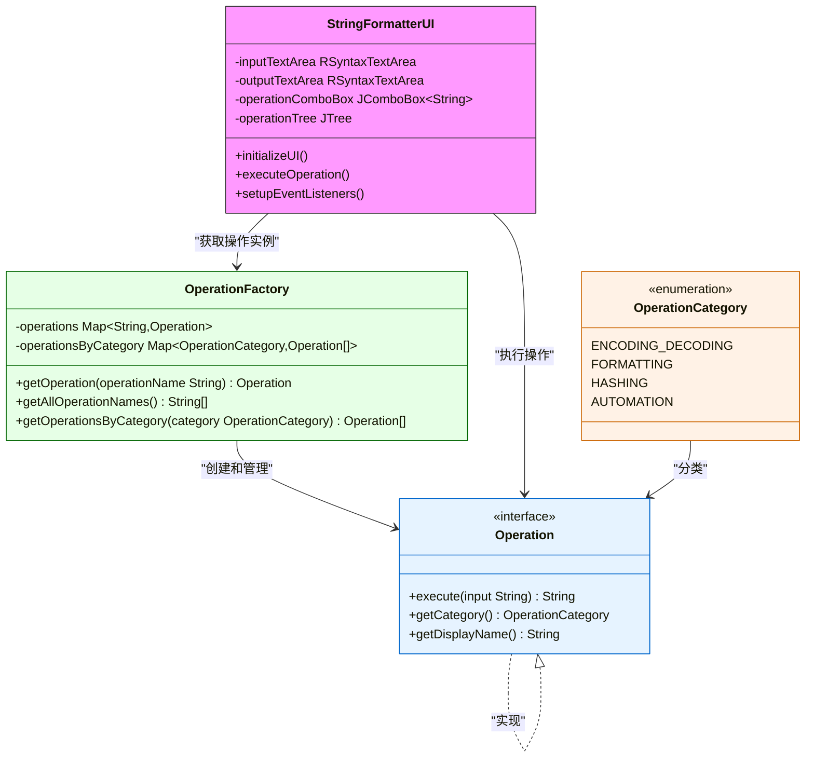

# 开发指南

<cite>
**Referenced Files in This Document**   
- [Operation.java](file://src/main/java/org/oxff/operation/Operation.java)
- [OperationFactory.java](file://src/main/java/org/oxff/core/OperationFactory.java)
- [OperationCategory.java](file://src/main/java/org/oxff/core/OperationCategory.java)
- [Base64EncodeOperation.java](file://src/main/java/org/oxff/operation/Base64EncodeOperation.java)
- [Base64DecodeOperation.java](file://src/main/java/org/oxff/operation/Base64DecodeOperation.java)
- [StringFormatterUI.java](file://src/main/java/org/oxff/ui/StringFormatterUI.java)
- [OperationTreeCellRenderer.java](file://src/main/java/org/oxff/ui/OperationTreeCellRenderer.java)
- [pom.xml](file://pom.xml)
- [README.md](file://README.md)
</cite>

## 目录
1. [简介](#简介)
2. [项目结构](#项目结构)
3. [核心组件](#核心组件)
4. [架构概述](#架构概述)
5. [详细组件分析](#详细组件分析)
6. [依赖分析](#依赖分析)
7. [性能考虑](#性能考虑)
8. [故障排除](#故障排除)
9. [结论](#结论)

## 简介
本开发指南旨在为贡献者提供详细的指导，介绍如何扩展uiTools的功能。文档重点说明基于Operation接口和OperationFactory工厂模式的插件化架构，指导开发者如何创建新的操作类并在系统中注册。通过本指南，开发者将了解如何实现新的字符串处理功能，确保代码符合项目规范，并成功集成到现有系统中。

## 项目结构
uiTools项目采用模块化设计，将核心功能、操作实现和用户界面分离。项目结构清晰，便于扩展和维护。主要目录包括core（核心类）、operation（操作实现）、ui（用户界面组件）和主入口点。

**Diagram sources**
- [OperationFactory.java](file://src/main/java/org/oxff/core/OperationFactory.java#L1-L60)
- [Operation.java](file://src/main/java/org/oxff/operation/Operation.java#L1-L26)
- [StringFormatterUI.java](file://src/main/java/org/oxff/ui/StringFormatterUI.java#L29-L513)

**Section sources**
- [OperationFactory.java](file://src/main/java/org/oxff/core/OperationFactory.java#L1-L60)
- [Operation.java](file://src/main/java/org/oxff/operation/Operation.java#L1-L26)
- [StringFormatterUI.java](file://src/main/java/org/oxff/ui/StringFormatterUI.java#L29-L513)

## 核心组件
本节分析uiTools的核心组件，包括Operation接口、OperationFactory工厂类和OperationCategory枚举。这些组件构成了系统的插件化架构基础，允许轻松扩展新的字符串处理功能。

**Section sources**
- [Operation.java](file://src/main/java/org/oxff/operation/Operation.java#L1-L26)
- [OperationFactory.java](file://src/main/java/org/oxff/core/OperationFactory.java#L1-L60)
- [OperationCategory.java](file://src/main/java/org/oxff/core/OperationCategory.java#L1-L20)

## 架构概述
uiTools采用基于接口的插件化架构，通过Operation接口定义所有字符串操作的契约，使用OperationFactory工厂类管理操作实例的创建和注册。这种设计模式实现了高内聚低耦合，使得系统易于扩展和维护。

**Diagram sources**
- [Operation.java](file://src/main/java/org/oxff/operation/Operation.java#L1-L26)
- [OperationFactory.java](file://src/main/java/org/oxff/core/OperationFactory.java#L1-L60)
- [OperationCategory.java](file://src/main/java/org/oxff/core/OperationCategory.java#L1-L20)
- [StringFormatterUI.java](file://src/main/java/org/oxff/ui/StringFormatterUI.java#L29-L513)

## 详细组件分析
本节深入分析uiTools的关键组件，包括Operation接口的设计原理、OperationFactory的工厂模式实现以及UI与操作的集成方式。

### Operation接口分析
Operation接口是uiTools插件化架构的核心，定义了所有字符串操作必须实现的契约。通过实现此接口，开发者可以轻松创建新的操作类并集成到系统中。

**Diagram sources**
- [Operation.java](file://src/main/java/org/oxff/operation/Operation.java#L1-L26)
- [Base64EncodeOperation.java](file://src/main/java/org/oxff/operation/Base64EncodeOperation.java#L1-L25)
- [Base64DecodeOperation.java](file://src/main/java/org/oxff/operation/Base64DecodeOperation.java#L1-L30)

**Section sources**
- [Operation.java](file://src/main/java/org/oxff/operation/Operation.java#L1-L26)
- [Base64EncodeOperation.java](file://src/main/java/org/oxff/operation/Base64EncodeOperation.java#L1-L25)
- [Base64DecodeOperation.java](file://src/main/java/org/oxff/operation/Base64DecodeOperation.java#L1-L30)

### OperationFactory工厂模式分析
OperationFactory采用工厂模式管理所有操作实例的创建和注册。通过静态代码块初始化所有操作，并提供便捷的方法获取操作实例，实现了操作的集中管理和高效访问。

**Diagram sources**
- [OperationFactory.java](file://src/main/java/org/oxff/core/OperationFactory.java#L1-L60)
- [StringFormatterUI.java](file://src/main/java/org/oxff/ui/StringFormatterUI.java#L29-L513)

**Section sources**
- [OperationFactory.java](file://src/main/java/org/oxff/core/OperationFactory.java#L1-L60)
- [StringFormatterUI.java](file://src/main/java/org/oxff/ui/StringFormatterUI.java#L29-L513)

### UI集成分析
StringFormatterUI类负责用户界面的展示和交互，通过OperationFactory获取操作实例，并将用户选择的操作与输入数据结合执行，实现了UI与业务逻辑的解耦。

**Diagram sources**
- [StringFormatterUI.java](file://src/main/java/org/oxff/ui/StringFormatterUI.java#L29-L513)
- [OperationFactory.java](file://src/main/java/org/oxff/core/OperationFactory.java#L1-L60)

**Section sources**
- [StringFormatterUI.java](file://src/main/java/org/oxff/ui/StringFormatterUI.java#L29-L513)
- [OperationFactory.java](file://src/main/java/org/oxff/core/OperationFactory.java#L1-L60)

## 依赖分析
uiTools项目依赖多个第三方库来实现其功能，包括Gson用于JSON处理、dom4j用于XML处理、commons-codec用于编解码操作等。这些依赖通过Maven进行管理，确保了项目的可构建性和可维护性。

**Diagram sources**
- [pom.xml](file://pom.xml#L1-L106)

**Section sources**
- [pom.xml](file://pom.xml#L1-L106)

## 性能考虑
在扩展uiTools功能时，开发者应考虑以下性能因素：操作执行效率、内存使用和UI响应性。对于计算密集型操作，建议使用异步执行避免阻塞UI线程；对于大文本处理，应考虑分块处理以减少内存占用。

## 故障排除
当扩展uiTools功能时，可能会遇到以下常见问题：新操作未在UI中显示、操作执行失败或UI响应异常。这些问题通常源于操作未正确注册、依赖缺失或代码错误。建议检查OperationFactory的静态块是否包含新操作实例，并确保所有依赖已正确配置。

**Section sources**
- [OperationFactory.java](file://src/main/java/org/oxff/core/OperationFactory.java#L1-L60)
- [pom.xml](file://pom.xml#L1-L106)

## 结论
通过本开发指南，贡献者可以深入了解uiTools的插件化架构，掌握如何基于Operation接口和OperationFactory工厂模式扩展新功能。遵循本文档的指导，开发者可以创建符合项目规范的新操作类，为uiTools添加更多实用的字符串处理功能。