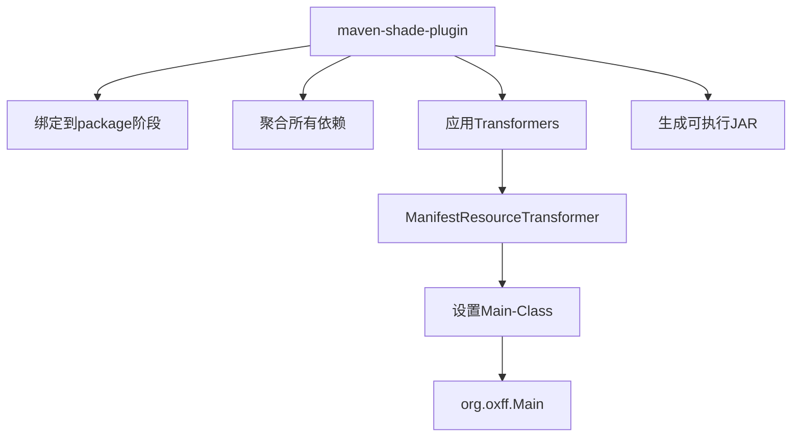
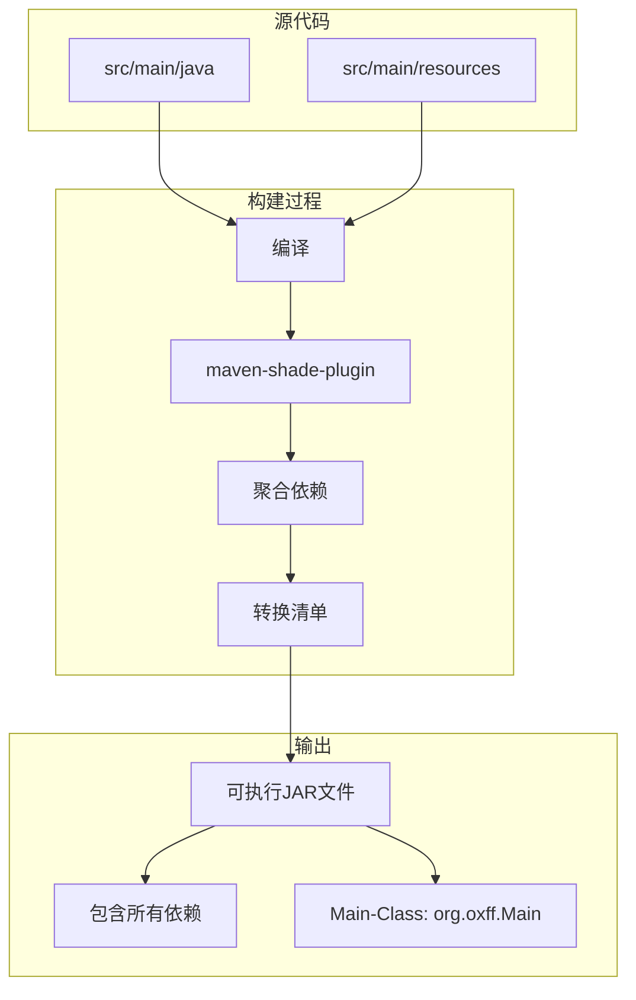
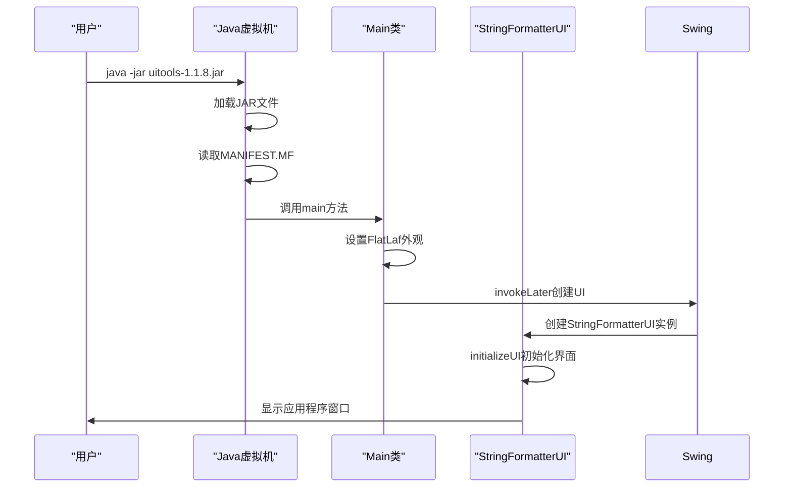

# 打包配置

<cite>
**Referenced Files in This Document**   
- [pom.xml](file://pom.xml)
- [Main.java](file://src/main/java/org/oxff/Main.java)
- [StringFormatterUI.java](file://src/main/java/org/oxff/ui/StringFormatterUI.java)
</cite>

## Table of Contents
1. [项目打包配置概述](#项目打包配置概述)
2. [Maven编译器配置](#maven编译器配置)
3. [maven-shade-plugin插件详解](#maven-shade-plugin插件详解)
4. [可执行JAR文件生成机制](#可执行jar文件生成机制)
5. [主类配置与执行流程](#主类配置与执行流程)
6. [打包配置最佳实践](#打包配置最佳实践)
7. [常见打包问题与解决方案](#常见打包问题与解决方案)

## 项目打包配置概述

本项目采用Maven作为构建工具，通过`pom.xml`文件中的配置实现完整的打包流程。项目打包配置的核心目标是生成一个可独立运行的JAR文件，该文件包含所有必要的依赖库和资源文件。打包配置主要涉及两个关键方面：Java编译器版本的设定和可执行JAR文件的生成。

项目通过`maven-compiler-plugin`插件明确指定了Java 11作为编译和运行的目标版本，确保了代码在现代Java环境下的兼容性。同时，通过`maven-shade-plugin`插件实现了"fat JAR"（或称为"uber JAR"）的打包策略，将所有第三方依赖库（如Gson、dom4j、commons-codec等）整合到单一的JAR文件中，从而实现了"一次构建，随处运行"的部署便利性。

**Section sources**
- [pom.xml](file://pom.xml#L1-L106)

## Maven编译器配置

项目在`pom.xml`文件中通过`properties`和`maven-compiler-plugin`插件双重配置了Java编译器参数，确保了编译环境的一致性和兼容性。配置中明确指定了Java 11作为源代码版本、目标字节码版本和发布版本。

在`properties`部分，定义了三个关键属性：
- `maven.compiler.source`：设置源代码兼容性为Java 11
- `maven.compiler.target`：设置生成的字节码兼容性为Java 11
- `maven.compiler.release`：指定Java平台版本为11

此外，在`maven-compiler-plugin`插件的配置中再次明确指定了`source`、`target`和`release`参数为11。这种双重配置虽然看似冗余，但提供了更强的配置保证，确保无论构建环境如何，项目都将使用Java 11进行编译。这种配置方式特别适用于需要在不同开发环境中保持一致构建结果的团队协作项目。

**Section sources**
- [pom.xml](file://pom.xml#L12-L16)
- [pom.xml](file://pom.xml#L88-L95)

## maven-shade-plugin插件详解

`maven-shade-plugin`是本项目实现可执行JAR文件打包的核心插件。该插件在Maven的`package`生命周期阶段执行，其主要功能是将项目的所有依赖库重新打包到最终的JAR文件中，并对JAR文件的元数据进行必要的转换和优化。

插件配置位于`pom.xml`文件的`<build><plugins>`部分，通过`<execution>`元素绑定到`package`阶段。插件的核心配置是`<transformers>`部分，其中定义了`ManifestResourceTransformer`转换器。这个转换器负责修改JAR文件的`MANIFEST.MF`清单文件，添加`Main-Class`属性，该属性指定了JAR文件的入口点类。

`maven-shade-plugin`不仅实现了依赖的聚合，还提供了多种资源转换器来解决常见的打包问题，如服务文件合并、资源文件重命名等。在本项目中，虽然只使用了最基本的`ManifestResourceTransformer`，但这一配置已足以满足生成可执行JAR文件的需求。

**Diagram sources**
- [pom.xml](file://pom.xml#L97-L105)

**Section sources**
- [pom.xml](file://pom.xml#L97-L105)

## 可执行JAR文件生成机制

`maven-shade-plugin`通过一系列步骤将项目构建为可执行的JAR文件。首先，在`package`阶段，插件会收集项目编译生成的类文件和所有声明的依赖库。然后，它将这些内容重新打包到一个新的JAR文件中，而不是使用Maven默认的`maven-jar-plugin`生成的简单JAR。

关键的转换步骤发生在`ManifestResourceTransformer`的执行过程中。该转换器会创建或修改JAR文件根目录下的`META-INF/MANIFEST.MF`文件，添加`Main-Class: org.oxff.Main`这一关键属性。这个属性告诉Java运行时环境，当执行`java -jar`命令时，应该从哪个类开始执行。

生成的JAR文件结构包含：
- `org/oxff/`：项目自身的类文件
- `META-INF/`：包含清单文件和其他元数据
- 第三方库的包结构：如`com/google/gson/`、`org/dom4j/`等

这种打包方式使得最终的JAR文件成为一个自包含的应用程序，用户无需关心复杂的类路径配置，只需一个简单的`java -jar`命令即可启动应用。

**Diagram sources**
- [pom.xml](file://pom.xml#L97-L105)

## 主类配置与执行流程

项目的入口点配置在`pom.xml`文件中，通过`ManifestResourceTransformer`的`<mainClass>`元素明确指定为`org.oxff.Main`。这个配置与`Main.java`文件中的`main`方法形成了完整的执行链条。

`Main`类的执行流程设计遵循了Swing应用程序的最佳实践。`main`方法首先通过`FlatLightLaf.setup()`设置FlatLaf外观，然后使用`SwingUtilities.invokeLater()`将UI创建代码放入事件调度线程（Event Dispatch Thread）中执行。这种设计确保了Swing组件在正确的线程上下文中创建和更新，避免了多线程访问UI组件可能引发的问题。

当用户执行`java -jar uitools-1.1.8.jar`命令时，Java运行时环境会：
1. 读取JAR文件的`MANIFEST.MF`文件
2. 根据`Main-Class`属性找到`org.oxff.Main`类
3. 调用该类的`main`静态方法
4. 执行UI初始化代码，创建并显示`StringFormatterUI`窗口

`StringFormatterUI`类作为应用程序的主界面，负责创建所有UI组件、设置布局、注册事件监听器，并管理应用程序的生命周期。

**Diagram sources**
- [pom.xml](file://pom.xml#L102-L104)
- [Main.java](file://src/main/java/org/oxff/Main.java#L13-L25)
- [StringFormatterUI.java](file://src/main/java/org/oxff/ui/StringFormatterUI.java#L65-L260)

**Section sources**
- [pom.xml](file://pom.xml#L102-L104)
- [Main.java](file://src/main/java/org/oxff/Main.java#L13-L25)
- [StringFormatterUI.java](file://src/main/java/org/oxff/ui/StringFormatterUI.java#L29-L546)

## 打包配置最佳实践

基于本项目的打包配置，可以总结出以下最佳实践：

1. **明确指定Java版本**：在`properties`和`maven-compiler-plugin`中同时配置Java版本，确保构建环境的一致性。

2. **使用maven-shade-plugin生成可执行JAR**：对于需要分发的独立应用程序，使用shade插件将所有依赖打包到单一JAR文件中。

3. **正确配置Main-Class**：确保`ManifestResourceTransformer`中的`mainClass`指向正确的入口点类，避免"No main manifest attribute"错误。

4. **保持依赖管理清晰**：在`dependencies`部分明确列出所有第三方库及其版本，便于依赖管理和安全更新。

5. **设置项目编码**：通过`project.build.sourceEncoding`属性指定源文件编码，避免中文字符等特殊字符的编码问题。

6. **合理使用插件版本**：指定插件的明确版本号，避免因插件版本不一致导致的构建差异。

这些最佳实践共同确保了项目的可构建性、可移植性和可维护性。

**Section sources**
- [pom.xml](file://pom.xml#L1-L106)

## 常见打包问题与解决方案

在使用maven-shade-plugin进行打包时，可能会遇到一些常见问题：

1. **No main manifest attribute错误**：这是最常见的问题，通常是由于`Main-Class`属性未正确设置。解决方案是检查`ManifestResourceTransformer`配置，确保`mainClass`元素正确指定了入口点类。

2. **依赖冲突**：当多个依赖库包含相同名称的资源文件（如`META-INF/services/`文件）时，shade插件可能会覆盖这些文件。解决方案是使用`ServicesResourceTransformer`等专门的转换器来合并这些文件。

3. **类路径过长**：在Windows系统上，过长的类路径可能导致"Unable to access jarfile"错误。使用fat JAR打包可以有效解决这个问题，因为所有依赖都包含在单一文件中。

4. **JAR文件过大**：如果项目依赖很多，生成的JAR文件可能会非常大。可以考虑使用模块化打包或提供精简版本。

5. **签名问题**：如果依赖库是签名的，重新打包可能会破坏签名。解决方案是排除签名文件或使用`<filters>`配置来处理签名。

本项目的配置通过正确设置`Main-Class`和使用标准的依赖管理，避免了大多数常见问题，生成了稳定可靠的可执行JAR文件。

**Section sources**
- [pom.xml](file://pom.xml#L97-L105)
- [pom.xml](file://pom.xml#L12-L16)