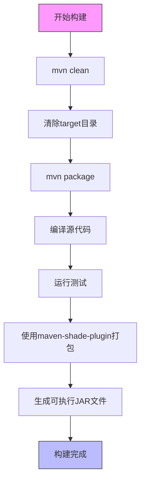
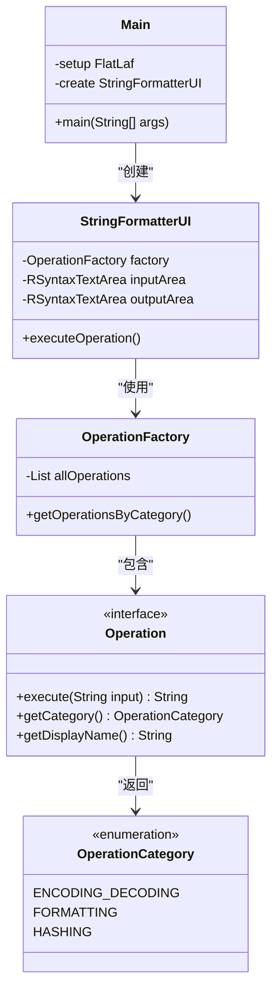

# 构建命令

<cite>
**Referenced Files in This Document**  
- [pom.xml](file://pom.xml)
- [CLAUDE.md](file://CLAUDE.md)
- [README.md](file://README.md)
- [Main.java](file://src/main/java/org/oxff/Main.java)
</cite>

## 目录
1. [简介](#简介)
2. [核心构建命令详解](#核心构建命令详解)
3. [不同开发阶段的构建策略](#不同开发阶段的构建策略)
4. [构建过程与项目结构](#构建过程与项目结构)
5. [常见问题与故障排除](#常见问题与故障排除)

## 简介
本项目是一个基于Java Swing的字符串格式化、编解码和数据提取工具，使用Maven作为构建工具和依赖管理器。本文档详细说明了项目构建所使用的Maven命令，包括`mvn clean package`、`mvn exec:java`等核心命令的使用方法、适用场景和执行结果。通过结合CLAUDE.md和README.md中的示例，我们将深入解析每个命令在不同开发阶段的应用策略，帮助开发者高效地进行项目构建和运行。

**Section sources**
- [CLAUDE.md](file://CLAUDE.md#L1-L72)
- [README.md](file://README.md#L1-L260)

## 核心构建命令详解

### mvn clean package 命令
`mvn clean package`是项目构建的核心命令，用于清理并打包项目生成可执行JAR文件。该命令执行两个主要阶段：

1. **clean阶段**：清除`target`目录，删除之前构建生成的所有文件，确保构建环境的干净。
2. **package阶段**：编译源代码，运行测试，并使用maven-shade-plugin打包成可执行JAR文件。

根据pom.xml配置，项目使用maven-shade-plugin插件在package阶段创建可执行JAR文件，并将`org.oxff.Main`类设置为主类。构建完成后，可执行JAR文件将生成在`target/`目录下，文件名为`uiTools-1.1.8.jar`。

```bash
# Clean and build the project
mvn clean package
```

**Section sources**
- [pom.xml](file://pom.xml#L1-L106)
- [CLAUDE.md](file://CLAUDE.md#L13-L15)
- [README.md](file://README.md#L63-L65)

### mvn exec:java 命令
`mvn exec:java`命令允许直接运行应用程序，无需先打包成JAR文件。通过`-Dexec.mainClass`参数指定主类，Maven会直接执行该类的main方法。

```bash
# Run the application
mvn exec:java -Dexec.mainClass="org.oxff.Main"
```

此命令特别适用于开发阶段的快速测试和调试，开发者可以在修改代码后立即运行应用程序，无需经历完整的打包过程。根据Main.java文件，应用程序入口点设置了FlatLaf现代化界面主题，并创建了StringFormatterUI主界面。

**Section sources**
- [CLAUDE.md](file://CLAUDE.md#L16-L18)
- [README.md](file://README.md#L70-L72)
- [Main.java](file://src/main/java/org/oxff/Main.java#L11-L26)

### -DskipTests 参数
`-DskipTests`参数用于跳过测试以加速构建过程。在开发过程中，当开发者专注于功能实现而非测试时，可以使用此参数快速构建项目。

```bash
# Test build (skip tests)
mvn clean package -DskipTests
```

此命令在以下场景中特别有用：
- 快速验证代码编译是否成功
- 在开发过程中频繁构建以测试UI变化
- 当测试环境不完整或测试依赖不可用时

需要注意的是，虽然跳过测试可以加速构建，但在发布版本前必须运行完整的测试套件以确保代码质量。

**Section sources**
- [CLAUDE.md](file://CLAUDE.md#L22-L24)
- [README.md](file://README.md#L215-L217)

## 不同开发阶段的构建策略

### 开发阶段
在开发阶段，推荐使用`mvn exec:java`命令进行快速迭代和调试。此阶段的重点是功能实现和UI调整，频繁的完整构建会降低开发效率。

```bash
# 开发阶段快速运行
mvn exec:java -Dexec.mainClass="org.oxff.Main"
```

当需要测试打包后的JAR文件行为时，可以使用`mvn clean package`命令，但在日常开发中应避免频繁使用。

### 测试阶段
在测试阶段，应使用完整的构建命令运行所有测试：

```bash
# 完整构建并运行测试
mvn clean package
```

此命令确保代码通过所有单元测试和集成测试，验证功能的正确性。根据项目配置，测试阶段会验证JSON格式化、XML处理、编解码操作等核心功能。

### 发布阶段
在发布阶段，项目使用GitHub Actions进行自动化发布。当推送版本标签（v*.*.*）时，自动化流程会：

1. 使用Maven构建JAR文件（包含shade插件创建可执行JAR）
2. 为Linux（deb）、macOS（dmg）和Windows（exe）创建原生包
3. 创建GitHub Release并上传所有构件

发布版本必须通过所有测试，确保代码质量和稳定性。

**Section sources**
- [CLAUDE.md](file://CLAUDE.md#L25-L32)
- [README.md](file://README.md#L63-L72)

## 构建过程与项目结构

### 项目构建流程


**Diagram sources**
- [pom.xml](file://pom.xml#L1-L106)

### 核心组件关系


**Diagram sources**
- [Main.java](file://src/main/java/org/oxff/Main.java#L11-L26)
- [StringFormatterUI.java](file://src/main/java/org/oxff/ui/StringFormatterUI.java)
- [OperationFactory.java](file://src/main/java/org/oxff/core/OperationFactory.java)
- [Operation.java](file://src/main/java/org/oxff/operation/Operation.java)
- [OperationCategory.java](file://src/main/java/org/oxff/core/OperationCategory.java)

## 常见问题与故障排除

### 构建失败
如果`mvn clean package`命令失败，可能的原因包括：
- JDK版本不符合要求（需要JDK 11或更高版本）
- Maven版本过低（需要3.6或更高版本）
- 网络问题导致依赖下载失败

解决方案：
1. 检查JDK版本：`java -version`
2. 检查Maven版本：`mvn -version`
3. 清理Maven本地仓库并重新下载依赖

### 应用程序无法启动
如果应用程序无法启动，可能的原因包括：
- 主类路径错误
- 依赖缺失
- Java版本不兼容

解决方案：
1. 确认`pom.xml`中maven-shade-plugin配置的mainClass正确
2. 检查`target`目录下的JAR文件是否完整
3. 确认Java版本为11或更高

### 跳过测试的风险
虽然`-DskipTests`可以加速构建，但长期跳过测试可能导致：
- 未发现的代码缺陷
- 回归问题
- 集成问题

建议策略：
- 日常开发中可适当跳过测试以提高效率
- 每日构建时运行完整测试套件
- 发布前必须通过所有测试

**Section sources**
- [README.md](file://README.md#L220-L250)
- [CLAUDE.md](file://CLAUDE.md#L1-L72)