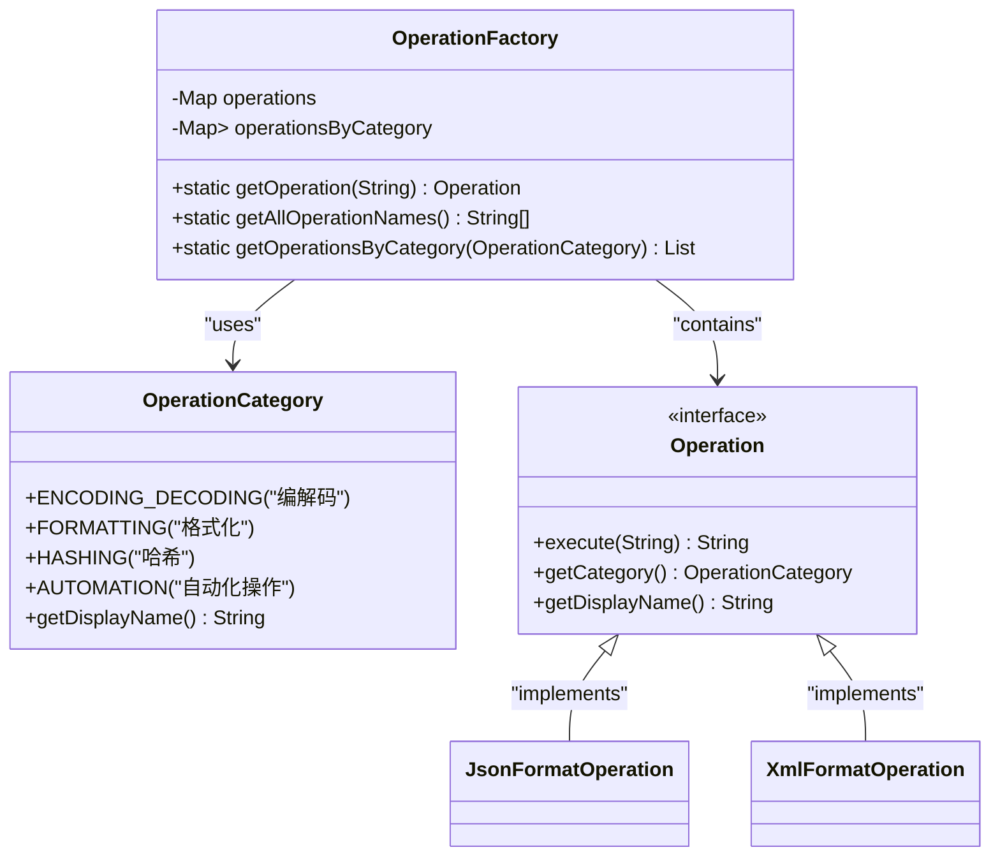
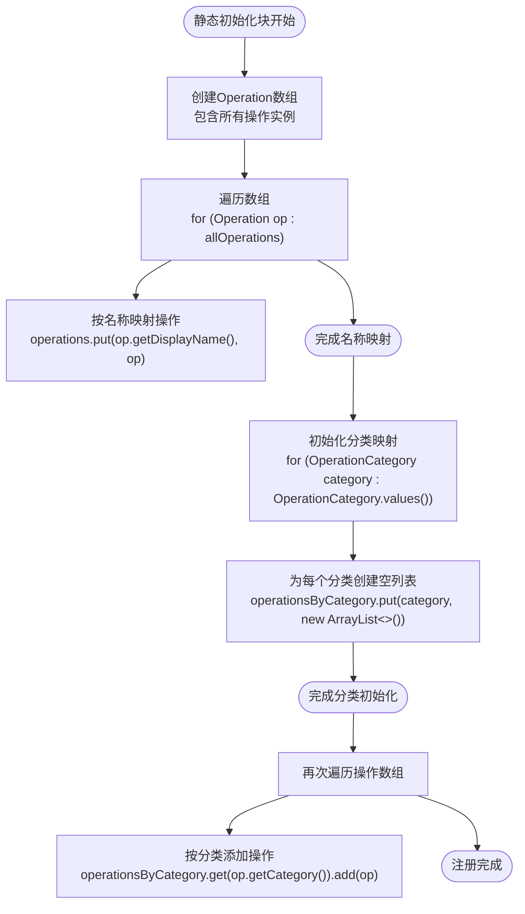
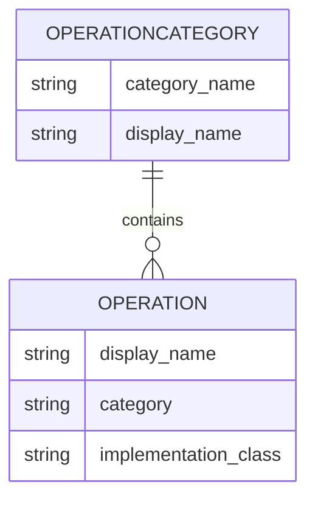
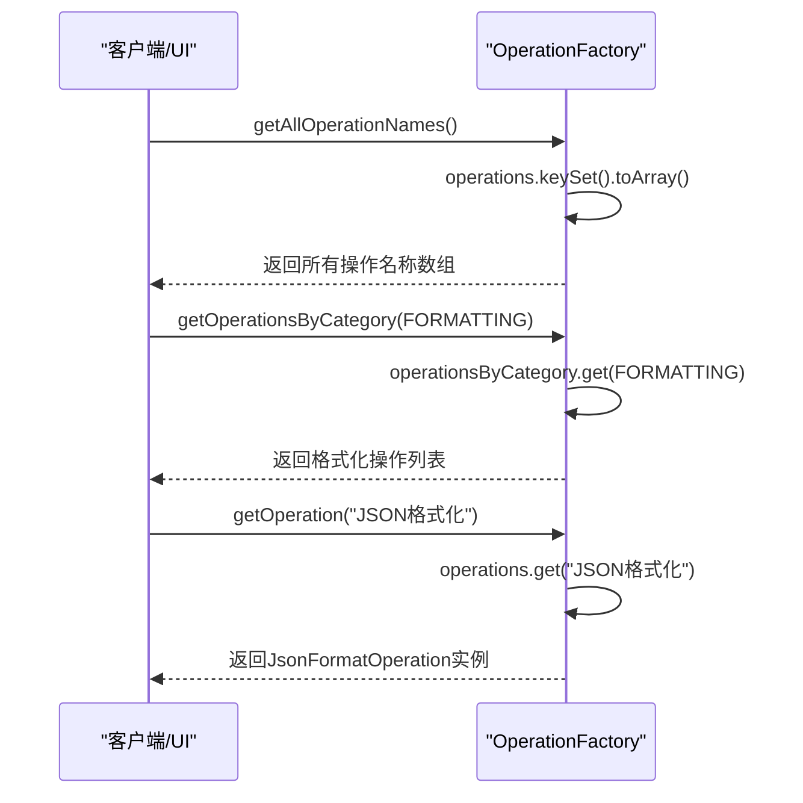
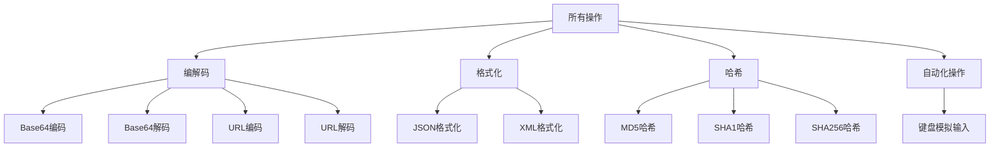
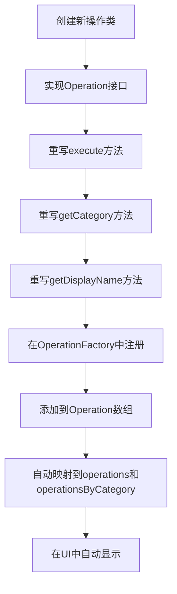

# 在OperationFactory中注册操作

<cite>
**Referenced Files in This Document**   
- [OperationFactory.java](file://src/main/java/org/oxff/core/OperationFactory.java)
- [OperationCategory.java](file://src/main/java/org/oxff/core/OperationCategory.java)
- [Operation.java](file://src/main/java/org/oxff/operation/Operation.java)
- [JsonFormatOperation.java](file://src/main/java/org/oxff/operation/JsonFormatOperation.java)
- [XmlFormatOperation.java](file://src/main/java/org/oxff/operation/XmlFormatOperation.java)
- [StringFormatterUI.java](file://src/main/java/org/oxff/ui/StringFormatterUI.java)
</cite>

## 目录
1. [介绍](#介绍)
2. [核心组件](#核心组件)
3. [注册机制详解](#注册机制详解)
4. [操作分类管理](#操作分类管理)
5. [工厂方法工作原理](#工厂方法工作原理)
6. [UI集成机制](#ui集成机制)
7. [添加新操作的标准流程](#添加新操作的标准流程)
8. [结论](#结论)

## 介绍

OperationFactory是本系统中的核心工厂类，负责管理所有字符串操作的实例化和注册。该工厂采用静态初始化块的方式，在类加载时自动注册所有可用的操作实例。通过HashMap按显示名称映射操作实例，并按OperationCategory组织操作列表，实现了高效的操作查找和分类管理。本文档详细说明了如何在OperationFactory的静态初始化块中注册新操作实例，以及相关的机制和流程。

**Section sources**
- [OperationFactory.java](file://src/main/java/org/oxff/core/OperationFactory.java#L6-L60)

## 核心组件

系统的核心组件包括OperationFactory、OperationCategory和Operation接口。OperationFactory作为工厂类，负责创建和管理所有操作实例。OperationCategory定义了操作的分类枚举，目前包括编解码、格式化、哈希和自动化操作四种类型。Operation接口是所有具体操作实现的基础，规定了操作必须实现的execute、getCategory和getDisplayName三个方法。

**Diagram sources**
- [OperationFactory.java](file://src/main/java/org/oxff/core/OperationFactory.java#L9-L60)
- [OperationCategory.java](file://src/main/java/org/oxff/core/OperationCategory.java#L5-L20)
- [Operation.java](file://src/main/java/org/oxff/operation/Operation.java#L7-L26)

**Section sources**
- [OperationFactory.java](file://src/main/java/org/oxff/core/OperationFactory.java#L6-L60)
- [OperationCategory.java](file://src/main/java/org/oxff/core/OperationCategory.java#L2-L20)
- [Operation.java](file://src/main/java/org/oxff/operation/Operation.java#L7-L26)

## 注册机制详解

OperationFactory使用静态初始化块来注册所有操作实例。在静态代码块中，首先创建一个Operation数组，将所有操作实例化。然后通过遍历该数组，将每个操作按其显示名称作为键存入operations HashMap中。这种机制确保了每个操作都有唯一的显示名称映射，便于后续通过名称快速查找。

**Diagram sources**
- [OperationFactory.java](file://src/main/java/org/oxff/core/OperationFactory.java#L15-L33)

**Section sources**
- [OperationFactory.java](file://src/main/java/org/oxff/core/OperationFactory.java#L15-L33)

## 操作分类管理

除了按显示名称映射操作外，OperationFactory还按OperationCategory组织操作列表。在注册过程中，首先为每个操作分类创建一个空的ArrayList，然后再次遍历所有操作实例，根据每个操作的getCategory()方法返回的分类，将其添加到对应的分类列表中。这种双重映射机制既支持按名称快速查找操作，又支持按分类获取操作列表。

**Diagram sources**
- [OperationFactory.java](file://src/main/java/org/oxff/core/OperationFactory.java#L35-L45)

**Section sources**
- [OperationFactory.java](file://src/main/java/org/oxff/core/OperationFactory.java#L35-L45)
- [OperationCategory.java](file://src/main/java/org/oxff/core/OperationCategory.java#L5-L20)

## 工厂方法工作原理

OperationFactory提供了三个主要的工厂方法：getOperation、getAllOperationNames和getOperationsByCategory。getOperation方法通过操作的显示名称从operations HashMap中获取对应的操作实例，实现了O(1)时间复杂度的快速查找。getAllOperationNames方法返回所有已注册操作的显示名称数组，用于UI中的下拉列表填充。getOperationsByCategory方法则返回指定分类下的所有操作列表，用于按分类展示操作。

**Diagram sources**
- [OperationFactory.java](file://src/main/java/org/oxff/core/OperationFactory.java#L49-L59)
- [StringFormatterUI.java](file://src/main/java/org/oxff/ui/StringFormatterUI.java#L65-L260)

**Section sources**
- [OperationFactory.java](file://src/main/java/org/oxff/core/OperationFactory.java#L49-L59)

## UI集成机制

注册后的操作会自动出现在UI的树形结构中。StringFormatterUI类通过调用OperationFactory的工厂方法来构建操作树。createOperationTree方法首先创建根节点，然后遍历所有操作分类，为每个分类创建节点，并通过getOperationsByCategory方法获取该分类下的所有操作，将它们作为子节点添加到分类节点下。这样就实现了操作在UI中的自动展示。

**Diagram sources**
- [StringFormatterUI.java](file://src/main/java/org/oxff/ui/StringFormatterUI.java#L330-L350)
- [OperationFactory.java](file://src/main/java/org/oxff/core/OperationFactory.java#L57-L59)

**Section sources**
- [StringFormatterUI.java](file://src/main/java/org/oxff/ui/StringFormatterUI.java#L330-L350)

## 添加新操作的标准流程

添加新操作的标准流程包括两个主要步骤：首先创建新的操作类实现Operation接口，然后在OperationFactory的静态初始化块中注册该操作。以JsonFormatOperation和XmlFormatOperation为例，这两个操作都实现了Operation接口，重写了execute、getCategory和getDisplayName方法。在OperationFactory中，它们被实例化并添加到Operation数组中，从而自动完成注册。

**Diagram sources**
- [JsonFormatOperation.java](file://src/main/java/org/oxff/operation/JsonFormatOperation.java#L15-L35)
- [XmlFormatOperation.java](file://src/main/java/org/oxff/operation/XmlFormatOperation.java#L18-L43)
- [OperationFactory.java](file://src/main/java/org/oxff/core/OperationFactory.java#L15-L33)

**Section sources**
- [JsonFormatOperation.java](file://src/main/java/org/oxff/operation/JsonFormatOperation.java#L15-L35)
- [XmlFormatOperation.java](file://src/main/java/org/oxff/operation/XmlFormatOperation.java#L18-L43)
- [OperationFactory.java](file://src/main/java/org/oxff/core/OperationFactory.java#L15-L33)

## 结论

OperationFactory通过静态初始化块实现了操作的自动注册机制，使用HashMap按显示名称映射操作实例，并按OperationCategory组织操作列表。新操作必须在Operation数组中实例化，才能被自动添加到operations和operationsByCategory两个映射中。注册后操作将自动出现在UI树形结构中，实现了高度的自动化和可扩展性。通过getOperation、getAllOperationNames和getOperationsByCategory等工厂方法，系统能够高效地管理和访问所有操作实例。