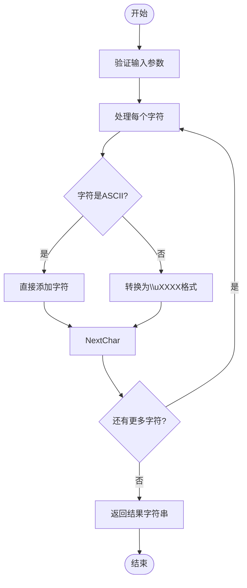
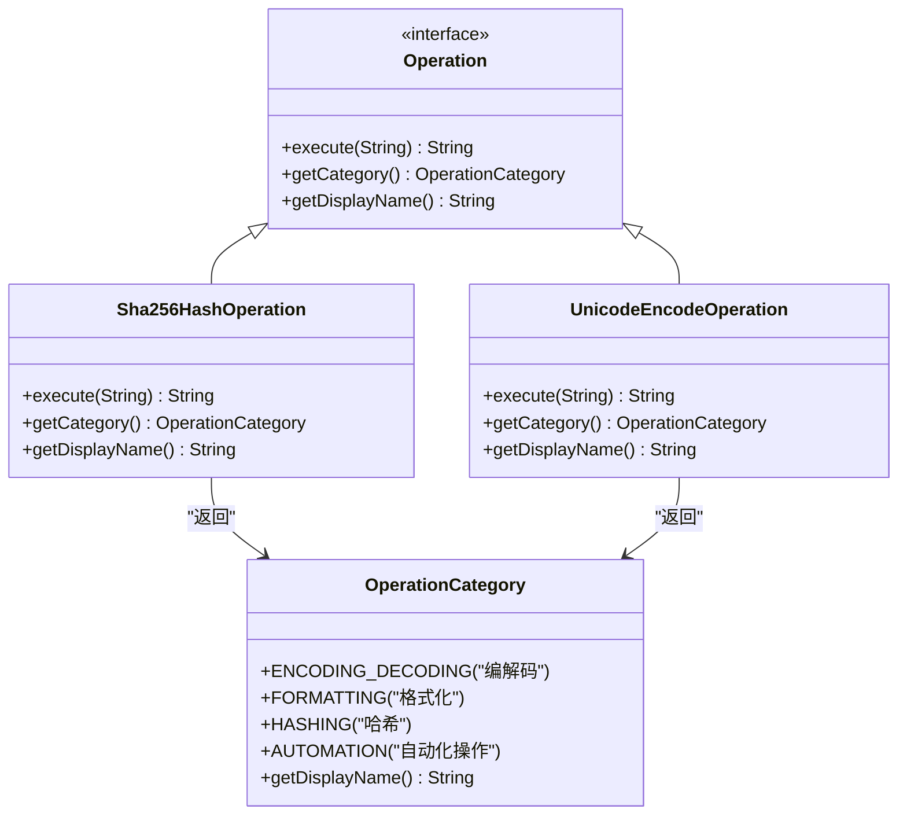
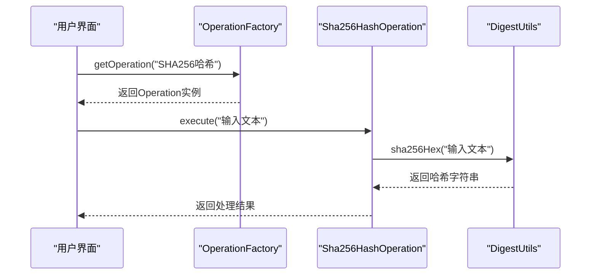
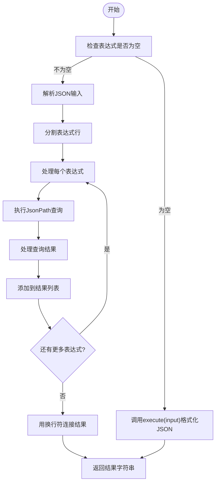

# 实现Operation接口

<cite>
**本文档中引用的文件**   
- [Operation.java](file://src/main/java/org/oxff/operation/Operation.java)
- [Sha256HashOperation.java](file://src/main/java/org/oxff/operation/Sha256HashOperation.java)
- [UnicodeEncodeOperation.java](file://src/main/java/org/oxff/operation/UnicodeEncodeOperation.java)
- [JsonFormatOperation.java](file://src/main/java/org/oxff/operation/JsonFormatOperation.java)
- [OperationCategory.java](file://src/main/java/org/oxff/core/OperationCategory.java)
- [StringFormatterUI.java](file://src/main/java/org/oxff/ui/StringFormatterUI.java)
</cite>

## 目录
1. [简介](#简介)
2. [核心方法实现](#核心方法实现)
3. [标准实现模式](#标准实现模式)
4. [表达式功能支持](#表达式功能支持)
5. [类实现模板](#类实现模板)
6. [异常处理最佳实践](#异常处理最佳实践)
7. [用户界面集成](#用户界面集成)

## 简介
`Operation`接口是字符串处理工具的核心，定义了所有字符串操作必须实现的三个核心方法。该接口位于`org.oxff.operation`包中，为各种字符串转换、格式化和编码操作提供了统一的契约。通过实现此接口，开发人员可以轻松扩展工具功能，添加新的操作类型，同时保持一致的用户体验和代码结构。

**Section sources**
- [Operation.java](file://src/main/java/org/oxff/operation/Operation.java#L7-L26)

## 核心方法实现

### execute(String input)方法的字符串处理逻辑
`execute(String input)`方法是`Operation`接口的核心，负责执行具体的字符串转换逻辑。该方法接收一个输入字符串并返回处理结果。实现时需要根据操作类型对输入字符串进行相应的处理。

在`Sha256HashOperation`中，该方法使用Apache Commons Codec库的`DigestUtils.sha256Hex()`方法计算输入字符串的SHA-256哈希值。而在`UnicodeEncodeOperation`中，方法遍历输入字符串的每个字符，对于ASCII字符直接保留，对于非ASCII字符则转换为`\uXXXX`格式的Unicode转义序列。



**Diagram sources**
- [UnicodeEncodeOperation.java](file://src/main/java/org/oxff/operation/UnicodeEncodeOperation.java#L7-L30)

**Section sources**
- [Sha256HashOperation.java](file://src/main/java/org/oxff/operation/Sha256HashOperation.java#L8-L23)
- [UnicodeEncodeOperation.java](file://src/main/java/org/oxff/operation/UnicodeEncodeOperation.java#L7-L30)

### getCategory()方法的分类返回机制
`getCategory()`方法返回一个`OperationCategory`枚举值，用于确定操作在用户界面中的分类位置。`OperationCategory`枚举定义了四种分类：编解码、格式化、哈希和自动化操作。

当实现`getCategory()`方法时，需要根据操作的功能选择合适的分类。例如，`Sha256HashOperation`返回`OperationCategory.HASHING`，而`UnicodeEncodeOperation`返回`OperationCategory.ENCODING_DECODING`。这些分类值在UI中用于组织操作树，使用户能够按类别浏览和选择操作。



**Diagram sources**
- [OperationCategory.java](file://src/main/java/org/oxff/core/OperationCategory.java#L5-L20)
- [Operation.java](file://src/main/java/org/oxff/operation/Operation.java#L7-L26)

**Section sources**
- [Sha256HashOperation.java](file://src/main/java/org/oxff/operation/Sha256HashOperation.java#L14-L17)
- [UnicodeEncodeOperation.java](file://src/main/java/org/oxff/operation/UnicodeEncodeOperation.java#L21-L24)

### getDisplayName()方法的显示名称提供
`getDisplayName()`方法返回一个用户友好的显示名称，该名称将在用户界面中显示给用户。与类名或技术名称不同，显示名称应该是中文的、描述性的，并且易于理解。

实现此方法时，应提供一个简洁明了的名称，准确描述操作的功能。例如，`Sha256HashOperation`返回"SHA256哈希"，`UnicodeEncodeOperation`返回"Unicode编码"。这些名称直接显示在操作选择下拉框和操作树中，为用户提供直观的操作识别。

**Section sources**
- [Sha256HashOperation.java](file://src/main/java/org/oxff/operation/Sha256HashOperation.java#L20-L23)
- [UnicodeEncodeOperation.java](file://src/main/java/org/oxff/operation/UnicodeEncodeOperation.java#L27-L30)

## 标准实现模式

### 哈希操作实现模式
哈希操作的实现模式相对简单，主要依赖于第三方库（如Apache Commons Codec）来计算哈希值。`Sha256HashOperation`、`Sha1HashOperation`和`Md5HashOperation`都遵循相同的模式：在`execute`方法中调用相应的哈希函数，返回十六进制格式的哈希字符串。



**Diagram sources**
- [Sha256HashOperation.java](file://src/main/java/org/oxff/operation/Sha256HashOperation.java#L8-L23)
- [StringFormatterUI.java](file://src/main/java/org/oxff/ui/StringFormatterUI.java#L395-L451)

### 编解码操作实现模式
编解码操作的实现通常涉及字符集处理和编码转换。以`UnicodeEncodeOperation`为例，其实现模式包括：遍历输入字符串的每个字符，检查字符的Unicode值，对于非ASCII字符生成相应的`\uXXXX`转义序列。`Base64EncodeOperation`和`UrlEncodeOperation`则直接使用Java标准库或第三方库提供的编码方法。

**Section sources**
- [UnicodeEncodeOperation.java](file://src/main/java/org/oxff/operation/UnicodeEncodeOperation.java#L7-L30)
- [Base64EncodeOperation.java](file://src/main/java/org/oxff/operation/Base64EncodeOperation.java#L10-L25)

## 表达式功能支持

### 支持表达式功能的操作重载
对于支持表达式功能的操作，如`JsonFormatOperation`和`XmlFormatOperation`，需要正确重载`execute`方法以支持`execute(String input, String expressions)`签名。这种重载方法允许用户输入JSONPath或XPath表达式来提取特定数据。

在`JsonFormatOperation`中，`execute(String input, String expressions)`方法首先验证JSON格式，然后解析表达式字符串（每行一个表达式），使用JsonPath库执行每个表达式并收集结果。如果表达式为空，则回退到基本的`execute(String input)`方法进行格式化。



**Diagram sources**
- [JsonFormatOperation.java](file://src/main/java/org/oxff/operation/JsonFormatOperation.java#L15-L122)

**Section sources**
- [JsonFormatOperation.java](file://src/main/java/org/oxff/operation/JsonFormatOperation.java#L15-L122)

### 用户界面中的表达式处理
在用户界面中，`StringFormatterUI`类通过反射机制调用重载的`execute`方法。当检测到选择了`JsonFormatOperation`或`XmlFormatOperation`并且提供了表达式输入时，UI会尝试通过反射获取并调用`execute(String, String)`方法。如果该方法不存在，则回退到基本的`execute(String)`方法。

**Section sources**
- [StringFormatterUI.java](file://src/main/java/org/oxff/ui/StringFormatterUI.java#L395-L451)

## 类实现模板
以下是实现`Operation`接口的标准模板：

```java
package org.oxff.operation;

import org.oxff.core.OperationCategory;

/**
 * [操作功能描述]
 */
public class [OperationName] implements Operation {
    @Override
    public String execute(String input) {
        // 实现具体的字符串处理逻辑
        // 包括输入验证、异常处理和结果返回
        return processedResult;
    }
    
    @Override
    public OperationCategory getCategory() {
        // 返回适当的操作分类
        return OperationCategory.[CATEGORY];
    }
    
    @Override
    public String getDisplayName() {
        // 返回用户友好的中文显示名称
        return "[显示名称]";
    }
}
```

开发者可以根据具体需求填充模板中的占位符，实现新的操作功能。

## 异常处理最佳实践
在实现`Operation`接口时，应遵循以下异常处理最佳实践：

1. **捕获特定异常**：针对不同的操作类型捕获特定的异常类型，而不是使用通用的`Exception`。
2. **提供有意义的错误信息**：在返回错误消息时，包含具体的错误原因，帮助用户理解问题所在。
3. **保持方法契约**：即使发生异常，也应返回一个字符串结果，而不是抛出异常，以保持接口契约的一致性。
4. **记录详细日志**：在捕获异常时，记录详细的错误信息和堆栈跟踪，便于调试和问题排查。

例如，在`Base64DecodeOperation`中，实现捕获`Exception`并返回包含错误消息的字符串，而不是让异常传播到调用方。

**Section sources**
- [Base64DecodeOperation.java](file://src/main/java/org/oxff/operation/Base64DecodeOperation.java#L10-L30)
- [JsonFormatOperation.java](file://src/main/java/org/oxff/operation/JsonFormatOperation.java#L15-L122)

## 用户界面集成
`Operation`接口的实现与用户界面紧密集成。`OperationFactory`类在静态初始化块中创建所有操作的实例，并通过`getOperation()`方法提供操作实例。`StringFormatterUI`使用`OperationFactory`获取操作实例，并在操作树中显示操作的分类和显示名称。

操作树的构建使用`OperationCategory`的`getDisplayName()`方法作为分类节点的文本，使用`Operation`的`getDisplayName()`方法作为操作节点的文本，实现了统一的界面展示。

```mermaid
graph TB
subgraph "用户界面"
UI[用户界面]
Tree[操作树]
end
subgraph "操作工厂"
Factory[OperationFactory]
Operations[操作实例集合]
end
subgraph "核心操作"
Operation[Operation接口]
Implementations[具体实现类]
end
UI --> Factory : 获取操作
Factory --> Operations : 存储实例
Operations --> Implementations : 创建实例
Implementations --> Operation : 实现接口
Tree --> Implementations : 显示名称
Tree --> Operations : 分类信息
```

**Diagram sources**
- [OperationFactory.java](file://src/main/java/org/oxff/core/OperationFactory.java#L6-L60)
- [StringFormatterUI.java](file://src/main/java/org/oxff/ui/StringFormatterUI.java#L297-L317)

**Section sources**
- [OperationFactory.java](file://src/main/java/org/oxff/core/OperationFactory.java#L6-L60)
- [StringFormatterUI.java](file://src/main/java/org/oxff/ui/StringFormatterUI.java#L297-L317)