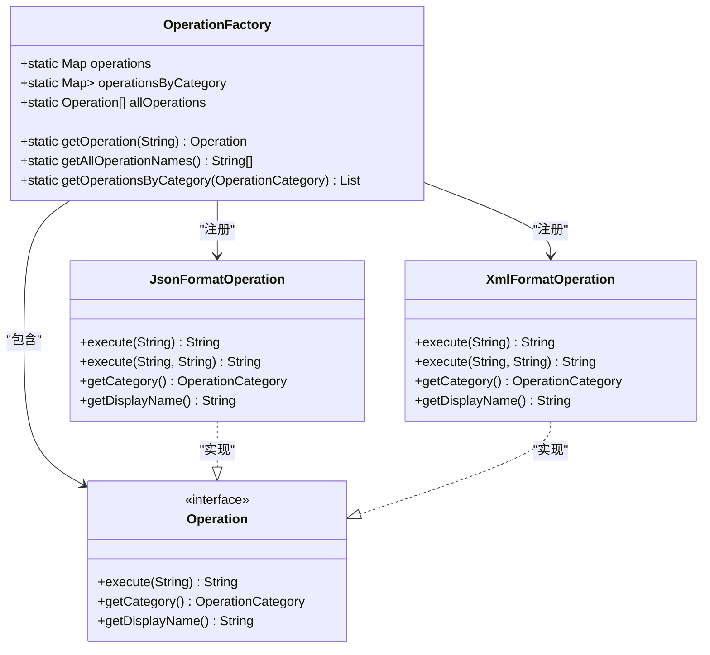
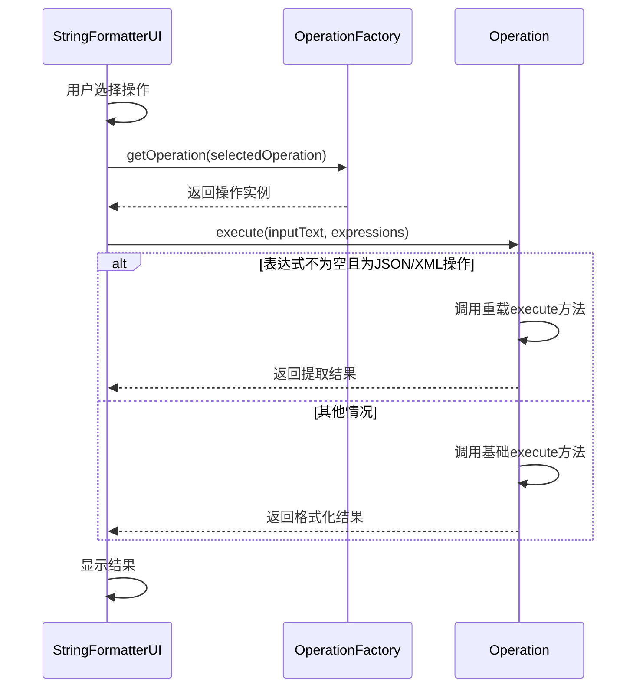
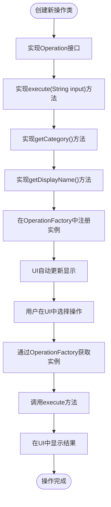

# 添加新操作

<cite>
**Referenced Files in This Document**   
- [Operation.java](file://src/main/java/org/oxff/operation/Operation.java)
- [OperationFactory.java](file://src/main/java/org/oxff/core/OperationFactory.java)
- [OperationCategory.java](file://src/main/java/org/oxff/core/OperationCategory.java)
- [JsonFormatOperation.java](file://src/main/java/org/oxff/operation/JsonFormatOperation.java)
- [XmlFormatOperation.java](file://src/main/java/org/oxff/operation/XmlFormatOperation.java)
- [StringFormatterUI.java](file://src/main/java/org/oxff/ui/StringFormatterUI.java)
</cite>

## 目录
1. [简介](#简介)
2. [核心接口实现](#核心接口实现)
3. [操作注册机制](#操作注册机制)
4. [重载方法实现](#重载方法实现)
5. [完整实现示例](#完整实现示例)
6. [UI集成原理](#ui集成原理)

## 简介
本指南详细说明了如何为uiTools应用程序添加新的功能操作。通过实现`Operation`接口并将其注册到`OperationFactory`中，开发者可以轻松扩展应用程序的功能。新添加的操作将自动出现在用户界面中，无需额外的UI配置工作。本文档将指导开发者完成从创建操作类到在UI中显示的完整流程。

## 核心接口实现

在uiTools中，所有字符串操作都必须实现`Operation`接口。该接口定义了三个核心方法，每个方法都有特定的职责和实现要求。

### execute(String input)方法
`execute(String input)`方法是操作的核心处理逻辑，负责接收输入字符串并返回处理结果。该方法的实现需要考虑异常处理和错误信息的返回，确保操作的健壮性。

**Section sources**
- [Operation.java](file://src/main/java/org/oxff/operation/Operation.java#L13-L13)

### getCategory()方法
`getCategory()`方法决定了操作在UI中的分类位置。通过返回适当的`OperationCategory`枚举值，新操作将被正确地组织在相应的分类节点下，保持UI的整洁和有序。

**Section sources**
- [Operation.java](file://src/main/java/org/oxff/operation/Operation.java#L19-L19)

### getDisplayName()方法
`getDisplayName()`方法提供了操作在UI中的显示名称。这个名称将直接显示在操作树和下拉列表中，因此应该使用清晰、描述性的中文名称，便于用户理解和选择。

**Section sources**
- [Operation.java](file://src/main/java/org/oxff/operation/Operation.java#L25-L25)

## 操作注册机制

新创建的操作类需要在`OperationFactory`的静态初始化块中进行注册，才能在UI中自动显示。注册过程是通过创建操作实例并将其添加到内部映射中完成的。

**Diagram sources**
- [OperationFactory.java](file://src/main/java/org/oxff/core/OperationFactory.java#L6-L60)
- [Operation.java](file://src/main/java/org/oxff/operation/Operation.java#L7-L26)

**Section sources**
- [OperationFactory.java](file://src/main/java/org/oxff/core/OperationFactory.java#L6-L60)

## 重载方法实现

为了支持更复杂的功能，如表达式处理，操作类可以提供`execute`方法的重载版本。这种设计模式允许操作在不同场景下表现出不同的行为。

### 方法签名规范
重载的`execute`方法应该保持一致的命名约定，通常接受额外的参数来处理特定功能。在uiTools中，`JsonFormatOperation`和`XmlFormatOperation`都实现了接受表达式参数的重载方法。

**Diagram sources**
- [StringFormatterUI.java](file://src/main/java/org/oxff/ui/StringFormatterUI.java#L395-L451)
- [JsonFormatOperation.java](file://src/main/java/org/oxff/operation/JsonFormatOperation.java#L45-L122)
- [XmlFormatOperation.java](file://src/main/java/org/oxff/operation/XmlFormatOperation.java#L45-L126)

**Section sources**
- [JsonFormatOperation.java](file://src/main/java/org/oxff/operation/JsonFormatOperation.java#L45-L122)
- [XmlFormatOperation.java](file://src/main/java/org/oxff/operation/XmlFormatOperation.java#L45-L126)

## 完整实现示例

创建一个新操作的完整流程包括实现`Operation`接口、在`OperationFactory`中注册实例，以及确保UI能够正确显示和调用该操作。

### 创建操作类
首先，创建一个新的Java类并实现`Operation`接口。类名应遵循驼峰命名法，以"Operation"结尾，如`MyCustomOperation`。

### 实现核心方法
实现三个核心方法：`execute`处理主要逻辑，`getCategory`返回适当的分类，`getDisplayName`提供用户友好的显示名称。

### 注册到工厂
在`OperationFactory`的静态初始化块中添加新操作的实例，确保它被正确地注册到系统中。

**Section sources**
- [Operation.java](file://src/main/java/org/oxff/operation/Operation.java#L7-L26)
- [OperationFactory.java](file://src/main/java/org/oxff/core/OperationFactory.java#L6-L60)

## UI集成原理

新操作在UI中的显示和调用是通过`StringFormatterUI`类实现的。该类负责创建操作树、处理用户交互和执行选定的操作。

### 操作树创建
`StringFormatterUI`使用`OperationFactory`提供的API来获取所有操作，并根据分类构建操作树。每个操作节点都存储了对应的操作实例，便于后续调用。

### 执行流程
当用户选择一个操作并点击执行按钮时，UI会从`OperationFactory`获取对应的操作实例，并调用其`execute`方法。执行结果随后显示在输出区域。

**Diagram sources**
- [StringFormatterUI.java](file://src/main/java/org/oxff/ui/StringFormatterUI.java#L297-L317)
- [OperationFactory.java](file://src/main/java/org/oxff/core/OperationFactory.java#L49-L51)

**Section sources**
- [StringFormatterUI.java](file://src/main/java/org/oxff/ui/StringFormatterUI.java#L297-L317)
- [OperationFactory.java](file://src/main/java/org/oxff/core/OperationFactory.java#L49-L51)