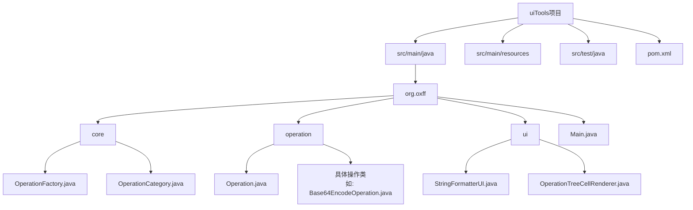
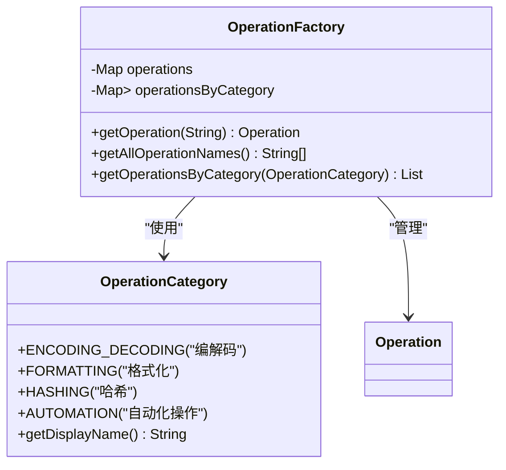
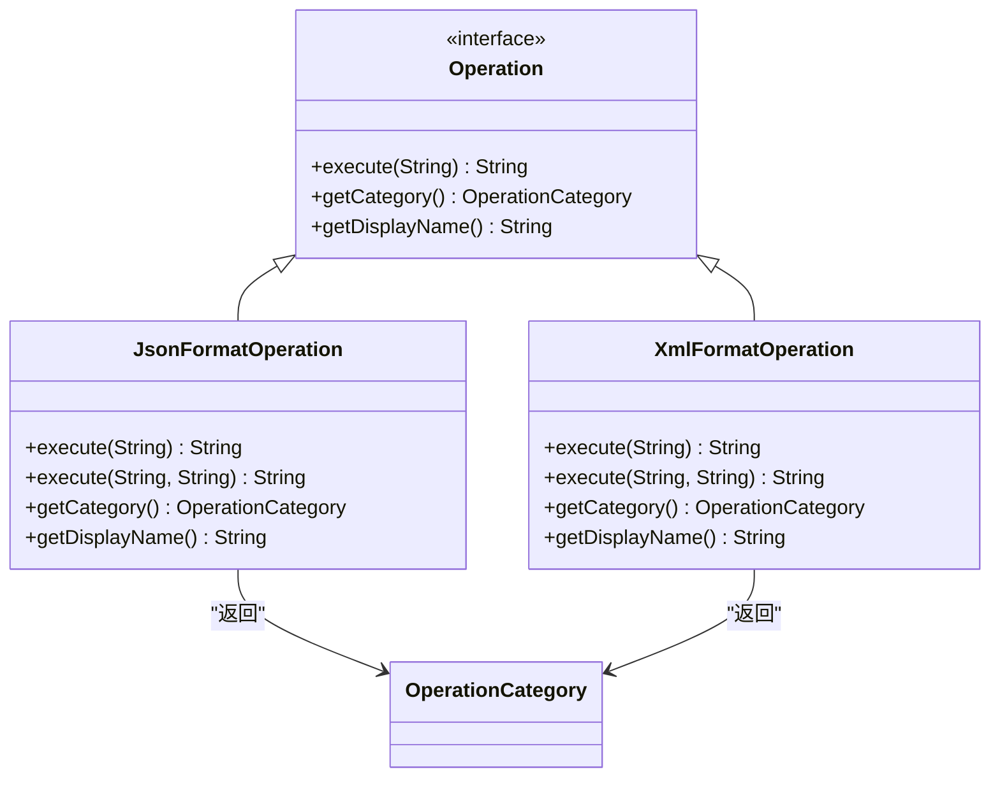
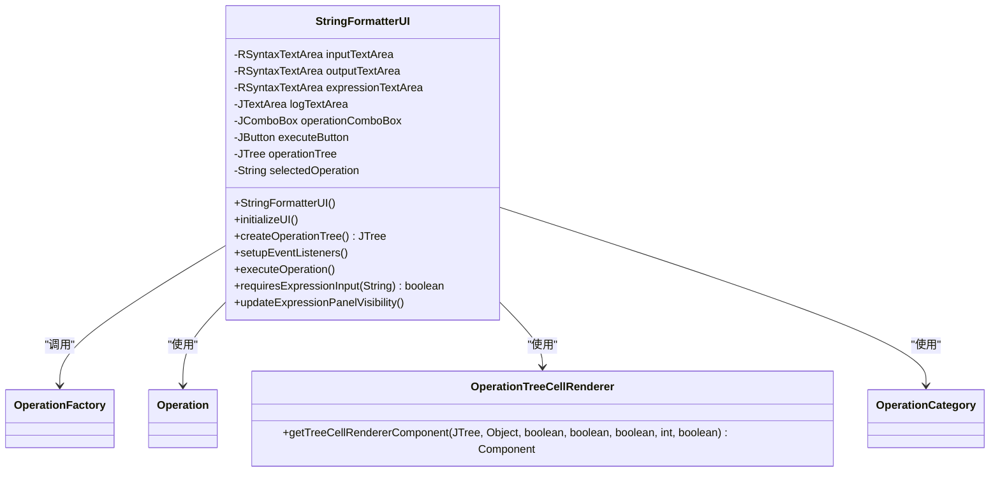
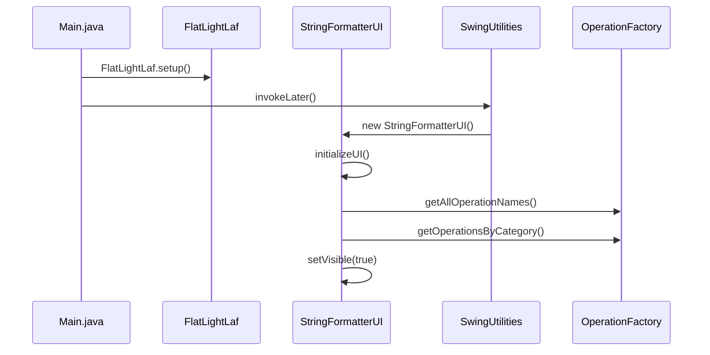
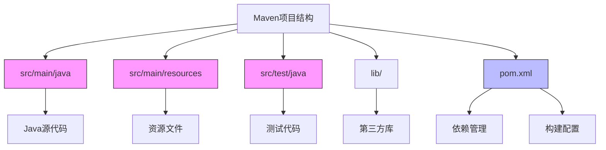

# 项目结构

<cite>
**Referenced Files in This Document**   
- [Main.java](file://src/main/java/org/oxff/Main.java)
- [OperationFactory.java](file://src/main/java/org/oxff/core/OperationFactory.java)
- [OperationCategory.java](file://src/main/java/org/oxff/core/OperationCategory.java)
- [Operation.java](file://src/main/java/org/oxff/operation/Operation.java)
- [StringFormatterUI.java](file://src/main/java/org/oxff/ui/StringFormatterUI.java)
- [JsonFormatOperation.java](file://src/main/java/org/oxff/operation/JsonFormatOperation.java)
- [XmlFormatOperation.java](file://src/main/java/org/oxff/operation/XmlFormatOperation.java)
- [OperationTreeCellRenderer.java](file://src/main/java/org/oxff/ui/OperationTreeCellRenderer.java)
- [pom.xml](file://pom.xml)
</cite>

## 目录

1. [项目结构](#项目结构)
2. [核心包分析](#核心包分析)
3. [操作包分析](#操作包分析)
4. [用户界面包分析](#用户界面包分析)
5. [程序入口点](#程序入口点)
6. [Maven项目结构](#maven项目结构)
7. [整体架构图](#整体架构图)

## 项目结构

本项目遵循Maven标准目录结构，采用分层架构设计，将核心控制、具体操作实现和用户界面组件分离，实现了良好的模块化和可维护性。项目主要分为三个核心包：core、operation和ui，分别负责不同的职责。



**Diagram sources**
- [pom.xml](file://pom.xml#L1-L106)

**Section sources**
- [pom.xml](file://pom.xml#L1-L106)

## 核心包分析

core包位于`src/main/java/org/oxff/core/`目录下，包含项目的核心控制类，负责操作的管理和分类。该包通过工厂模式和枚举类型实现了操作的集中管理和分类组织。

### OperationFactory类

OperationFactory类是操作工厂，采用单例模式（静态工厂）实现，负责创建和管理所有操作实例。它在静态初始化块中预加载所有操作，提高了运行时性能。



**Diagram sources**
- [OperationFactory.java](file://src/main/java/org/oxff/core/OperationFactory.java#L6-L60)
- [OperationCategory.java](file://src/main/java/org/oxff/core/OperationCategory.java#L3-L20)

**Section sources**
- [OperationFactory.java](file://src/main/java/org/oxff/core/OperationFactory.java#L6-L60)
- [OperationCategory.java](file://src/main/java/org/oxff/core/OperationCategory.java#L3-L20)

## 操作包分析

operation包位于`src/main/java/org/oxff/operation/`目录下，存放所有实现具体功能的操作类。这些类实现了统一的Operation接口，遵循了开闭原则，便于扩展新的操作。

### Operation接口

Operation接口定义了所有操作必须实现的三个方法：execute用于执行操作，getCategory用于获取操作分类，getDisplayName用于获取操作的显示名称。这种设计实现了操作的标准化。



**Diagram sources**
- [Operation.java](file://src/main/java/org/oxff/operation/Operation.java#L7-L26)
- [JsonFormatOperation.java](file://src/main/java/org/oxff/operation/JsonFormatOperation.java#L9-L122)
- [XmlFormatOperation.java](file://src/main/java/org/oxff/operation/XmlFormatOperation.java#L9-L126)

**Section sources**
- [Operation.java](file://src/main/java/org/oxff/operation/Operation.java#L7-L26)
- [JsonFormatOperation.java](file://src/main/java/org/oxff/operation/JsonFormatOperation.java#L9-L122)
- [XmlFormatOperation.java](file://src/main/java/org/oxff/operation/XmlFormatOperation.java#L9-L126)

## 用户界面包分析

ui包位于`src/main/java/org/oxff/ui/`目录下，负责用户界面组件的实现。该包通过Swing框架构建了图形用户界面，并实现了界面组件与业务逻辑的解耦。

### StringFormatterUI类

StringFormatterUI类是主界面类，继承自JFrame，构建了应用程序的主窗口。它通过组合模式组织了各种UI组件，并通过事件监听器处理用户交互。



**Diagram sources**
- [StringFormatterUI.java](file://src/main/java/org/oxff/ui/StringFormatterUI.java#L29-L513)
- [OperationTreeCellRenderer.java](file://src/main/java/org/oxff/ui/OperationTreeCellRenderer.java#L3-L42)

**Section sources**
- [StringFormatterUI.java](file://src/main/java/org/oxff/ui/StringFormatterUI.java#L29-L513)
- [OperationTreeCellRenderer.java](file://src/main/java/org/oxff/ui/OperationTreeCellRenderer.java#L3-L42)

## 程序入口点

Main.java是程序的入口点，位于`src/main/java/org/oxff/`目录下。它通过main方法启动应用程序，设置了界面外观并创建了主界面实例。



**Diagram sources**
- [Main.java](file://src/main/java/org/oxff/Main.java#L1-L26)
- [StringFormatterUI.java](file://src/main/java/org/oxff/ui/StringFormatterUI.java#L29-L513)
- [OperationFactory.java](file://src/main/java/org/oxff/core/OperationFactory.java#L6-L60)

**Section sources**
- [Main.java](file://src/main/java/org/oxff/Main.java#L1-L26)

## Maven项目结构

项目遵循Maven标准目录结构，资源文件和测试代码按照约定进行组织。pom.xml文件定义了项目依赖和构建配置。

### 资源文件组织

资源文件存放在`src/main/resources`目录下，虽然当前项目未使用该目录，但按照Maven约定，配置文件、图片等资源应存放于此。

### 测试代码组织

测试代码存放在`src/test/java`目录下，按照与main代码相同的包结构组织，便于测试对应的功能模块。

### 依赖管理

pom.xml文件中定义了项目所需的所有依赖，包括JSON处理、XML处理、编解码、界面美化等库。



**Diagram sources**
- [pom.xml](file://pom.xml#L1-L106)

**Section sources**
- [pom.xml](file://pom.xml#L1-L106)

## 整体架构图

项目采用分层架构设计，各层职责分明，通过清晰的调用关系实现功能。

```mermaid
graph TD
A[用户界面层<br>ui包] --> |调用| B[核心控制层<br>core包]
B --> |管理| C[操作实现层<br>operation包]
C --> |实现| D[Operation接口]
A --> |使用| B
A --> |使用| C
B --> |使用| D
subgraph "用户界面层"
A1[StringFormatterUI]
A2[OperationTreeCellRenderer]
end
subgraph "核心控制层"
B1[OperationFactory]
B2[OperationCategory]
end
subgraph "操作实现层"
C1[JsonFormatOperation]
C2[XmlFormatOperation]
C3[Base64EncodeOperation]
C4[其他操作类]
end
A1 --> B1 : "获取操作列表"
A1 --> B1 : "获取操作实例"
A1 --> B2 : "获取分类信息"
B1 --> C1 : "创建实例"
B1 --> C2 : "创建实例"
B1 --> C3 : "创建实例"
C1 --> D : "实现接口"
C2 --> D : "实现接口"
C3 --> D : "实现接口"
style A fill:#f96,stroke:#333
style B fill:#6f9,stroke:#333
style C fill:#69f,stroke:#333
```

**Diagram sources**
- [Main.java](file://src/main/java/org/oxff/Main.java#L1-L26)
- [OperationFactory.java](file://src/main/java/org/oxff/core/OperationFactory.java#L6-L60)
- [Operation.java](file://src/main/java/org/oxff/operation/Operation.java#L7-L26)
- [StringFormatterUI.java](file://src/main/java/org/oxff/ui/StringFormatterUI.java#L29-L513)

**Section sources**
- [Main.java](file://src/main/java/org/oxff/Main.java#L1-L26)
- [OperationFactory.java](file://src/main/java/org/oxff/core/OperationFactory.java#L6-L60)
- [Operation.java](file://src/main/java/org/oxff/operation/Operation.java#L7-L26)
- [StringFormatterUI.java](file://src/main/java/org/oxff/ui/StringFormatterUI.java#L29-L513)