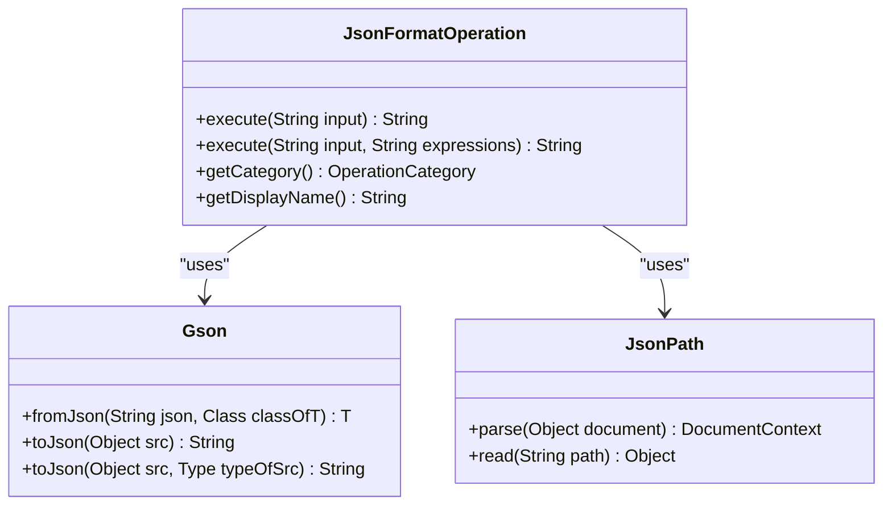
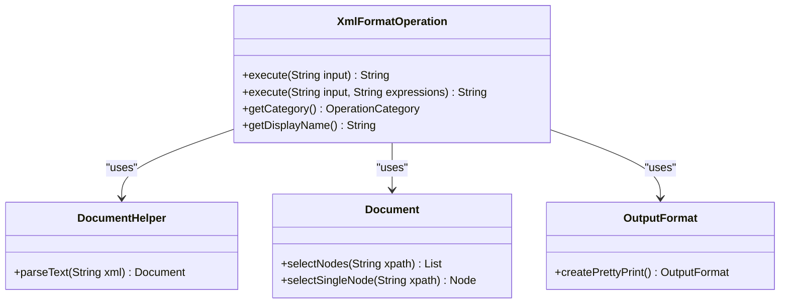
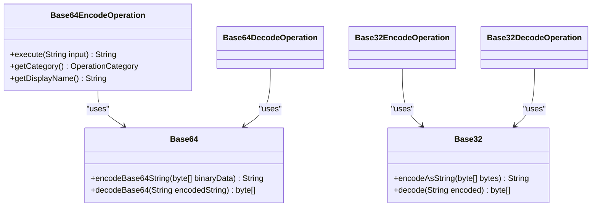
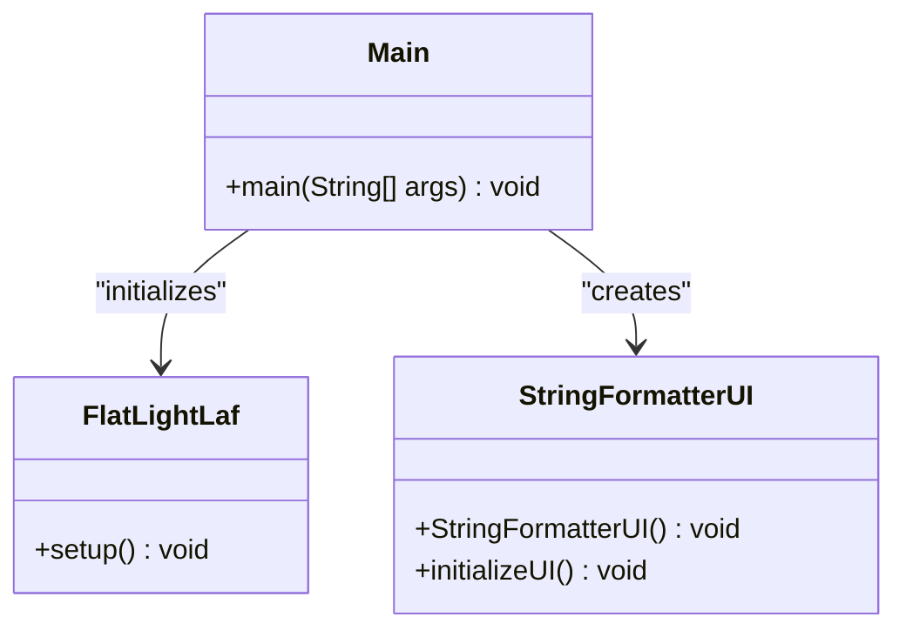
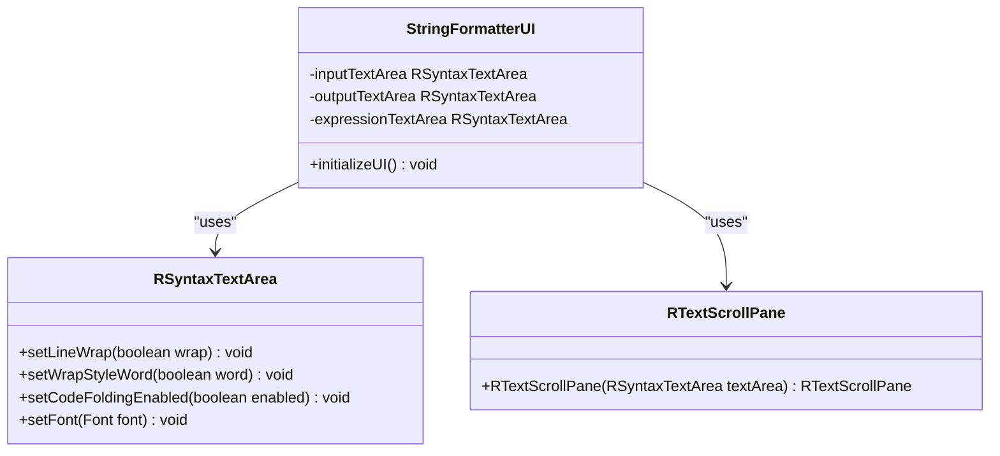
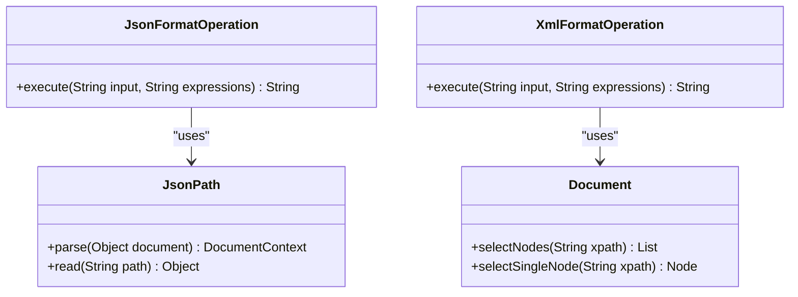
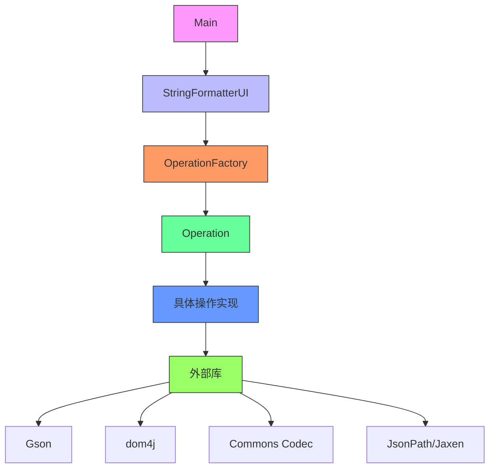
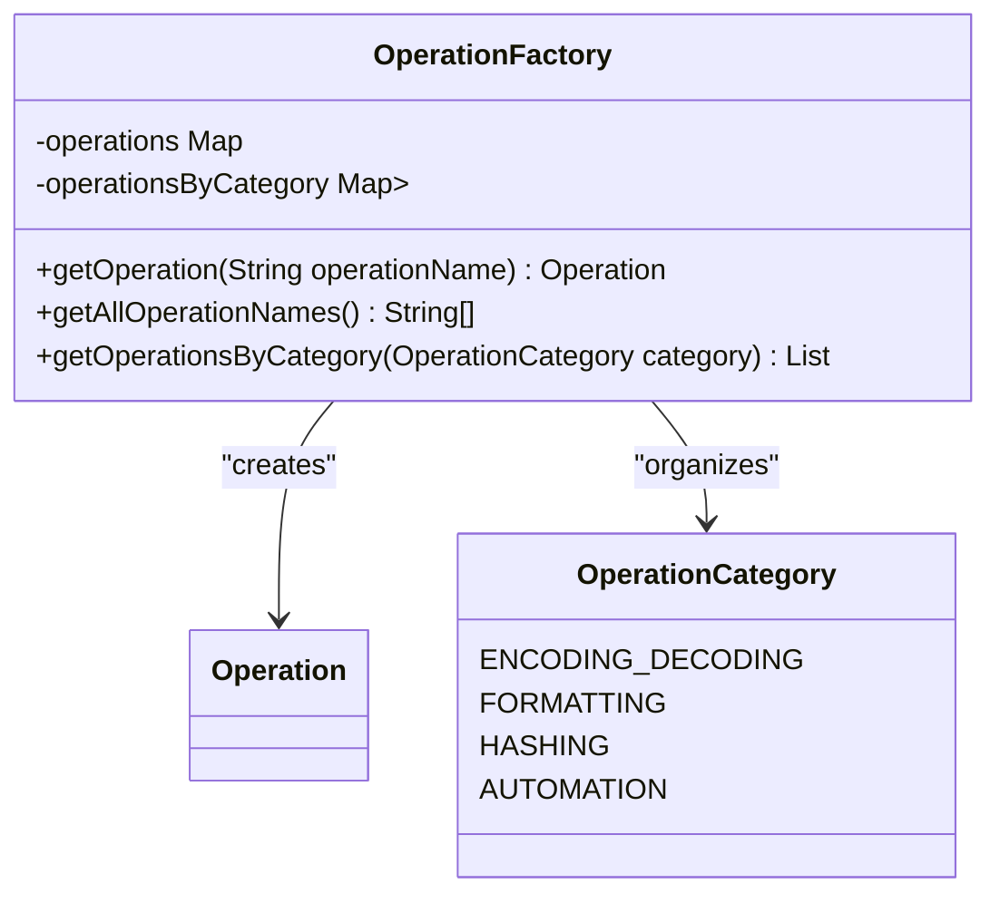
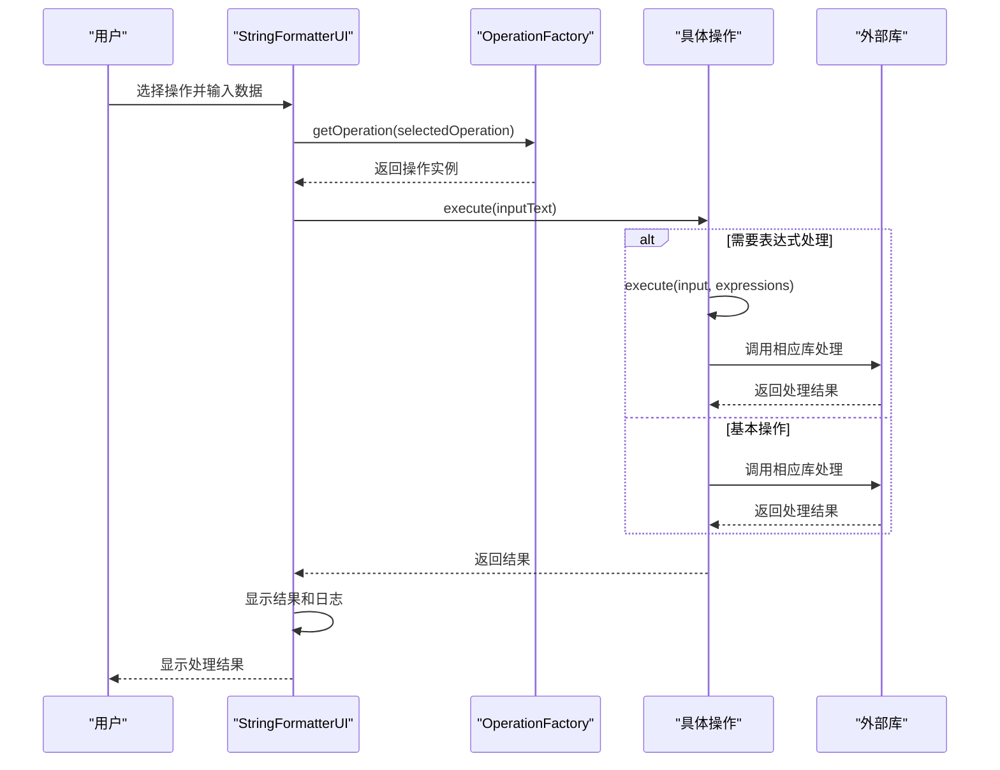
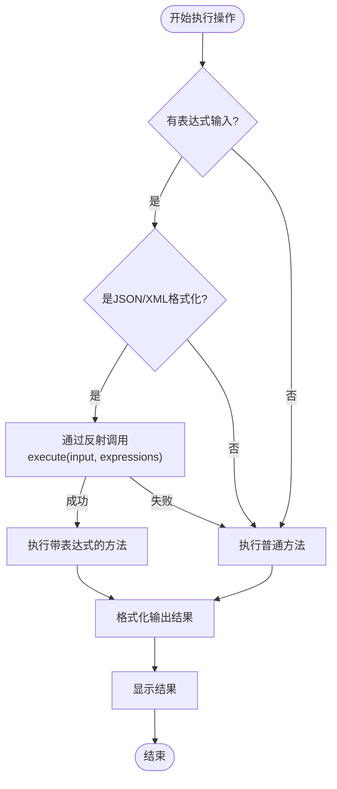

# 技术栈与依赖

<cite>
**Referenced Files in This Document**   
- [pom.xml](file://pom.xml)
- [Main.java](file://src/main/java/org/oxff/Main.java)
- [StringFormatterUI.java](file://src/main/java/org/oxff/ui/StringFormatterUI.java)
- [Operation.java](file://src/main/java/org/oxff/operation/Operation.java)
- [OperationFactory.java](file://src/main/java/org/oxff/core/OperationFactory.java)
- [JsonFormatOperation.java](file://src/main/java/org/oxff/operation/JsonFormatOperation.java)
- [XmlFormatOperation.java](file://src/main/java/org/oxff/operation/XmlFormatOperation.java)
- [Base64EncodeOperation.java](file://src/main/java/org/oxff/operation/Base64EncodeOperation.java)
- [README.md](file://README.md)
</cite>

## 目录
1. [项目概述](#项目概述)
2. [核心技术栈](#核心技术栈)
3. [依赖管理](#依赖管理)
4. [核心组件分析](#核心组件分析)
5. [技术协同工作原理](#技术协同工作原理)
6. [性能与兼容性影响](#性能与兼容性影响)
7. [结论](#结论)

## 项目概述

uiTools项目是一个基于Java Swing的图形界面工具，旨在提供全面的字符串格式化、编解码和数据提取功能。该项目通过集成多种外部库，实现了对JSON、XML、Base64、URL等格式的处理能力，以及MD5、SHA1、SHA256等哈希算法的支持。项目采用模块化设计，通过Maven进行依赖管理，确保了代码的可维护性和扩展性。

**Section sources**
- [README.md](file://README.md#L1-L260)

## 核心技术栈

### Java 11+
项目基于Java 11+开发，选择此版本的原因包括：
- **长期支持（LTS）**: Java 11是长期支持版本，提供了稳定的API和长期的安全更新
- **性能优化**: 相比早期版本，Java 11在JVM性能、垃圾回收和内存管理方面有显著改进
- **模块化系统**: Java 9引入的模块化系统在Java 11中更加成熟，有助于构建更清晰的代码结构
- **API增强**: 包含了HttpClient、Stream API增强等现代Java特性

### Maven构建系统
Maven作为项目的构建和依赖管理工具，提供了以下优势：
- **依赖管理**: 自动下载和管理项目所需的所有外部库
- **构建生命周期**: 提供标准化的构建流程（编译、测试、打包、部署）
- **项目结构标准化**: 强制执行一致的项目目录结构
- **可重复构建**: 确保在不同环境中构建结果的一致性

**Section sources**
- [pom.xml](file://pom.xml#L1-L106)
- [README.md](file://README.md#L100-L105)

### Swing GUI框架
Swing作为Java的标准GUI工具包，为项目提供了：
- **跨平台兼容性**: 在Windows、macOS、Linux等操作系统上保持一致的外观和行为
- **丰富的组件库**: 提供按钮、文本框、树形控件等完整的UI组件
- **可扩展性**: 支持自定义组件和外观主题
- **事件驱动模型**: 简化用户交互处理

### Gson（JSON处理）
Gson库（版本2.10.1）用于JSON数据的序列化和反序列化：
- **功能**: 实现JSON格式化、解析和对象映射
- **集成方式**: 在`JsonFormatOperation`类中用于验证和格式化JSON数据
- **优势**: 轻量级、高性能、易于使用
- **选择原因**: Google开发，社区支持广泛，API简洁



**Diagram sources **
- [JsonFormatOperation.java](file://src/main/java/org/oxff/operation/JsonFormatOperation.java#L15-L122)
- [pom.xml](file://pom.xml#L25-L30)

### dom4j（XML解析）
dom4j库（版本2.1.4）用于XML文档的解析和处理：
- **功能**: 实现XML格式化、XPath查询和文档操作
- **集成方式**: 在`XmlFormatOperation`类中用于解析和格式化XML数据
- **优势**: 高性能、内存效率高、支持XPath查询
- **选择原因**: 功能全面，API设计优雅，支持流式处理



**Diagram sources **
- [XmlFormatOperation.java](file://src/main/java/org/oxff/operation/XmlFormatOperation.java#L18-L126)
- [pom.xml](file://pom.xml#L32-L37)

### Apache Commons Codec（编解码）
Apache Commons Codec库（版本1.16.0）提供各种编解码算法：
- **功能**: 实现Base64、Base32、Hex等编码解码操作
- **集成方式**: 在`Base64EncodeOperation`、`Base32EncodeOperation`等类中使用
- **优势**: 经过充分测试，支持多种编码格式，性能稳定
- **选择原因**: Apache项目，可靠性高，文档完善



**Diagram sources **
- [Base64EncodeOperation.java](file://src/main/java/org/oxff/operation/Base64EncodeOperation.java#L10-L25)
- [pom.xml](file://pom.xml#L39-L44)

### FlatLaf（UI主题美化）
FlatLaf库（版本3.2.5）用于提升Swing应用的视觉体验：
- **功能**: 提供现代化的扁平化UI主题
- **集成方式**: 在`Main`类中通过`FlatLightLaf.setup()`初始化
- **优势**: 现代化外观，支持深色/浅色主题，性能良好
- **选择原因**: 解决了传统Swing应用外观陈旧的问题，提升用户体验



**Diagram sources **
- [Main.java](file://src/main/java/org/oxff/Main.java#L13-L25)
- [pom.xml](file://pom.xml#L46-L51)

### RSyntaxTextArea（语法高亮编辑器）
RSyntaxTextArea库（版本3.3.3）提供带语法高亮的文本编辑功能：
- **功能**: 在输入、输出和表达式区域提供语法高亮和行号显示
- **集成方式**: 在`StringFormatterUI`类中作为`inputTextArea`、`outputTextArea`和`expressionTextArea`的实现
- **优势**: 支持多种编程语言语法高亮，提供代码折叠功能
- **选择原因**: 增强代码可读性，提升用户体验



**Diagram sources **
- [StringFormatterUI.java](file://src/main/java/org/oxff/ui/StringFormatterUI.java#L30-L34)
- [pom.xml](file://pom.xml#L53-L58)

### Jayway JsonPath和Jaxen（表达式引擎）
Jayway JsonPath（版本2.8.0）和Jaxen（版本1.2.0）用于表达式查询：
- **功能**: 支持JSONPath和XPath表达式，实现数据精准提取
- **集成方式**: 在`JsonFormatOperation`和`XmlFormatOperation`中分别用于JSON和XML数据查询
- **优势**: 强大的表达式语言，支持复杂查询条件
- **选择原因**: 行业标准的表达式引擎，功能强大且稳定



**Diagram sources **
- [JsonFormatOperation.java](file://src/main/java/org/oxff/operation/JsonFormatOperation.java#L64-L122)
- [XmlFormatOperation.java](file://src/main/java/org/oxff/operation/XmlFormatOperation.java#L64-L126)
- [pom.xml](file://pom.xml#L60-L65)

## 依赖管理

### pom.xml配置
项目通过`pom.xml`文件管理所有依赖，关键配置包括：

- **Java版本配置**:
```xml
<properties>
    <maven.compiler.source>11</maven.compiler.source>
    <maven.compiler.target>11</maven.compiler.target>
    <maven.compiler.release>11</maven.compiler.release>
</properties>
```

- **依赖声明**:
```xml
<dependencies>
    <!-- JSON处理 -->
    <dependency>
        <groupId>com.google.code.gson</groupId>
        <artifactId>gson</artifactId>
        <version>2.10.1</version>
    </dependency>
    <!-- 其他依赖... -->
</dependencies>
```

- **构建插件**:
```xml
<build>
    <plugins>
        <plugin>
            <groupId>org.apache.maven.plugins</groupId>
            <artifactId>maven-compiler-plugin</artifactId>
            <version>3.11.0</version>
            <configuration>
                <source>11</source>
                <target>11</target>
                <release>11</release>
            </configuration>
        </plugin>
        <!-- 可执行JAR打包插件 -->
        <plugin>
            <groupId>org.apache.maven.plugins</groupId>
            <artifactId>maven-shade-plugin</artifactId>
            <version>3.5.0</version>
            <executions>
                <execution>
                    <phase>package</phase>
                    <goals>
                        <goal>shade</goal>
                    </goals>
                    <configuration>
                        <transformers>
                            <transformer implementation="org.apache.maven.plugins.shade.resource.ManifestResourceTransformer">
                                <mainClass>org.oxff.Main</mainClass>
                            </transformer>
                        </transformers>
                    </configuration>
                </execution>
            </executions>
        </plugin>
    </plugins>
</build>
```

**Section sources**
- [pom.xml](file://pom.xml#L1-L106)

## 核心组件分析

### 架构设计
项目采用清晰的分层架构，主要包含以下组件：



**Diagram sources **
- [Main.java](file://src/main/java/org/oxff/Main.java#L13-L25)
- [StringFormatterUI.java](file://src/main/java/org/oxff/ui/StringFormatterUI.java#L29-L513)
- [OperationFactory.java](file://src/main/java/org/oxff/core/OperationFactory.java#L9-L60)

### 操作接口设计
`Operation`接口定义了所有操作的统一契约：

```java
public interface Operation {
    String execute(String input);
    OperationCategory getCategory();
    String getDisplayName();
}
```

**Section sources**
- [Operation.java](file://src/main/java/org/oxff/operation/Operation.java#L7-L26)

### 操作工厂模式
`OperationFactory`类采用工厂模式管理所有操作实例：



**Diagram sources **
- [OperationFactory.java](file://src/main/java/org/oxff/core/OperationFactory.java#L9-L60)
- [OperationCategory.java](file://src/main/java/org/oxff/core/OperationCategory.java#L5-L20)

## 技术协同工作原理

### 数据流分析
项目中各技术组件协同工作的主要流程：



**Diagram sources **
- [StringFormatterUI.java](file://src/main/java/org/oxff/ui/StringFormatterUI.java#L395-L451)
- [OperationFactory.java](file://src/main/java/org/oxff/core/OperationFactory.java#L49-L51)

### 表达式处理机制
对于支持表达式的操作（JSON/XML格式化），项目采用反射机制调用重载方法：



**Diagram sources **
- [StringFormatterUI.java](file://src/main/java/org/oxff/ui/StringFormatterUI.java#L410-L430)

## 性能与兼容性影响

### 版本选择考量
各依赖库的版本选择基于以下因素：

| 依赖库 | 版本 | 选择原因 |
|--------|------|----------|
| Gson | 2.10.1 | 最新稳定版本，修复了安全漏洞，性能优化 |
| dom4j | 2.1.4 | 支持Java 11+，修复了内存泄漏问题 |
| Commons Codec | 1.16.0 | 包含最新的编码算法，性能改进 |
| FlatLaf | 3.2.5 | 支持最新的Java版本，UI改进 |
| RSyntaxTextArea | 3.3.3 | 修复了高DPI显示问题，性能提升 |
| JsonPath | 2.8.0 | 支持新的JSONPath语法，性能优化 |
| Jaxen | 1.2.0 | 兼容Java 11+，修复了XPath解析问题 |

**Section sources**
- [pom.xml](file://pom.xml#L25-L70)

### 性能特征
- **内存使用**: 由于使用了Swing和多个外部库，启动时内存占用相对较高，但运行时内存使用稳定
- **启动时间**: 首次启动需要加载所有依赖库，后续启动通过JAR缓存加快速度
- **处理速度**: 对于小到中等大小的数据处理非常快速，大文件处理可能需要优化
- **CPU使用**: 大多数操作为CPU密集型，但现代处理器上表现良好

### 兼容性考虑
- **Java版本**: 明确要求Java 11+，确保了向后兼容性
- **操作系统**: 通过Swing实现跨平台兼容，在Windows、macOS和Linux上均可运行
- **字符编码**: 统一使用UTF-8编码，确保中文和其他Unicode字符的正确处理
- **依赖冲突**: 通过Maven的依赖管理机制避免版本冲突

**Section sources**
- [pom.xml](file://pom.xml#L10-L15)
- [README.md](file://README.md#L95-L100)

## 结论

uiTools项目通过精心选择和集成一系列成熟的技术栈和外部库，构建了一个功能强大且用户友好的字符串处理工具。Java 11+提供了稳定的基础平台，Maven确保了依赖管理的可靠性，Swing框架实现了跨平台的GUI界面。Gson、dom4j等专业库提供了高质量的数据处理能力，而FlatLaf和RSyntaxTextArea则显著提升了用户体验。

各技术组件通过清晰的接口和设计模式协同工作，形成了一个模块化、可扩展的系统架构。Operation接口和OperationFactory工厂模式实现了操作的统一管理和动态调用，而反射机制则巧妙地支持了表达式功能的扩展。

项目的依赖管理通过pom.xml文件集中配置，确保了构建的可重复性和可维护性。所选依赖库的版本均为经过验证的稳定版本，平衡了新功能、性能优化和兼容性需求。

总体而言，该技术栈的选择体现了对功能完整性、性能表现和用户体验的综合考量，为项目的长期维护和发展奠定了坚实的基础。

**Section sources**
- [pom.xml](file://pom.xml#L1-L106)
- [README.md](file://README.md#L1-L260)