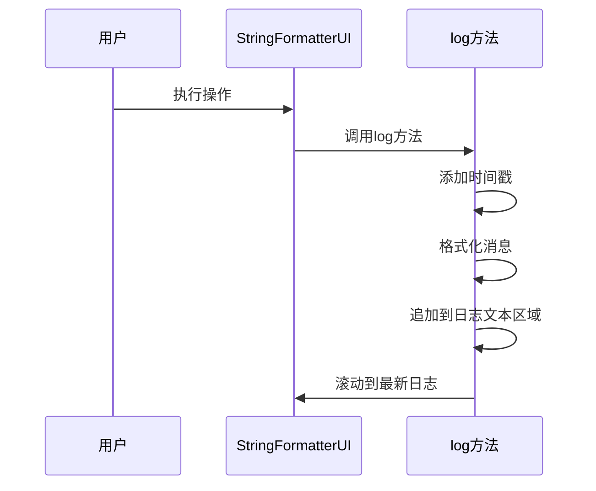
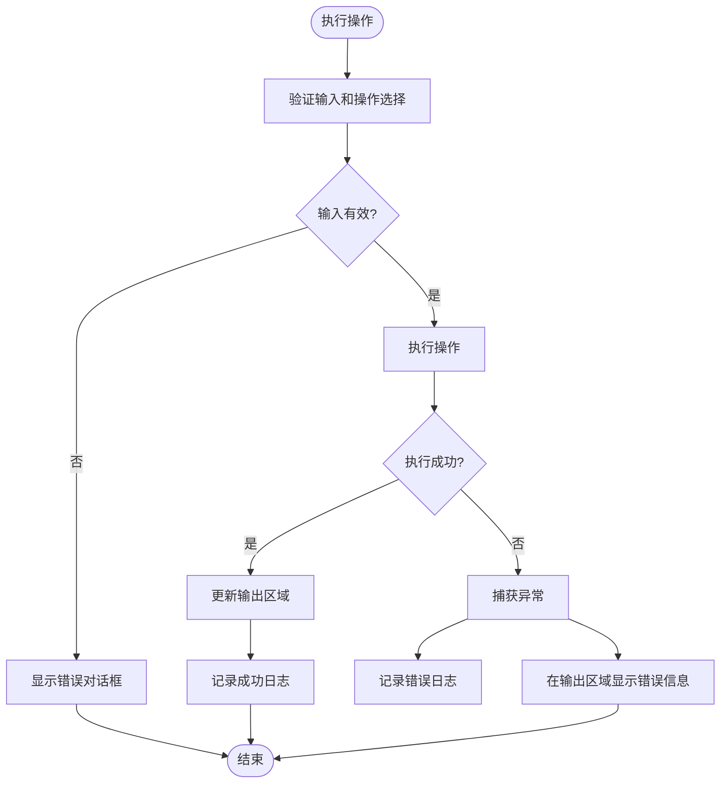
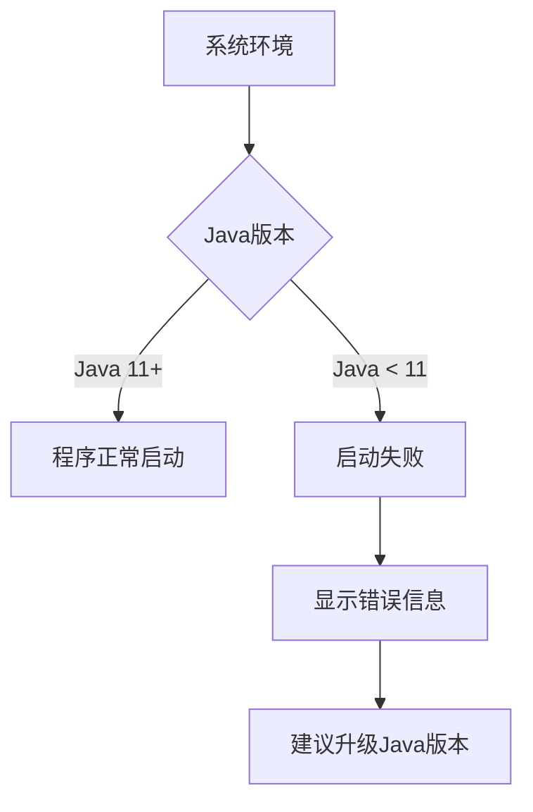
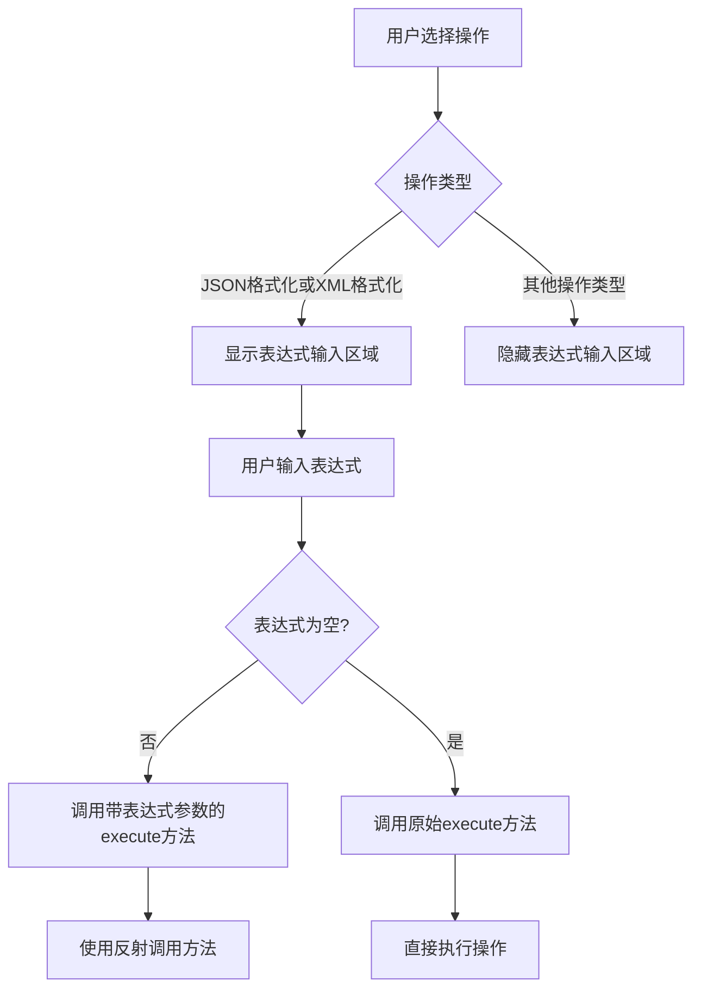

# 故障排除

<cite>
**Referenced Files in This Document**   
- [StringFormatterUI.java](file://src/main/java/org/oxff/ui/StringFormatterUI.java)
- [README.md](file://README.md)
- [pom.xml](file://pom.xml)
- [CLAUDE.md](file://CLAUDE.md)
</cite>

## 目录
1. [简介](#简介)
2. [常见问题及解决方案](#常见问题及解决方案)
3. [日志诊断与调试](#日志诊断与调试)
4. [程序启动问题](#程序启动问题)
5. [表达式相关问题](#表达式相关问题)
6. [输入输出问题](#输入输出问题)
7. [界面显示问题](#界面显示问题)

## 简介
本故障排除指南旨在帮助用户解决在使用uiTools过程中可能遇到的各种问题。通过分析应用程序的代码结构和日志机制，本指南提供了针对常见问题的详细解决方案。uiTools是一款基于Java Swing的字符串格式化、编解码和数据提取工具，支持JSON/JSONPath和XML/XPath操作，具有现代化的用户界面和丰富的功能特性。

**Section sources**
- [README.md](file://README.md#L1-L20)

## 常见问题及解决方案
本节列出了用户在使用uiTools时可能遇到的最常见问题及其对应的解决方案。

### XPath/JSONPath表达式返回空结果
当XPath或JSONPath表达式返回空结果时，用户应检查以下方面：

1. **数据格式验证**：确保输入的XML或JSON数据格式正确且有效。对于XML数据，检查标签是否正确闭合；对于JSON数据，使用在线JSON验证工具确认语法正确性。

2. **表达式语法检查**：确认XPath或JSONPath表达式语法正确。XPath表达式应遵循标准XPath 1.0语法，而JSONPath表达式应符合Jayway JSONPath规范。

3. **命名空间问题**：对于XML数据，如果文档包含命名空间，需要在XPath表达式中正确处理命名空间前缀。

4. **路径准确性**：仔细核对表达式中的路径是否与数据结构完全匹配，注意大小写敏感性和属性名称的准确性。

**Section sources**
- [README.md](file://README.md#L200-L210)

### 程序无法启动
当程序无法启动时，应检查以下要求：

1. **Java版本要求**：确认系统中安装的Java版本为JDK 11或更高版本。可以在命令行中执行`java -version`来检查当前Java版本。

2. **JAR文件完整性**：如果通过JAR文件运行程序，确保JAR文件完整且未损坏。重新构建项目或重新下载JAR文件可能解决此问题。

3. **依赖项完整性**：确保所有必要的依赖项都已正确下载和配置。使用Maven构建时，确保网络连接正常以下载所有依赖。

**Section sources**
- [README.md](file://README.md#L210-L220)
- [pom.xml](file://pom.xml#L15-L20)

### 表达式输入区域不可见
表达式输入区域的可见性与所选操作类型直接相关：

1. **选择正确的操作类型**：表达式输入区域仅在选择JSON格式化或XML格式化操作时显示。选择其他操作类型（如编解码或哈希操作）时，该区域会自动隐藏。

2. **操作类型切换**：当从非格式化操作切换到JSON或XML格式化操作时，表达式输入区域会自动显示；反之，当切换回其他操作类型时，该区域会自动隐藏。

**Section sources**
- [README.md](file://README.md#L220-L230)
- [StringFormatterUI.java](file://src/main/java/org/oxff/ui/StringFormatterUI.java#L266-L279)

## 日志诊断与调试
uiTools内置了详细的日志记录机制，帮助用户诊断和解决使用过程中遇到的问题。

### 日志记录机制
应用程序通过`StringFormatterUI`类中的`log`方法实现日志记录功能。该方法将时间戳和消息添加到日志文本区域，便于用户追踪操作历史和错误信息。



**Diagram sources**
- [StringFormatterUI.java](file://src/main/java/org/oxff/ui/StringFormatterUI.java#L494-L498)

**Section sources**
- [StringFormatterUI.java](file://src/main/java/org/oxff/ui/StringFormatterUI.java#L494-L498)

### 异常捕获与处理
应用程序在关键操作中实现了异常捕获逻辑，确保程序在遇到错误时不会崩溃，并向用户提供有意义的错误信息。



**Diagram sources**
- [StringFormatterUI.java](file://src/main/java/org/oxff/ui/StringFormatterUI.java#L395-L451)

**Section sources**
- [StringFormatterUI.java](file://src/main/java/org/oxff/ui/StringFormatterUI.java#L395-L451)

### 读取错误信息进行诊断
当操作失败时，用户可以通过以下步骤读取和理解错误信息：

1. **查看日志区域**：在应用程序底部的"日志"面板中查看详细的执行记录和错误信息。

2. **分析错误消息**：日志中的错误消息通常包含失败原因的描述，如"执行操作失败：输入为空"或"未找到操作"。

3. **检查输出区域**：如果操作执行失败，输出区域会显示具体的错误信息，如"执行失败: "后跟异常消息。

4. **结合上下文判断**：将日志信息与当前操作和输入数据结合分析，确定问题根源。

## 程序启动问题
本节详细说明了可能导致程序无法启动的各种原因及解决方案。

### Java版本要求
uiTools要求Java 11或更高版本才能正常运行。项目配置文件明确指定了Java 11作为编译和运行版本。



**Diagram sources**
- [pom.xml](file://pom.xml#L15-L20)
- [pom.xml](file://pom.xml#L70-L75)

**Section sources**
- [pom.xml](file://pom.xml#L15-L20)
- [pom.xml](file://pom.xml#L70-L75)

### 构建和运行方式
用户可以通过多种方式启动程序，每种方式都有其特定的要求：

1. **Maven运行**：使用`mvn exec:java -Dexec.mainClass="org.oxff.Main"`命令，需要确保Maven已正确安装且版本为3.6或更高。

2. **JAR文件运行**：使用`java -jar target/uiTools-1.1.4.jar`命令，需要确保JAR文件完整且Java环境配置正确。

**Section sources**
- [README.md](file://README.md#L55-L65)

## 表达式相关问题
本节深入探讨与XPath和JSONPath表达式相关的各种问题及其解决方案。

### 表达式语法指南
正确的表达式语法是成功提取数据的关键：

#### XPath表达式示例
```xpath
//book/title                           # 提取所有书名
//book/author                          # 提取所有作者
//book[@category='fiction']/price      # 提取小说类书籍的价格
//book[@lang='en']/title               # 提取英文书籍的书名
//book[year>2000]/title                # 提取2000年后出版的书籍
```

#### JSONPath表达式示例
```jsonpath
$.store.book[*].title                   # 提取所有书名
$.store.book[*].author                  # 提取所有作者
$.store.book[?(@.category=='fiction')].price    # 提取小说类书籍的价格
$.store.book[?(@.year>2000)].title      # 提取2000年后出版的书籍
$.store.book.length()                   # 计算书籍总数
```

**Section sources**
- [README.md](file://README.md#L100-L120)

### 表达式处理逻辑
应用程序根据所选操作类型智能地决定是否应用表达式处理：



**Diagram sources**
- [StringFormatterUI.java](file://src/main/java/org/oxff/ui/StringFormatterUI.java#L266-L279)
- [StringFormatterUI.java](file://src/main/java/org/oxff/ui/StringFormatterUI.java#L395-L451)

**Section sources**
- [StringFormatterUI.java](file://src/main/java/org/oxff/ui/StringFormatterUI.java#L266-L279)
- [StringFormatterUI.java](file://src/main/java/org/oxff/ui/StringFormatterUI.java#L395-L451)

## 输入输出问题
本节解决与输入输出相关的常见问题。

### 输入为空的处理
当用户尝试执行操作但输入为空时，应用程序会进行验证并给出提示：

```mermaid
flowchart TD
A[点击执行按钮] --> B{输入为空?}
B --> |是| C[显示警告对话框]
C --> D[记录日志: "执行操作失败：输入为空"]
B --> |否| E[继续执行操作]
```

**Diagram sources**
- [StringFormatterUI.java](file://src/main/java/org/oxff/ui/StringFormatterUI.java#L405-L410)

**Section sources**
- [StringFormatterUI.java](file://src/main/java/org/oxff/ui/StringFormatterUI.java#L405-L410)

### 剪贴板操作
应用程序支持完整的剪贴板操作，包括复制和粘贴：

1. **粘贴输入**：从剪贴板粘贴内容到输入框，如果操作失败，会在日志中记录错误信息。

2. **复制输出**：将输出内容复制到剪贴板，便于用户在其他应用程序中使用结果。

**Section sources**
- [StringFormatterUI.java](file://src/main/java/org/oxff/ui/StringFormatterUI.java#L330-L355)

## 界面显示问题
本节解决与用户界面显示相关的各种问题。

### 自动换行功能
应用程序支持输入、输出和表达式区域的自动换行功能：

1. **启用自动换行**：勾选"自动换行"复选框或点击"自动换行"按钮，所有文本区域将启用自动换行。

2. **禁用自动换行**：取消勾选复选框，所有文本区域将恢复为单行显示模式。

**Section sources**
- [StringFormatterUI.java](file://src/main/java/org/oxff/ui/StringFormatterUI.java#L370-L375)

### 快捷键支持
应用程序提供了丰富的快捷键支持，提高用户操作效率：

- **Ctrl+E**: 执行操作
- **Ctrl+C**: 复制输入内容
- **Ctrl+V**: 粘贴到输入框
- **Ctrl+Shift+C**: 复制输出内容
- **Ctrl+Shift+X**: 清空输入内容
- **Ctrl+A**: 全选（在输入或输出框中）

**Section sources**
- [README.md](file://README.md#L160-L165)