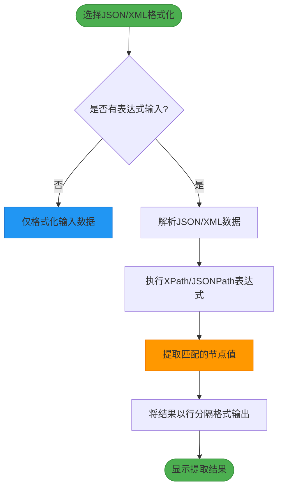

# 更新日志

<cite>
**Referenced Files in This Document**   
- [README.md](file://README.md)
- [pom.xml](file://pom.xml)
- [JsonFormatOperation.java](file://src/main/java/org/oxff/operation/JsonFormatOperation.java)
- [XmlFormatOperation.java](file://src/main/java/org/oxff/operation/XmlFormatOperation.java)
- [StringFormatterUI.java](file://src/main/java/org/oxff/ui/StringFormatterUI.java)
</cite>

## 目录
1. [v1.0.x 初始版本](#v10x-初始版本)
2. [v1.1.3 基础功能完善](#v113-基础功能完善)
3. [v1.1.4 重大功能更新](#v114-重大功能更新)
4. [版本演进总结](#版本演进总结)

## v1.0.x 初始版本

v1.0.x是项目的初始发布版本，奠定了基础功能框架和核心架构。该版本实现了基本的字符串处理能力，为后续功能扩展提供了稳定的基础。

### 核心功能
- **基础编解码操作**：实现了URL编码/解码、Base64/Base32编码/解码、Hex编码/解码等基础编解码功能
- **哈希计算**：支持MD5、SHA1、SHA256等常用哈希算法
- **基础格式化**：提供JSON和XML格式化功能，将压缩的字符串转换为可读的格式
- **核心架构**：采用工厂模式（OperationFactory）管理所有操作，通过Operation接口统一操作实现

### 技术架构
项目采用模块化设计，核心组件包括：
- **Operation接口**：定义所有操作的统一契约
- **OperationFactory**：负责操作的注册和获取
- **OperationCategory**：对操作进行分类管理

此版本为后续迭代建立了清晰的扩展机制，新操作只需实现Operation接口并注册到OperationFactory即可在UI中自动显示。

**Section sources**
- [README.md](file://README.md#L0-L38)
- [pom.xml](file://pom.xml#L0-L105)
- [OperationFactory.java](file://src/main/java/org/oxff/core/OperationFactory.java#L9-L60)

## v1.1.3 基础功能完善

v1.1.3版本在初始版本的基础上完善了基础功能，提升了用户体验和稳定性。

### 功能增强
- **操作分类优化**：改进操作分类浏览体验，使用户能更直观地找到所需功能
- **UI交互改进**：增加更多快捷键支持，提升操作效率
- **剪贴板功能**：完善复制、粘贴、清空等剪贴板操作，支持输入输出内容交换
- **错误处理**：增强输入验证和错误提示，提供更友好的用户反馈

### 性能优化
- 优化了文本处理算法的性能
- 改进了内存使用模式，减少大文本处理时的内存占用
- 提升了UI响应速度，特别是在处理复杂格式化任务时

此版本主要聚焦于基础功能的打磨和用户体验的提升，为后续重大功能更新做好了准备。

**Section sources**
- [README.md](file://README.md#L0-L38)
- [StringFormatterUI.java](file://src/main/java/org/oxff/ui/StringFormatterUI.java#L0-L513)

## v1.1.4 重大功能更新

v1.1.4版本是一次重大更新，引入了多项创新功能，极大地扩展了工具的应用场景。

### 新增功能

#### XPath/JSONPath表达式支持
- **JSONPath支持**：集成Jayway JSONPath库，支持使用JSONPath表达式从JSON数据中精准提取所需字段
- **XPath支持**：集成Jaxen库，支持使用XPath表达式从XML数据中提取数据
- **智能识别**：系统能自动识别操作类型并应用相应的表达式引擎

**Diagram sources**
- [JsonFormatOperation.java](file://src/main/java/org/oxff/operation/JsonFormatOperation.java#L45-L122)
- [XmlFormatOperation.java](file://src/main/java/org/oxff/operation/XmlFormatOperation.java#L49-L126)

#### 多表达式批量处理
- **批量输入**：支持一次输入多个表达式，每行一个
- **批量执行**：系统会依次执行每个表达式，提取所有匹配的数据
- **结果合并**：将所有提取结果以行分隔格式输出，便于批量复制使用

#### 现代化UI主题
- **FlatLaf界面**：采用FlatLaf现代化界面主题，提供更美观的视觉体验
- **三面板布局**：优化为直观的三面板布局（输入 → 表达式 + 输出）
- **语法高亮**：集成RSyntaxTextArea组件，提供语法高亮的代码编辑体验
- **自动换行**：支持输入输出区域的自动换行功能

### 技术改进
- **依赖升级**：添加json-path 2.8.0和jaxen 1.2.0依赖
- **Java版本要求**：调整Java版本要求至11+，以支持新特性
- **反射机制**：在StringFormatterUI中使用反射机制调用带表达式参数的execute方法，实现功能扩展

### 性能优化
- 优化表达式处理性能，提升复杂表达式的执行效率
- 改进内存管理，减少大文档处理时的内存占用
- 提升UI响应速度，特别是在处理多表达式批量任务时

### Bug修复
- 修复已知的格式化问题
- 修复表达式处理中的边界情况
- 改进错误处理机制，提供更详细的错误信息

此版本将工具从简单的格式化器转变为强大的数据提取工具，显著提升了实用价值。

**Section sources**
- [README.md](file://README.md#L0-L38)
- [JsonFormatOperation.java](file://src/main/java/org/oxff/operation/JsonFormatOperation.java#L45-L122)
- [XmlFormatOperation.java](file://src/main/java/org/oxff/operation/XmlFormatOperation.java#L49-L126)
- [StringFormatterUI.java](file://src/main/java/org/oxff/ui/StringFormatterUI.java#L0-L513)

## 版本演进总结

从v1.0.x到v1.1.4，项目经历了从基础工具到功能完备的数据处理平台的演进。

### 功能演进路径
- **v1.0.x**：建立基础编解码和格式化能力
- **v1.1.3**：完善基础功能，提升用户体验
- **v1.1.4**：引入数据提取能力，扩展应用场景

### 技术演进特点
- **架构稳定性**：核心架构（Operation模式）保持稳定，支持功能扩展
- **渐进式增强**：每次更新都建立在前一版本基础上，避免架构颠覆
- **用户体验优先**：持续优化UI交互和性能表现

### 升级建议
- **从v1.0.x升级**：需注意Java版本要求已提升至11+
- **从v1.1.3升级**：可立即享受数据提取等新功能，无需配置变更
- **新用户**：建议直接使用最新版本，以获得完整功能体验

项目通过持续迭代，逐步构建了一个功能强大且易于使用的字符串处理工具，满足了开发者在日常开发中的多样化需求。

**Section sources**
- [README.md](file://README.md#L0-L38)
- [pom.xml](file://pom.xml#L0-L105)