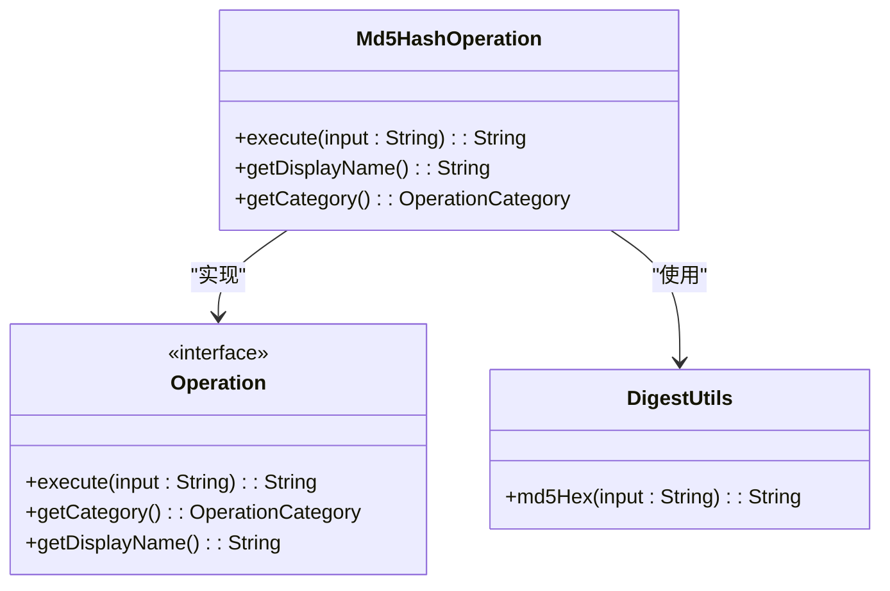

# MD5哈希

<cite>
**Referenced Files in This Document**   
- [Md5HashOperation.java](file://src/main/java/org/oxff/operation/Md5HashOperation.java)
- [OperationCategory.java](file://src/main/java/org/oxff/core/OperationCategory.java)
- [Operation.java](file://src/main/java/org/oxff/operation/Operation.java)
- [OperationFactory.java](file://src/main/java/org/oxff/core/OperationFactory.java)
</cite>

## 目录
1. [简介](#简介)
2. [核心实现分析](#核心实现分析)
3. [类图与架构](#类图与架构)
4. [UI集成与分类](#ui集成与分类)
5. [使用示例](#使用示例)
6. [安全注意事项](#安全注意事项)
7. [相关操作](#相关操作)

## 简介
`Md5HashOperation`类是字符串处理工具中的一个核心功能组件，专门用于对输入字符串生成MD5哈希值。该实现利用Apache Commons Codec库的`DigestUtils.md5Hex`方法，将任意长度的输入字符串转换为128位的哈希值，并以32位十六进制字符串的形式返回。此功能广泛应用于数据完整性校验、文件指纹生成等非安全敏感场景。

## 核心实现分析
`Md5HashOperation`类的核心功能通过`execute`方法实现，该方法接收一个字符串输入并返回其MD5哈希值。实现逻辑极为简洁，直接调用Apache Commons Codec库的`DigestUtils.md5Hex`方法完成哈希计算。MD5算法是一种不可逆的哈希函数，意味着无法从生成的哈希值反推出原始输入数据。

**Section sources**
- [Md5HashOperation.java](file://src/main/java/org/oxff/operation/Md5HashOperation.java#L9-L12)

## 类图与架构


**Diagram sources**
- [Md5HashOperation.java](file://src/main/java/org/oxff/operation/Md5HashOperation.java#L8-L23)
- [Operation.java](file://src/main/java/org/oxff/operation/Operation.java#L7-L26)

**Section sources**
- [Md5HashOperation.java](file://src/main/java/org/oxff/operation/Md5HashOperation.java#L8-L23)

## UI集成与分类
`Md5HashOperation`通过`getDisplayName`和`getCategory`方法无缝集成到用户界面操作树中。`getDisplayName`方法返回"MD5哈希"作为该操作的显示名称，而`getCategory`方法返回`OperationCategory.HASHING`，将此操作归类于"哈希"类别。`OperationFactory`类在静态初始化块中创建所有操作实例，包括`Md5HashOperation`，并将其按名称和分类组织，便于UI组件检索和显示。

```mermaid
flowchart TD
A[OperationFactory初始化] --> B[创建Md5HashOperation实例]
B --> C[按显示名称注册到operations映射]
C --> D[按分类添加到operationsByCategory]
D --> E[UI从OperationFactory获取操作列表]
E --> F[在操作树中显示"MD5哈希"于"哈希"分类下]
```

**Diagram sources**
- [Md5HashOperation.java](file://src/main/java/org/oxff/operation/Md5HashOperation.java#L14-L22)
- [OperationFactory.java](file://src/main/java/org/oxff/core/OperationFactory.java#L20-L60)

**Section sources**
- [Md5HashOperation.java](file://src/main/java/org/oxff/operation/Md5HashOperation.java#L14-L22)
- [OperationFactory.java](file://src/main/java/org/oxff/core/OperationFactory.java#L20-L60)

## 使用示例
`Md5HashOperation`可用于多种数据校验场景：
- **文件内容指纹**：对文件内容生成MD5哈希，用于验证文件是否被修改
- **数据完整性校验**：在网络传输或存储前后对数据生成哈希，确保数据完整性
- **缓存键生成**：将长字符串输入转换为固定长度的哈希值作为缓存键

例如，输入字符串"Hello World"将生成MD5哈希值"b10a8db164e0754105b7a99be72e3fe5"。

## 安全注意事项
尽管MD5算法因其计算速度快和输出长度固定而被广泛使用，但由于已发现的碰撞漏洞，**不应在任何安全敏感场景中使用**。特别是：
- **密码存储**：MD5哈希容易受到彩虹表攻击和碰撞攻击，应使用bcrypt、scrypt或PBKDF2等专门设计的密码哈希算法
- **数字签名**：由于碰撞漏洞，MD5不再适合用于数字签名和证书
- **安全认证**：不应依赖MD5进行任何安全认证机制

MD5仅推荐用于非安全相关的数据完整性校验。

## 相关操作
`Md5HashOperation`是哈希操作家族的一部分，与以下相关操作共同提供多种哈希算法：
- `Sha1HashOperation`：使用SHA-1算法生成160位哈希值
- `Sha256HashOperation`：使用SHA-256算法生成256位哈希值，安全性更高

这些操作均实现`Operation`接口，遵循相同的架构模式，确保代码的一致性和可维护性。

**Section sources**
- [OperationCategory.java](file://src/main/java/org/oxff/core/OperationCategory.java#L8-L8)
- [OperationFactory.java](file://src/main/java/org/oxff/core/OperationFactory.java#L35-L37)