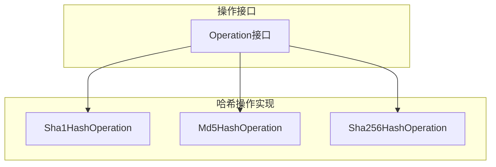
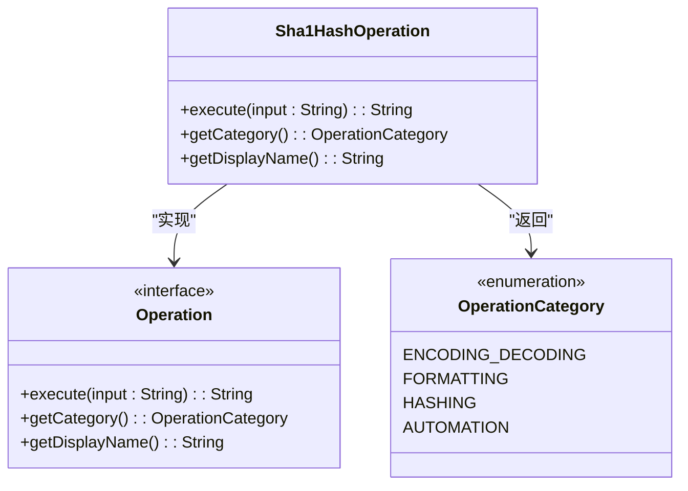

# SHA1哈希

<cite>
**Referenced Files in This Document**   
- [Sha1HashOperation.java](file://src/main/java/org/oxff/operation/Sha1HashOperation.java)
- [Operation.java](file://src/main/java/org/oxff/operation/Operation.java)
- [Md5HashOperation.java](file://src/main/java/org/oxff/operation/Md5HashOperation.java)
- [Sha256HashOperation.java](file://src/main/java/org/oxff/operation/Sha256HashOperation.java)
- [OperationCategory.java](file://src/main/java/org/oxff/core/OperationCategory.java)
</cite>

## 目录
1. [简介](#简介)
2. [核心组件](#核心组件)
3. [架构概述](#架构概述)
4. [详细组件分析](#详细组件分析)
5. [依赖分析](#依赖分析)
6. [性能考虑](#性能考虑)
7. [故障排除指南](#故障排除指南)
8. [结论](#结论)

## 简介
本文档详细阐述了`Sha1HashOperation`类如何利用Apache Commons Codec库中的`DigestUtils.sha1Hex`方法实现SHA-1哈希算法。该实现遵循`Operation`接口规范，提供标准化的哈希操作功能。文档分析了SHA-1算法生成160位消息摘要并转换为40位十六进制字符串的过程，比较了其与MD5在安全性上的相对优势（如更强的抗碰撞性），同时也指出了其已知的安全漏洞。结合旧系统数据签名和版本控制中的哈希校验等应用场景，为开发者提供使用指导，建议在非高安全需求场景下谨慎使用，并优先考虑更安全的SHA-256算法。

## 核心组件
`Sha1HashOperation`类是本系统中实现SHA-1哈希功能的核心组件。该类实现了`Operation`接口，通过调用Apache Commons Codec库的`DigestUtils.sha1Hex`方法，将输入字符串转换为40位的十六进制哈希值。该实现遵循了统一的操作接口规范，确保了与其他字符串操作（如MD5、SHA-256等）的一致性和可扩展性。

**Section sources**
- [Sha1HashOperation.java](file://src/main/java/org/oxff/operation/Sha1HashOperation.java#L1-L24)
- [Operation.java](file://src/main/java/org/oxff/operation/Operation.java#L1-L27)

## 架构概述
系统采用接口驱动的设计模式，所有字符串操作都实现统一的`Operation`接口。`Sha1HashOperation`作为哈希操作的一种具体实现，与其他哈希算法（如MD5、SHA-256）并列，共同构成了系统的哈希功能模块。这种设计模式实现了操作的标准化和可插拔性，便于功能的扩展和维护。



**Diagram sources**
- [Operation.java](file://src/main/java/org/oxff/operation/Operation.java#L1-L27)
- [Sha1HashOperation.java](file://src/main/java/org/oxff/operation/Sha1HashOperation.java#L1-L24)
- [Md5HashOperation.java](file://src/main/java/org/oxff/operation/Md5HashOperation.java#L1-L24)
- [Sha256HashOperation.java](file://src/main/java/org/oxff/operation/Sha256HashOperation.java#L1-L24)

## 详细组件分析

### Sha1HashOperation分析
`Sha1HashOperation`类是SHA-1哈希算法的具体实现，它遵循`Operation`接口的规范，提供了标准化的哈希计算功能。

#### 类图


**Diagram sources**
- [Operation.java](file://src/main/java/org/oxff/operation/Operation.java#L1-L27)
- [Sha1HashOperation.java](file://src/main/java/org/oxff/operation/Sha1HashOperation.java#L1-L24)
- [OperationCategory.java](file://src/main/java/org/oxff/core/OperationCategory.java#L1-L21)

#### 方法职责
`Sha1HashOperation`类实现了`Operation`接口的三个核心方法：
- `execute`方法：调用`DigestUtils.sha1Hex`方法对输入字符串进行SHA-1哈希计算，生成40位的十六进制字符串。
- `getCategory`方法：返回`OperationCategory.HASHING`，标识该操作属于哈希类别。
- `getDisplayName`方法：返回"SHA1哈希"，作为用户界面中的显示名称。

**Section sources**
- [Sha1HashOperation.java](file://src/main/java/org/oxff/operation/Sha1HashOperation.java#L1-L24)

### 安全性分析
SHA-1算法生成160位（20字节）的消息摘要，转换为40位的十六进制字符串。与MD5相比，SHA-1具有更强的抗碰撞性，即找到两个不同输入产生相同哈希值的难度更大。然而，随着计算能力的提升和密码学研究的进展，SHA-1已被证实存在严重的安全漏洞，能够被实际攻击者利用生成碰撞。因此，尽管在非高安全需求场景下（如旧系统数据签名或版本控制中的哈希校验）仍可谨慎使用，但强烈建议在新系统中优先选择更安全的SHA-256等算法。

**Section sources**
- [Sha1HashOperation.java](file://src/main/java/org/oxff/operation/Sha1HashOperation.java#L1-L24)
- [Md5HashOperation.java](file://src/main/java/org/oxff/operation/Md5HashOperation.java#L1-L24)
- [Sha256HashOperation.java](file://src/main/java/org/oxff/operation/Sha256HashOperation.java#L1-L24)

## 依赖分析
`Sha1HashOperation`类依赖于Apache Commons Codec库的`DigestUtils`工具类来执行实际的哈希计算。该类通过实现`Operation`接口，与系统的其他组件进行交互。`OperationCategory`枚举用于对操作进行分类管理。

```mermaid
graph LR
Sha1HashOperation --> DigestUtils : "使用"
Sha1HashOperation --> Operation : "实现"
Sha1HashOperation --> OperationCategory : "引用"
```

**Diagram sources**
- [Sha1HashOperation.java](file://src/main/java/org/oxff/operation/Sha1HashOperation.java#L1-L24)
- [Operation.java](file://src/main/java/org/oxff/operation/Operation.java#L1-L27)
- [OperationCategory.java](file://src/main/java/org/oxff/core/OperationCategory.java#L1-L21)

## 性能考虑
SHA-1哈希计算的性能通常优于SHA-256等更安全的算法，因为其计算复杂度较低。对于大量数据的哈希计算，应考虑性能影响，特别是在高并发场景下。由于哈希计算是CPU密集型操作，建议在必要时进行性能测试和优化。

## 故障排除指南
当`Sha1HashOperation`的哈希结果不符合预期时，应首先检查输入字符串的编码和内容是否正确。确保Apache Commons Codec库的版本兼容，并检查是否有其他代码修改了输入数据。对于安全性要求较高的场景，建议迁移到SHA-256等更安全的哈希算法。

**Section sources**
- [Sha1HashOperation.java](file://src/main/java/org/oxff/operation/Sha1HashOperation.java#L1-L24)
- [Sha256HashOperation.java](file://src/main/java/org/oxff/operation/Sha256HashOperation.java#L1-L24)

## 结论
`Sha1HashOperation`类提供了一个标准化的SHA-1哈希实现，遵循了系统的操作接口规范。虽然SHA-1在抗碰撞性上优于MD5，但其已知的安全漏洞使其不适合用于高安全需求的场景。开发者应在非关键应用中谨慎使用，并优先考虑更安全的替代方案如SHA-256。系统的模块化设计使得算法的替换和扩展变得简单，为未来的安全升级提供了便利。