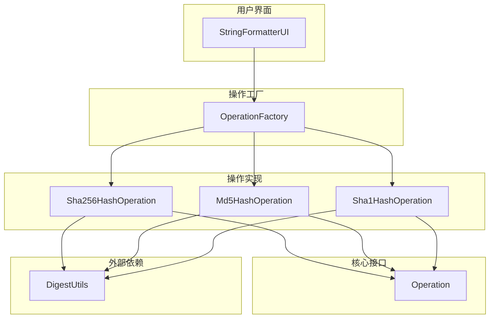
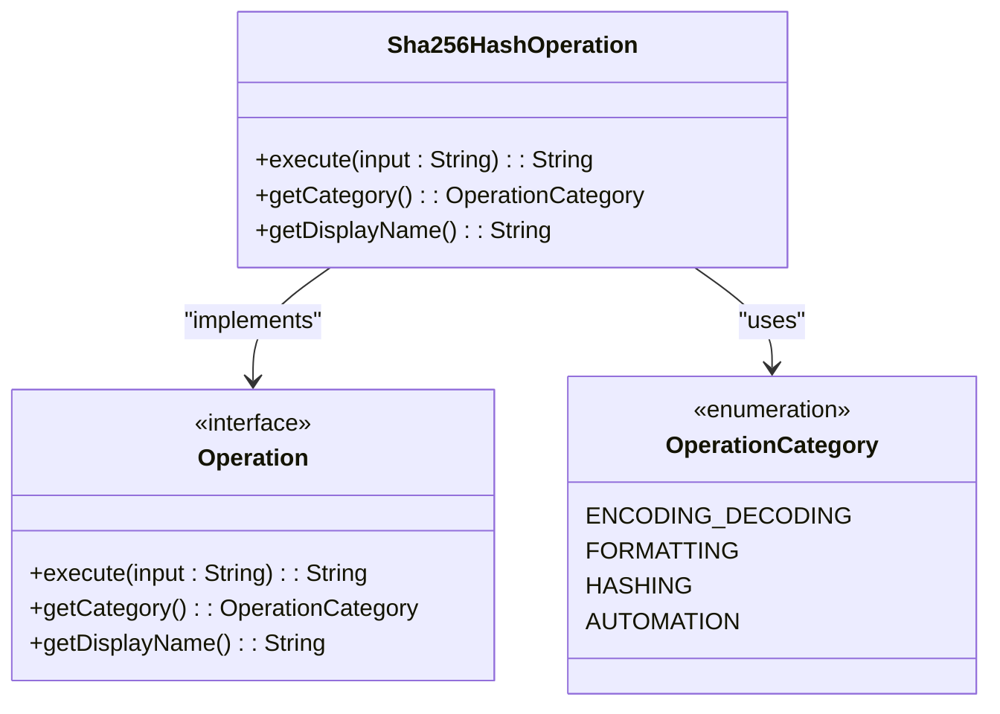
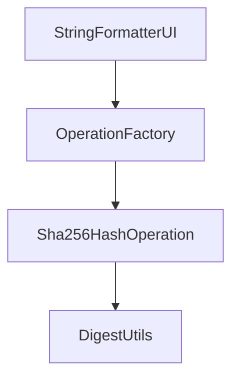

# SHA256哈希

<cite>
**Referenced Files in This Document**   
- [Sha256HashOperation.java](file://src/main/java/org/oxff/operation/Sha256HashOperation.java)
- [Operation.java](file://src/main/java/org/oxff/operation/Operation.java)
- [OperationCategory.java](file://src/main/java/org/oxff/core/OperationCategory.java)
- [Sha1HashOperation.java](file://src/main/java/org/oxff/operation/Sha1HashOperation.java)
- [Md5HashOperation.java](file://src/main/java/org/oxff/operation/Md5HashOperation.java)
- [OperationFactory.java](file://src/main/java/org/oxff/core/OperationFactory.java)
- [StringFormatterUI.java](file://src/main/java/org/oxff/ui/StringFormatterUI.java)
</cite>

## 目录
1. [简介](#简介)
2. [核心组件](#核心组件)
3. [架构概览](#架构概览)
4. [详细组件分析](#详细组件分析)
5. [依赖分析](#依赖分析)
6. [性能考量](#性能考量)
7. [故障排除指南](#故障排除指南)
8. [结论](#结论)

## 简介
`Sha256HashOperation` 类是基于 Apache Commons Codec 库中的 `DigestUtils.sha256Hex` 方法实现的 SHA-256 安全哈希算法。该类生成 256 位的高强度摘要，并以十六进制字符串形式输出。SHA-256 在当前密码学实践中被广泛推荐，适用于密码存储、数字签名和安全认证等高安全性场景。该类遵循 `Operation` 接口的设计模式，确保与系统中其他操作的一致性集成。典型用例包括 API 密钥签名和区块链数据哈希。与 MD5 和 SHA1 相比，SHA-256 在计算强度和安全级别上具有显著优势，但需要注意其性能开销，在性能敏感场景中需权衡使用。

## 核心组件

`Sha256HashOperation` 类是实现 SHA-256 哈希功能的核心组件。它通过调用 `DigestUtils.sha256Hex` 方法来计算输入字符串的哈希值，并返回十六进制格式的摘要。该类实现了 `Operation` 接口，提供了 `execute`、`getCategory` 和 `getDisplayName` 方法，确保了与系统其他操作的一致性。

**Section sources**
- [Sha256HashOperation.java](file://src/main/java/org/oxff/operation/Sha256HashOperation.java#L8-L23)
- [Operation.java](file://src/main/java/org/oxff/operation/Operation.java#L7-L26)

## 架构概览

`Sha256HashOperation` 类是整个字符串格式化工具的一部分，该工具采用模块化设计，通过 `Operation` 接口统一管理各种字符串操作。`OperationFactory` 类负责创建和管理所有操作实例，而 `StringFormatterUI` 类则提供用户界面，允许用户选择和执行不同的操作。

**Diagram sources**
- [Sha256HashOperation.java](file://src/main/java/org/oxff/operation/Sha256HashOperation.java#L8-L23)
- [OperationFactory.java](file://src/main/java/org/oxff/core/OperationFactory.java#L15-L60)
- [StringFormatterUI.java](file://src/main/java/org/oxff/ui/StringFormatterUI.java#L100-L150)

## 详细组件分析

### Sha256HashOperation 分析
`Sha256HashOperation` 类实现了 `Operation` 接口，提供了 SHA-256 哈希功能。其 `execute` 方法调用 `DigestUtils.sha256Hex` 来计算输入字符串的哈希值，并返回十六进制格式的摘要。`getCategory` 方法返回 `OperationCategory.HASHING`，表明该操作属于哈希类别。`getDisplayName` 方法返回 `"SHA256哈希"`，作为用户界面中的显示名称。

**Diagram sources**
- [Sha256HashOperation.java](file://src/main/java/org/oxff/operation/Sha256HashOperation.java#L8-L23)
- [Operation.java](file://src/main/java/org/oxff/operation/Operation.java#L7-L26)
- [OperationCategory.java](file://src/main/java/org/oxff/core/OperationCategory.java#L5-L20)

### Operation 接口分析
`Operation` 接口定义了所有字符串操作必须实现的方法。`execute` 方法用于执行具体的操作，`getCategory` 方法返回操作的分类，`getDisplayName` 方法返回操作的显示名称。通过实现此接口，`Sha256HashOperation` 类能够与其他操作保持一致，便于在系统中统一管理和调用。

**Section sources**
- [Operation.java](file://src/main/java/org/oxff/operation/Operation.java#L7-L26)

## 依赖分析

`Sha256HashOperation` 类依赖于 `DigestUtils` 类来执行 SHA-256 哈希计算。`DigestUtils` 是 Apache Commons Codec 库的一部分，提供了多种哈希和编码功能。`OperationFactory` 类负责初始化所有操作实例，包括 `Sha256HashOperation`，并将其注册到操作映射中，以便在用户界面中选择和执行。

**Diagram sources**
- [Sha256HashOperation.java](file://src/main/java/org/oxff/operation/Sha256HashOperation.java#L8-L23)
- [OperationFactory.java](file://src/main/java/org/oxff/core/OperationFactory.java#L15-L60)
- [StringFormatterUI.java](file://src/main/java/org/oxff/ui/StringFormatterUI.java#L100-L150)

## 性能考量

SHA-256 算法虽然提供了高强度的安全性，但其计算开销相对较高。在处理大量数据或频繁调用的场景中，可能会对性能产生影响。建议在性能敏感的应用中，评估使用 SHA-256 的必要性，或考虑使用更轻量级的哈希算法（如 SHA-1 或 MD5）作为替代方案，但需注意这些算法的安全性较低。

## 故障排除指南

如果 `Sha256HashOperation` 无法正常工作，请检查以下几点：
1. 确保 Apache Commons Codec 库已正确添加到项目依赖中。
2. 检查输入字符串是否为空或 null。
3. 确认 `OperationFactory` 是否正确初始化了 `Sha256HashOperation` 实例。
4. 查看日志输出，确认是否有异常信息。

**Section sources**
- [Sha256HashOperation.java](file://src/main/java/org/oxff/operation/Sha256HashOperation.java#L8-L23)
- [OperationFactory.java](file://src/main/java/org/oxff/core/OperationFactory.java#L15-L60)

## 结论

`Sha256HashOperation` 类通过集成 Apache Commons Codec 库的 `DigestUtils`，提供了一个简单而强大的 SHA-256 哈希功能。该类遵循 `Operation` 接口的设计模式，确保了与系统其他操作的一致性。尽管 SHA-256 在安全性和计算强度上优于 MD5 和 SHA1，但其性能开销也更高，因此在实际应用中需要根据具体需求进行权衡。通过 `OperationFactory` 和 `StringFormatterUI` 的支持，用户可以方便地选择和执行 SHA-256 哈希操作，适用于各种高安全性场景。