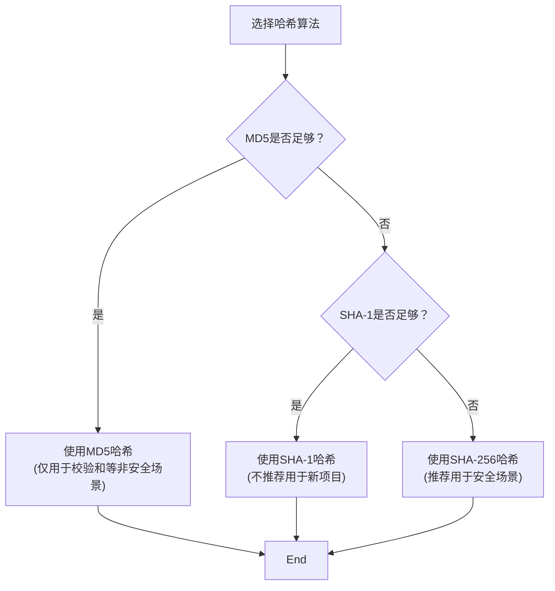
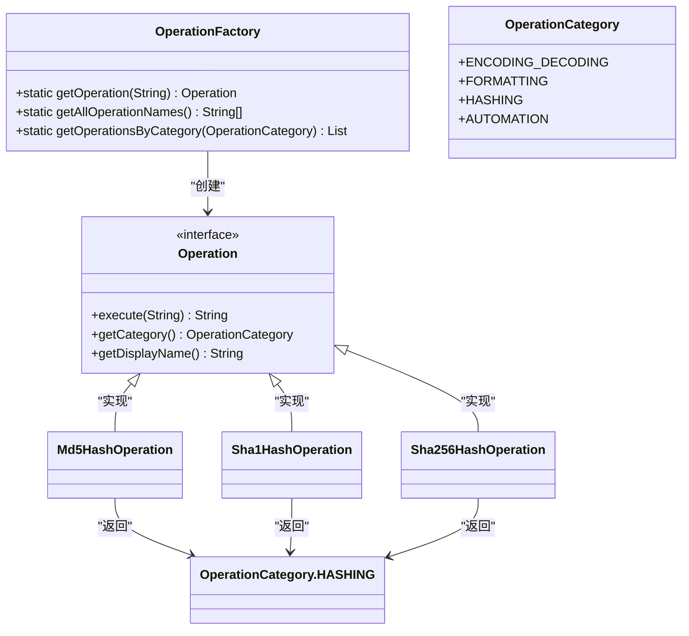
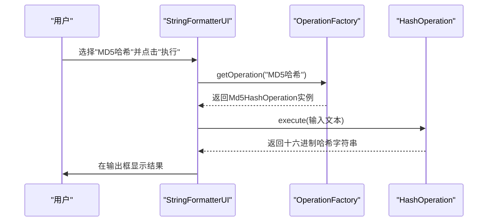

# 哈希操作

<cite>
**Referenced Files in This Document**   
- [Md5HashOperation.java](file://src/main/java/org/oxff/operation/Md5HashOperation.java)
- [Sha1HashOperation.java](file://src/main/java/org/oxff/operation/Sha1HashOperation.java)
- [Sha256HashOperation.java](file://src/main/java/org/oxff/operation/Sha256HashOperation.java)
- [OperationFactory.java](file://src/main/java/org/oxff/core/OperationFactory.java)
- [OperationCategory.java](file://src/main/java/org/oxff/core/OperationCategory.java)
- [Operation.java](file://src/main/java/org/oxff/operation/Operation.java)
- [StringFormatterUI.java](file://src/main/java/org/oxff/ui/StringFormatterUI.java)
</cite>

## 目录
1. [哈希操作实现](#哈希操作实现)
2. [哈希算法安全性与选择建议](#哈希算法安全性与选择建议)
3. [操作工厂与分类](#操作工厂与分类)
4. [用户界面集成](#用户界面集成)

## 哈希操作实现

`Md5HashOperation`、`Sha1HashOperation`和`Sha256HashOperation`三个类实现了对字符串数据的哈希摘要计算功能。这些类均实现了`Operation`接口，通过调用Apache Commons Codec库中的`DigestUtils`工具类来完成具体的哈希计算。

每个哈希操作类的`execute`方法实现极为简洁，直接委托给`DigestUtils`的相应静态方法。`Md5HashOperation`使用`DigestUtils.md5Hex()`方法生成128位的MD5消息摘要，并以十六进制字符串形式返回；`Sha1HashOperation`使用`DigestUtils.sha1Hex()`方法生成160位的SHA-1摘要；而`Sha256HashOperation`则使用`DigestUtils.sha256Hex()`方法生成256位的SHA-256摘要。这种设计模式体现了高度的代码复用和简洁性，将复杂的哈希算法细节完全封装在成熟的第三方库中，确保了计算的准确性和可靠性。

所有哈希操作都具有不可逆的特性，即无法从生成的哈希值反推出原始输入数据，这使得它们非常适合用于数据完整性校验和密码存储等场景。

**Section sources**
- [Md5HashOperation.java](file://src/main/java/org/oxff/operation/Md5HashOperation.java#L8-L12)
- [Sha1HashOperation.java](file://src/main/java/org/oxff/operation/Sha1HashOperation.java#L8-L12)
- [Sha256HashOperation.java](file://src/main/java/org/oxff/operation/Sha256HashOperation.java#L8-L12)
- [Operation.java](file://src/main/java/org/oxff/operation/Operation.java#L8-L12)

## 哈希算法安全性与选择建议

尽管MD5、SHA-1和SHA-256都属于加密哈希函数，但它们的安全性存在显著差异。MD5算法由于存在严重的碰撞漏洞，已被认为是不安全的，不应再用于任何需要安全保证的场景。SHA-1算法也已发现理论上的碰撞攻击，其安全性同样受到质疑。

因此，为开发者提供以下选择建议：**MD5哈希**仅推荐用于非安全性的数据完整性校验，例如文件校验和验证或缓存键生成，其优势在于计算速度快。**SHA-1哈希**虽然比MD5更安全，但也应避免用于高安全要求的场景。**SHA-256哈希**是目前推荐的标准，它提供了256位的输出长度，具有极强的抗碰撞性和安全性，适用于密码哈希、数字签名、安全令牌生成等关键安全场景。

**Diagram sources**
- [Md5HashOperation.java](file://src/main/java/org/oxff/operation/Md5HashOperation.java)
- [Sha1HashOperation.java](file://src/main/java/org/oxff/operation/Sha1HashOperation.java)
- [Sha256HashOperation.java](file://src/main/java/org/oxff/operation/Sha256HashOperation.java)

## 操作工厂与分类

所有哈希操作类在`OperationFactory`中被统一管理和初始化。`OperationFactory`是一个单例工厂类，其静态代码块在类加载时会创建所有可用操作的实例，包括`Md5HashOperation`、`Sha1HashOperation`和`Sha256HashOperation`，并将它们注册到内部的映射表中。

这些哈希操作被归类到`OperationCategory.HASHING`分类下。`OperationCategory`是一个枚举类型，定义了包括"哈希"、"编解码"、"格式化"在内的多种操作类型。通过`getCategory()`方法，每个哈希操作类都返回`OperationCategory.HASHING`，这使得`OperationFactory`能够按分类组织所有操作，为用户界面提供结构化的操作列表。

这种工厂模式和分类机制实现了操作的集中注册、统一管理和按需获取，极大地提高了代码的可维护性和扩展性。

**Diagram sources**
- [OperationFactory.java](file://src/main/java/org/oxff/core/OperationFactory.java#L9-L60)
- [OperationCategory.java](file://src/main/java/org/oxff/core/OperationCategory.java#L5-L20)
- [Operation.java](file://src/main/java/org/oxff/operation/Operation.java)

**Section sources**
- [OperationFactory.java](file://src/main/java/org/oxff/core/OperationFactory.java#L9-L60)
- [OperationCategory.java](file://src/main/java/org/oxff/core/OperationCategory.java#L5-L20)

## 用户界面集成

在用户界面中，这些哈希操作通过`StringFormatterUI`类进行调用。用户可以在操作分类树中选择"哈希"分类，然后从`Md5HashOperation`、`Sha1HashOperation`或`Sha256HashOperation`中选择具体的操作。当用户点击"执行"按钮时，`StringFormatterUI`会通过`OperationFactory.getOperation()`方法获取对应的操作实例，并调用其`execute()`方法对输入框中的文本进行处理。

整个调用流程清晰且解耦：用户界面负责交互和输入输出，`OperationFactory`负责提供具体的操作实现，而各个`Operation`类则专注于完成特定的哈希计算任务。这种分层架构使得系统易于扩展，可以方便地添加新的哈希算法或其他类型的操作。

**Diagram sources**
- [StringFormatterUI.java](file://src/main/java/org/oxff/ui/StringFormatterUI.java)
- [OperationFactory.java](file://src/main/java/org/oxff/core/OperationFactory.java)
- [Md5HashOperation.java](file://src/main/java/org/oxff/operation/Md5HashOperation.java)

**Section sources**
- [StringFormatterUI.java](file://src/main/java/org/oxff/ui/StringFormatterUI.java#L300-L350)
- [OperationFactory.java](file://src/main/java/org/oxff/core/OperationFactory.java#L50-L60)