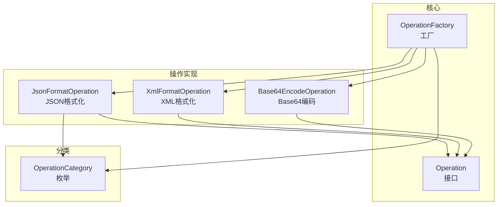
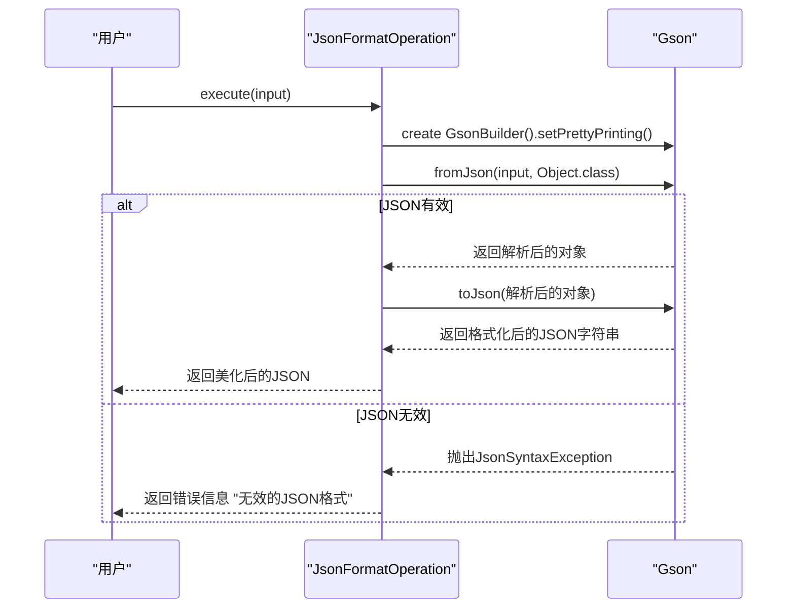
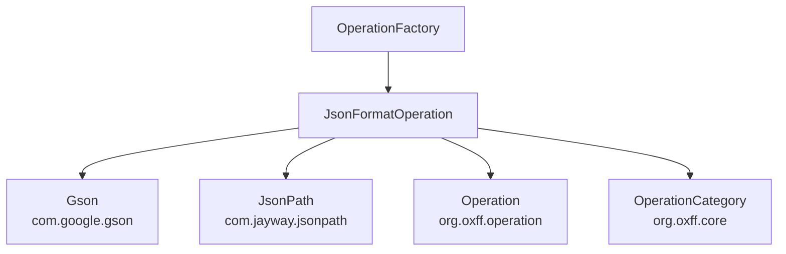

# JSON格式化

<cite>
**Referenced Files in This Document**   
- [JsonFormatOperation.java](file://src/main/java/org/oxff/operation/JsonFormatOperation.java)
- [OperationFactory.java](file://src/main/java/org/oxff/core/OperationFactory.java)
- [OperationCategory.java](file://src/main/java/org/oxff/core/OperationCategory.java)
- [Operation.java](file://src/main/java/org/oxff/operation/Operation.java)
</cite>

## 目录
1. [简介](#简介)
2. [核心组件](#核心组件)
3. [架构概览](#架构概览)
4. [详细组件分析](#详细组件分析)
5. [依赖分析](#依赖分析)
6. [性能考虑](#性能考虑)
7. [故障排除指南](#故障排除指南)
8. [结论](#结论)

## 简介
`JsonFormatOperation`类是`uiTools`项目中负责JSON格式化与美化输出的核心组件。该类实现了`Operation`接口，提供两种主要功能：基础的JSON格式化美化和基于JSONPath表达式的高级数据提取。通过集成Google的Gson库和Jayway的JsonPath库，该操作能够将紧凑的JSON字符串转换为结构清晰、易于阅读的格式，并支持从复杂JSON文档中精确提取所需数据。该操作被归类为`OperationCategory.FORMATTING`（格式化），并在`OperationFactory`中注册，使其能够被用户界面调用。

## 核心组件

`JsonFormatOperation`类的核心功能由两个`execute`方法实现：一个用于基础的JSON格式化，另一个用于结合JSONPath表达式的高级数据提取。该类还实现了`Operation`接口的`getCategory`和`getDisplayName`方法，以提供操作的分类和显示名称。

**Section sources**
- [JsonFormatOperation.java](file://src/main/java/org/oxff/operation/JsonFormatOperation.java#L15-L35)

## 架构概览

`JsonFormatOperation`是`Operation`接口的一个具体实现，它被`OperationFactory`在静态初始化块中实例化并注册到操作映射中。`OperationFactory`负责管理所有操作的生命周期，并根据用户请求提供相应的操作实例。`JsonFormatOperation`的分类由`OperationCategory`枚举定义。



**Diagram sources**
- [JsonFormatOperation.java](file://src/main/java/org/oxff/operation/JsonFormatOperation.java#L12-L122)
- [OperationFactory.java](file://src/main/java/org/oxff/core/OperationFactory.java#L9-L60)
- [OperationCategory.java](file://src/main/java/org/oxff/core/OperationCategory.java#L6-L20)

## 详细组件分析

### JsonFormatOperation分析

`JsonFormatOperation`类提供了JSON处理的完整解决方案，包括格式化、验证和数据提取。

#### 基础JSON格式化方法


**Diagram sources**
- [JsonFormatOperation.java](file://src/main/java/org/oxff/operation/JsonFormatOperation.java#L16-L25)

#### 高级JSONPath数据提取方法
```mermaid
flowchart TD
Start([execute(input, expressions)]) --> ValidateInput["验证expressions是否为空"]
ValidateInput --> |为空| CallBase["调用execute(input)进行基础格式化"]
ValidateInput --> |不为空| ParseJSON["使用Gson解析JSON输入"]
ParseJSON --> |解析失败| ReturnError["返回'无效的JSON格式'"]
ParseJSON --> |解析成功| SplitExpressions["将expressions按行分割"]
SplitExpressions --> LoopStart{表达式列表<br/>遍历开始}
LoopStart --> GetExpression["获取下一个表达式"]
GetExpression --> |表达式为空| LoopStart
GetExpression --> ExecutePath["使用JsonPath.parse().read()执行表达式"]
ExecutePath --> |路径未找到| HandleNotFound["跳过此表达式"]
ExecutePath --> |执行错误| HandleError["添加错误信息到结果"]
ExecutePath --> |执行成功| CheckResult["检查结果是否为null"]
CheckResult --> |是null| LoopStart
CheckResult --> |不是null| IsList{"结果是List?"}
IsList --> |是| ProcessList["遍历列表，convertToString每个元素"]
IsList --> |否| ProcessSingle["convertToString单个结果"]
ProcessList --> AddToList["将非空结果添加到results"]
ProcessSingle --> AddToList
AddToList --> LoopEnd{表达式列表<br/>遍历结束?}
LoopEnd --> |否| LoopStart
LoopEnd --> |是| CheckResults["检查results是否为空"]
CheckResults --> |为空| ReturnNotFound["返回'未找到匹配的节点'"]
CheckResults --> |不为空| JoinResults["使用String.join(\n)连接结果"]
JoinResults --> ReturnResults["返回结果字符串"]
```

**Diagram sources**
- [JsonFormatOperation.java](file://src/main/java/org/oxff/operation/JsonFormatOperation.java#L43-L102)

#### 对象到字符串转换逻辑
```mermaid
flowchart TD
Start([convertToString(obj)]) --> CheckNull["检查obj是否为null"]
CheckNull --> |是| ReturnNull["返回null"]
CheckNull --> |否| IsString{"obj是String?"}
IsString --> |是| TrimString["返回obj.trim()"]
IsString --> |否| IsNumberOrBoolean{"obj是Number或Boolean?"}
IsNumberOrBoolean --> |是| ToString["返回obj.toString()"]
IsNumberOrBoolean --> |否| SerializeObject["使用Gson.toJson(obj).trim()序列化"]
SerializeObject --> ReturnResult["返回序列化后的字符串"]
```

**Diagram sources**
- [JsonFormatOperation.java](file://src/main/java/org/oxff/operation/JsonFormatOperation.java#L107-L121)

**Section sources**
- [JsonFormatOperation.java](file://src/main/java/org/oxff/operation/JsonFormatOperation.java#L12-L122)

## 依赖分析

`JsonFormatOperation`类依赖于多个外部库和内部组件。它直接依赖于Google的Gson库进行JSON的解析和序列化，以及Jayway的JsonPath库进行JSONPath表达式的求值。在项目内部，它实现了`Operation`接口，并使用`OperationCategory`枚举来定义其分类。`OperationFactory`负责创建和管理`JsonFormatOperation`的实例。



**Diagram sources**
- [JsonFormatOperation.java](file://src/main/java/org/oxff/operation/JsonFormatOperation.java#L1-L10)
- [OperationFactory.java](file://src/main/java/org/oxff/core/OperationFactory.java#L15-L18)

**Section sources**
- [JsonFormatOperation.java](file://src/main/java/org/oxff/operation/JsonFormatOperation.java#L1-L122)
- [OperationFactory.java](file://src/main/java/org/oxff/core/OperationFactory.java#L9-L60)

## 性能考虑

`JsonFormatOperation`在处理大型JSON文档时需要考虑内存使用。`Gson`库在解析JSON时会将整个文档加载到内存中，因此对于非常大的JSON文件，可能会导致内存不足。同样，`JsonPath`在执行复杂表达式时也可能消耗大量内存和CPU资源。建议避免使用过于复杂的嵌套表达式，并在处理大型文档时考虑分批处理或流式处理方案。

## 故障排除指南

当`JsonFormatOperation`无法正常工作时，请参考以下常见问题：

1.  **输入JSON无效**：如果输入的字符串不是有效的JSON格式，`execute`方法会返回以"无效的JSON格式"开头的错误信息。请检查输入字符串的语法，确保引号、括号和逗号使用正确。
2.  **JSONPath表达式错误**：如果JSONPath表达式语法错误或指向的路径不存在，结果中会包含以"JSONPath表达式错误"开头的行。请验证表达式是否正确，例如`$.store.book[0].title`。
3.  **未找到匹配节点**：当所有JSONPath表达式都未找到匹配项时，方法会返回"未找到匹配的节点"。请确认JSON结构和路径表达式是否匹配。
4.  **空结果**：如果提取的结果为空字符串或null，它们会被过滤掉。这可能是预期行为，也可能是由于数据本身为空。

**Section sources**
- [JsonFormatOperation.java](file://src/main/java/org/oxff/operation/JsonFormatOperation.java#L80-L95)
- [JsonFormatOperation.java](file://src/main/java/org/oxff/operation/JsonFormatOperation.java#L65-L75)

## 结论

`JsonFormatOperation`是一个功能强大且设计良好的组件，它有效地结合了Gson和JsonPath库，为用户提供了一套完整的JSON处理工具。其清晰的接口设计和健壮的错误处理机制使其易于集成和使用。通过`OperationFactory`的集中管理，该操作能够无缝地融入整个应用的功能体系中。对于初学者，它提供了简单的JSON美化功能；对于高级用户，它支持复杂的JSONPath查询，满足了不同层次的需求。