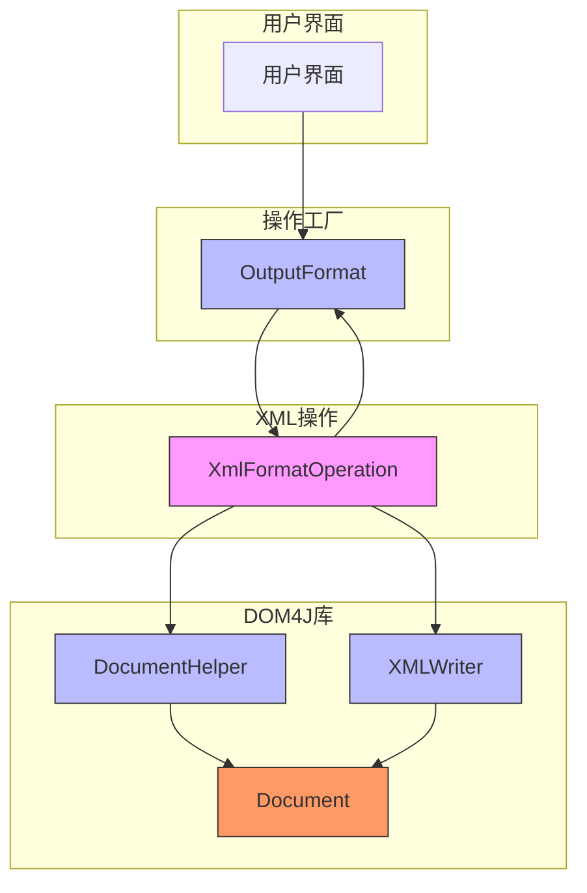
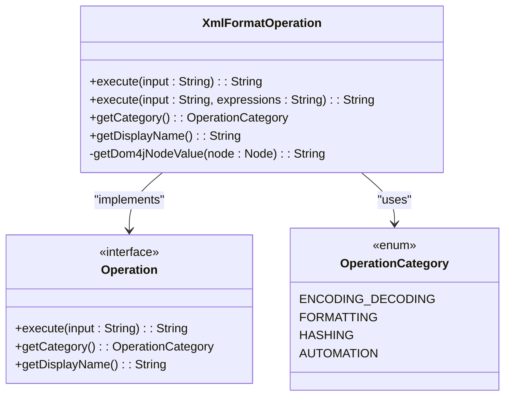
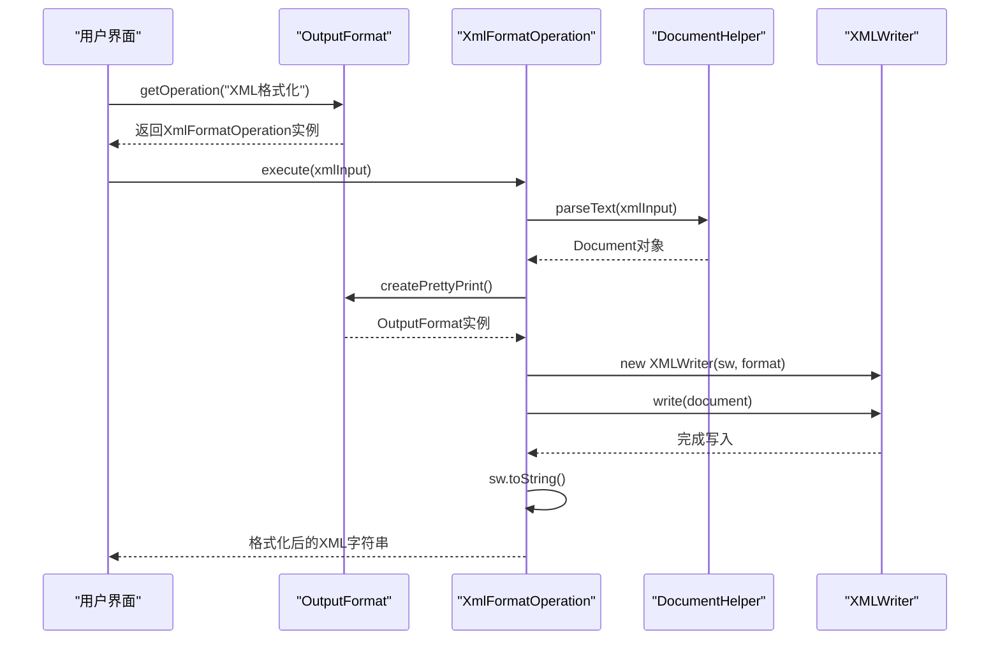
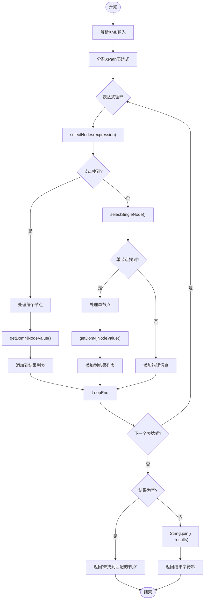
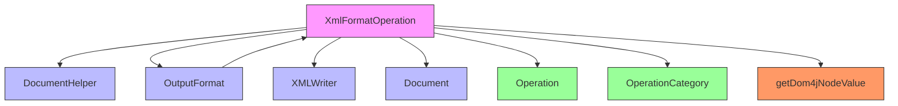

# XML格式化

<cite>
**Referenced Files in This Document**   
- [XmlFormatOperation.java](file://src/main/java/org/oxff/operation/XmlFormatOperation.java)
- [OperationFactory.java](file://src/main/java/org/oxff/core/OperationFactory.java)
- [OperationCategory.java](file://src/main/java/org/oxff/core/OperationCategory.java)
- [StringFormatterUI.java](file://src/main/java/org/oxff/ui/StringFormatterUI.java)
</cite>

## 目录
1. [简介](#简介)
2. [核心组件](#核心组件)
3. [架构概述](#架构概述)
4. [详细组件分析](#详细组件分析)
5. [依赖分析](#依赖分析)
6. [性能考虑](#性能考虑)
7. [故障排除指南](#故障排除指南)
8. [结论](#结论)

## 简介
`XmlFormatOperation`类是XML处理功能的核心实现，提供XML格式化美化和XPath数据提取两大核心功能。该类利用dom4j库的强大功能，将原始XML字符串转换为格式化输出，并支持通过XPath表达式精确提取所需数据。作为`Operation`接口的实现，它被注册到操作工厂中，属于格式化操作类别，为用户提供直观的XML处理能力。

## 核心组件

`XmlFormatOperation`类实现了`Operation`接口，提供XML格式化和数据提取功能。其核心方法`execute(String input)`负责将原始XML字符串格式化为美观的输出，而重载方法`execute(String input, String expressions)`则支持通过XPath表达式提取特定节点数据。该类还实现了`getCategory()`和`getDisplayName()`方法，用于标识操作的分类和显示名称。

**Section sources**
- [XmlFormatOperation.java](file://src/main/java/org/oxff/operation/XmlFormatOperation.java#L18-L126)

## 架构概述

**Diagram sources**
- [XmlFormatOperation.java](file://src/main/java/org/oxff/operation/XmlFormatOperation.java#L18-L126)
- [OperationFactory.java](file://src/main/java/org/oxff/core/OperationFactory.java#L17-L60)

## 详细组件分析

### XmlFormatOperation分析

`XmlFormatOperation`类是XML处理功能的核心，提供两种执行模式：基础格式化和带XPath表达式的高级数据提取。

#### 类结构分析

**Diagram sources**
- [XmlFormatOperation.java](file://src/main/java/org/oxff/operation/XmlFormatOperation.java#L18-L126)
- [Operation.java](file://src/main/java/org/oxff/operation/Operation.java#L7-L26)
- [OperationCategory.java](file://src/main/java/org/oxff/core/OperationCategory.java#L4-L20)

#### 执行流程分析

**Diagram sources**
- [XmlFormatOperation.java](file://src/main/java/org/oxff/operation/XmlFormatOperation.java#L19-L33)
- [StringFormatterUI.java](file://src/main/java/org/oxff/ui/StringFormatterUI.java#L444-L463)

#### XPath处理流程

**Diagram sources**
- [XmlFormatOperation.java](file://src/main/java/org/oxff/operation/XmlFormatOperation.java#L51-L105)

## 依赖分析

**Diagram sources**
- [XmlFormatOperation.java](file://src/main/java/org/oxff/operation/XmlFormatOperation.java#L18-L126)

**Section sources**
- [XmlFormatOperation.java](file://src/main/java/org/oxff/operation/XmlFormatOperation.java#L18-L126)
- [OperationFactory.java](file://src/main/java/org/oxff/core/OperationFactory.java#L17-L60)

## 性能考虑

在处理大型XML文档时，应注意内存使用和处理效率。`XmlFormatOperation`类使用dom4j的DOM解析方式，会将整个文档加载到内存中，因此对于非常大的XML文件可能会导致内存不足。建议在处理大型文档时考虑使用SAX或StAX等流式解析器。此外，复杂的XPath表达式可能会影响性能，应尽量优化表达式以提高查询效率。

## 故障排除指南

当XML格式化失败时，通常会返回"无效的XML格式"错误信息，这表明输入的XML字符串不符合XML语法规范。检查XML是否包含正确的标签闭合、属性引号等。对于XPath表达式错误，系统会返回具体的表达式和错误信息，帮助用户定位问题。确保XPath表达式语法正确，路径存在且节点可访问。

**Section sources**
- [XmlFormatOperation.java](file://src/main/java/org/oxff/operation/XmlFormatOperation.java#L19-L33)
- [XmlFormatOperation.java](file://src/main/java/org/oxff/operation/XmlFormatOperation.java#L51-L105)

## 结论

`XmlFormatOperation`类通过整合dom4j库的强大功能，为用户提供了一套完整的XML处理解决方案。它不仅能够将杂乱的XML字符串格式化为美观的输出，还支持通过XPath表达式精确提取所需数据。该类的设计遵循了清晰的接口规范，易于集成和扩展，是XML处理功能的核心组件。