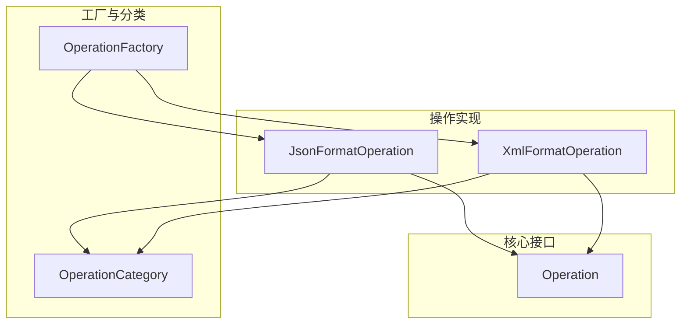
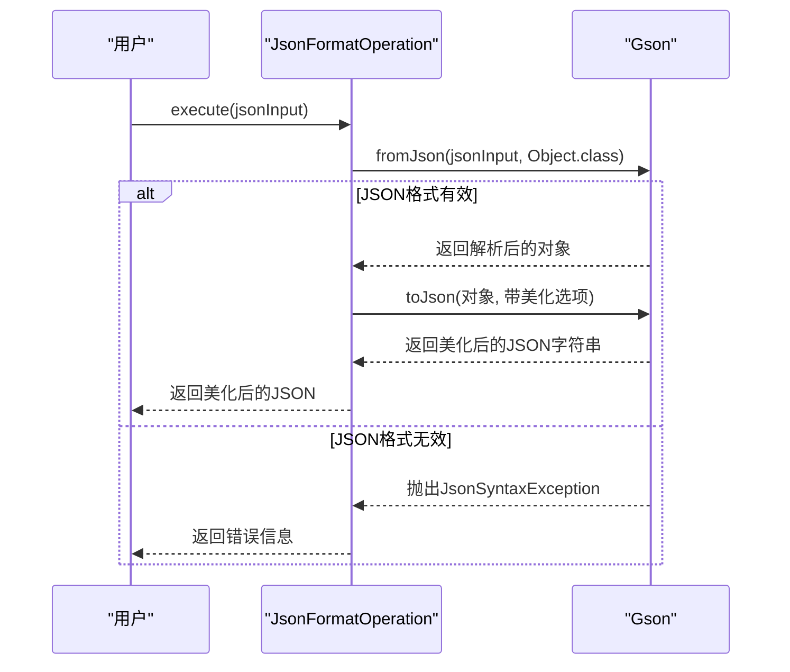
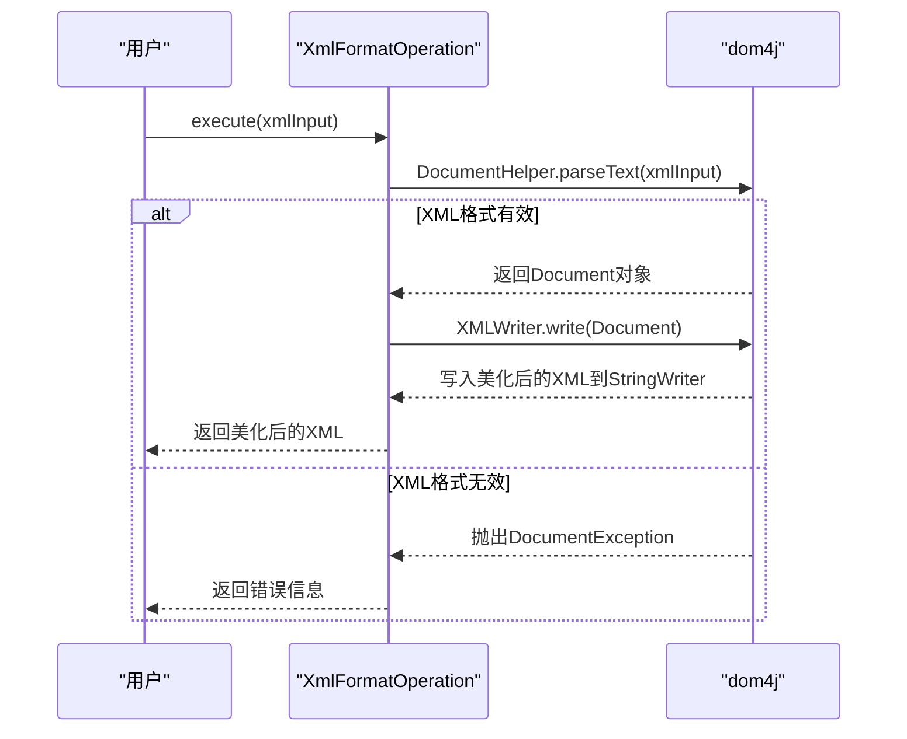
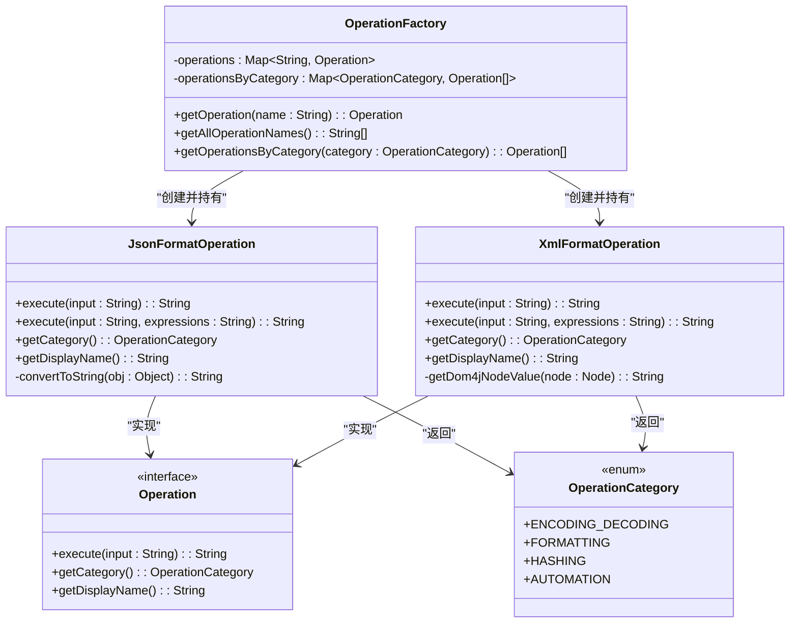
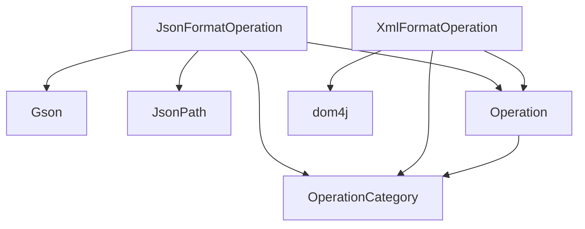

# 格式化操作

<cite>
**Referenced Files in This Document**   
- [JsonFormatOperation.java](file://src/main/java/org/oxff/operation/JsonFormatOperation.java)
- [XmlFormatOperation.java](file://src/main/java/org/oxff/operation/XmlFormatOperation.java)
- [OperationFactory.java](file://src/main/java/org/oxff/core/OperationFactory.java)
- [OperationCategory.java](file://src/main/java/org/oxff/core/OperationCategory.java)
- [Operation.java](file://src/main/java/org/oxff/operation/Operation.java)
</cite>

## 目录
1. [简介](#简介)
2. [核心组件](#核心组件)
3. [架构概览](#架构概览)
4. [详细组件分析](#详细组件分析)
5. [依赖分析](#依赖分析)
6. [性能考虑](#性能考虑)
7. [故障排除指南](#故障排除指南)
8. [结论](#结论)

## 简介
本文档深入分析了`JsonFormatOperation`和`XmlFormatOperation`两个核心格式化操作的实现机制。这两个操作为用户提供JSON和XML数据的格式化、美化以及通过表达式提取特定内容的功能。`JsonFormatOperation`利用Gson库进行JSON处理，并支持JSONPath表达式；`XmlFormatOperation`则使用dom4j库处理XML，并支持XPath表达式。两者均属于`OperationCategory.FORMATTING`分类，并通过`OperationFactory`进行统一管理和注册。文档将详细阐述其工作原理、异常处理策略和使用方法。

## 核心组件
本文档的核心组件是`JsonFormatOperation`和`XmlFormatOperation`，它们实现了`Operation`接口，提供了对JSON和XML数据的格式化与内容提取功能。

**Section sources**
- [JsonFormatOperation.java](file://src/main/java/org/oxff/operation/JsonFormatOperation.java#L15-L122)
- [XmlFormatOperation.java](file://src/main/java/org/oxff/operation/XmlFormatOperation.java#L18-L126)

## 架构概览
以下图表展示了`JsonFormatOperation`和`XmlFormatOperation`在整体架构中的位置及其与工厂和分类系统的交互关系。

**Diagram sources**
- [JsonFormatOperation.java](file://src/main/java/org/oxff/operation/JsonFormatOperation.java#L15-L122)
- [XmlFormatOperation.java](file://src/main/java/org/oxff/operation/XmlFormatOperation.java#L18-L126)
- [OperationFactory.java](file://src/main/java/org/oxff/core/OperationFactory.java#L1-L60)
- [OperationCategory.java](file://src/main/java/org/oxff/core/OperationCategory.java#L1-L20)

## 详细组件分析

### JsonFormatOperation 分析
`JsonFormatOperation`类负责处理JSON数据的格式化和内容提取。

#### JSON格式化与美化
该操作通过Gson库实现JSON的格式化和美化输出。当调用单参数的`execute(String input)`方法时，它会创建一个带有`setPrettyPrinting()`选项的`Gson`实例，将输入的紧凑JSON字符串解析为对象，然后再序列化为带有缩进和换行的美化格式。

**Diagram sources**
- [JsonFormatOperation.java](file://src/main/java/org/oxff/operation/JsonFormatOperation.java#L16-L25)

#### JSONPath内容提取
`JsonFormatOperation`提供了重载的`execute(String input, String expressions)`方法，支持通过JSONPath表达式从JSON数据中提取特定字段值。该方法首先验证JSON格式，然后将多行表达式拆分，逐个执行。对于每个表达式，它使用`JsonPath.parse()`和`read()`方法读取匹配的节点。结果可以是单个值或列表，方法会递归处理并将所有非空结果转换为字符串，最后用换行符连接返回。

**Section sources**
- [JsonFormatOperation.java](file://src/main/java/org/oxff/operation/JsonFormatOperation.java#L43-L102)

### XmlFormatOperation 分析
`XmlFormatOperation`类负责处理XML数据的格式化和内容提取。

#### XML格式化与美化
该操作利用dom4j库实现XML的格式化。在`execute(String input)`方法中，它使用`DocumentHelper.parseText()`解析输入的XML字符串，创建一个`Document`对象。然后，通过`OutputFormat.createPrettyPrint()`创建一个美化格式的输出器，并使用`XMLWriter`将`Document`写入一个`StringWriter`，从而生成带有缩进和换行的美化XML。

**Diagram sources**
- [XmlFormatOperation.java](file://src/main/java/org/oxff/operation/XmlFormatOperation.java#L19-L33)

#### XPath内容提取
`XmlFormatOperation`同样提供了重载的`execute(String input, String expressions)`方法，用于通过XPath表达式提取XML节点内容。它使用`document.selectNodes(expression)`和`document.selectSingleNode(expression)`来执行XPath查询。查询结果会传递给`getDom4jNodeValue()`方法，该方法根据节点类型（元素、属性、文本等）返回相应的文本值。所有非空的结果会被收集并用换行符连接返回。

**Section sources**
- [XmlFormatOperation.java](file://src/main/java/org/oxff/operation/XmlFormatOperation.java#L51-L105)

### 公共特性分析
两个操作类都实现了`Operation`接口，具有统一的分类和显示名称。

#### 分类与注册
两个操作都属于`OperationCategory.FORMATTING`（格式化）分类。它们在`OperationFactory`的静态初始化块中被实例化并注册到全局操作映射中，使得系统可以通过`getOperation()`方法根据显示名称获取其实例。

**Diagram sources**
- [Operation.java](file://src/main/java/org/oxff/operation/Operation.java#L7-L26)
- [JsonFormatOperation.java](file://src/main/java/org/oxff/operation/JsonFormatOperation.java#L15-L122)
- [XmlFormatOperation.java](file://src/main/java/org/oxff/operation/XmlFormatOperation.java#L18-L126)
- [OperationCategory.java](file://src/main/java/org/oxff/core/OperationCategory.java#L1-L20)
- [OperationFactory.java](file://src/main/java/org/oxff/core/OperationFactory.java#L1-L60)

## 依赖分析
`JsonFormatOperation`和`XmlFormatOperation`都依赖于外部库来处理各自的数据格式。`JsonFormatOperation`依赖于`com.google.gson`和`com.jayway.jsonpath`库，而`XmlFormatOperation`依赖于`org.dom4j`库。它们都依赖于项目内部的`Operation`接口和`OperationCategory`枚举。

**Diagram sources**
- [JsonFormatOperation.java](file://src/main/java/org/oxff/operation/JsonFormatOperation.java#L1-L122)
- [XmlFormatOperation.java](file://src/main/java/org/oxff/operation/XmlFormatOperation.java#L1-L126)

## 性能考虑
- **JSON处理**：Gson库的`fromJson`和`toJson`操作对于大型JSON文档可能会消耗较多内存和CPU。建议对非常大的JSON文件进行分块处理。
- **XML处理**：dom4j采用DOM模型，会将整个XML文档加载到内存中，因此对于超大XML文件，可能会导致内存溢出。对于此类场景，应考虑使用SAX或StAX等流式解析器。
- **表达式处理**：频繁执行复杂的JSONPath或XPath表达式会影响性能。如果需要对同一文档执行多个查询，应考虑缓存解析后的文档对象。

## 故障排除指南
本节提供常见问题的解决方案。

### 输入格式错误
当输入的JSON或XML格式不正确时，两个操作都会捕获相应的异常（`JsonSyntaxException`或`DocumentException`），并返回以"无效的JSON格式"或"无效的XML格式"开头的错误信息。用户应检查输入数据的语法是否正确。

**Section sources**
- [JsonFormatOperation.java](file://src/main/java/org/oxff/operation/JsonFormatOperation.java#L16-L25)
- [XmlFormatOperation.java](file://src/main/java/org/oxff/operation/XmlFormatOperation.java#L19-L33)

### 表达式执行失败
如果JSONPath或XPath表达式语法错误或指向的节点不存在，操作会捕获异常，并在结果中返回以"JSONPath表达式错误"或"XPath表达式错误"开头的信息，同时包含具体的表达式和错误详情。用户应检查表达式语法和数据结构。

**Section sources**
- [JsonFormatOperation.java](file://src/main/java/org/oxff/operation/JsonFormatOperation.java#L43-L102)
- [XmlFormatOperation.java](file://src/main/java/org/oxff/operation/XmlFormatOperation.java#L51-L105)

## 结论
`JsonFormatOperation`和`XmlFormatOperation`为用户提供了一套强大且易用的JSON和XML数据处理工具。它们通过集成成熟的第三方库（Gson和dom4j），实现了数据的美化格式化和通过表达式（JSONPath/XPath）的内容提取。其设计遵循了统一的`Operation`接口规范，并通过`OperationFactory`进行集中管理，体现了良好的模块化和可扩展性。开发者可以参考此模式来实现其他类型的数据处理操作。