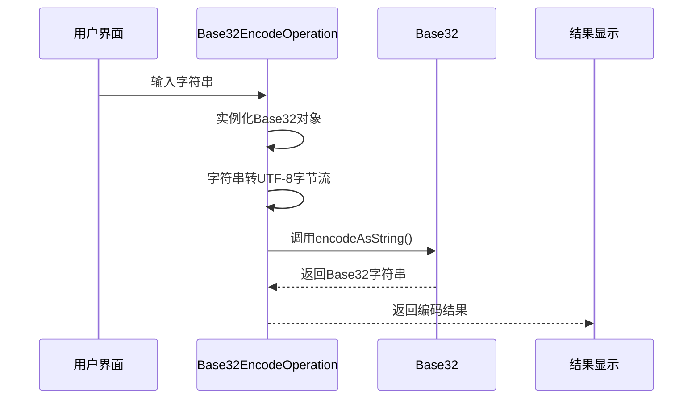
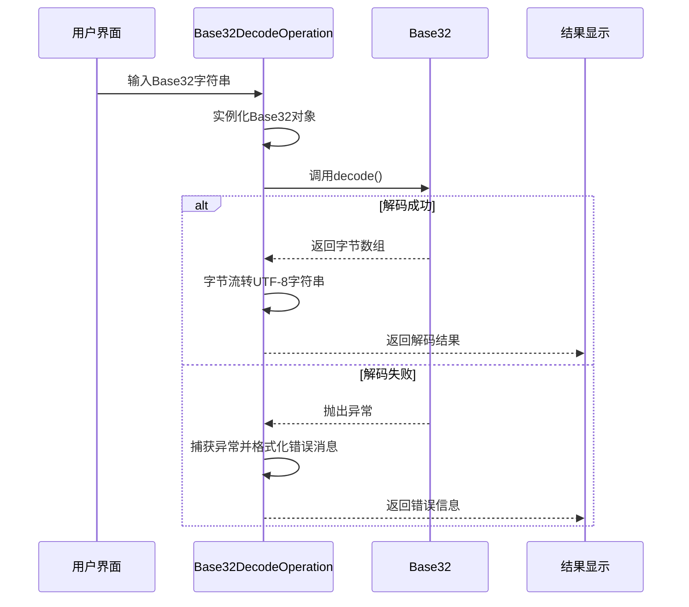
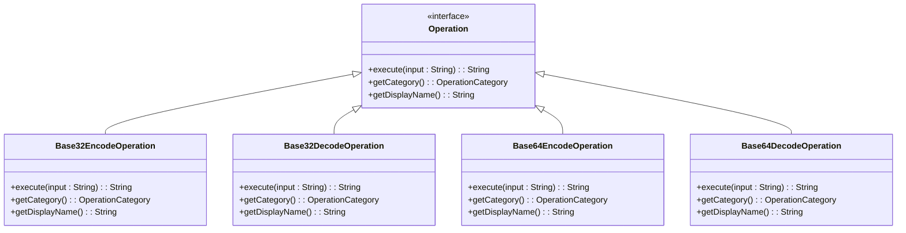
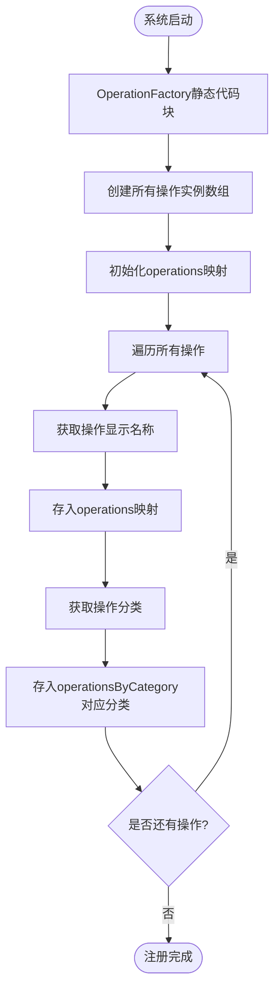

# Base32编解码

<cite>
**Referenced Files in This Document**   
- [Base32EncodeOperation.java](file://src/main/java/org/oxff/operation/Base32EncodeOperation.java)
- [Base32DecodeOperation.java](file://src/main/java/org/oxff/operation/Base32DecodeOperation.java)
- [Base64EncodeOperation.java](file://src/main/java/org/oxff/operation/Base64EncodeOperation.java)
- [Base64DecodeOperation.java](file://src/main/java/org/oxff/operation/Base64DecodeOperation.java)
- [OperationFactory.java](file://src/main/java/org/oxff/core/OperationFactory.java)
- [Operation.java](file://src/main/java/org/oxff/operation/Operation.java)
- [OperationCategory.java](file://src/main/java/org/oxff/core/OperationCategory.java)
</cite>

## 目录
1. [引言](#引言)
2. [核心组件](#核心组件)
3. [编码机制分析](#编码机制分析)
4. [解码机制分析](#解码机制分析)
5. [与Base64操作的对比](#与base64操作的对比)
6. [字符集与编码表差异](#字符集与编码表差异)
7. [应用场景优势](#应用场景优势)
8. [操作工厂注册流程](#操作工厂注册流程)
9. [结论](#结论)

## 引言
Base32是一种二进制到文本的编码方案，旨在提供比Base64更高的可读性和容错性。本文档全面阐述了`Base32EncodeOperation`和`Base32DecodeOperation`的工作机制，详细分析了其在Java应用中的实现方式、异常处理机制以及与Base64操作的异同。通过代码级分析，揭示了Base32在二维码、短链接等对可读性要求较高的场景中的优势，并说明了其在`OperationFactory`中的注册流程。

## 核心组件

`Base32EncodeOperation`和`Base32DecodeOperation`是实现Base32编解码功能的核心组件，它们都实现了`Operation`接口，遵循统一的操作规范。这两个类分别负责Base32编码和解码任务，通过调用Apache Commons Codec库中的`Base32`类来完成实际的编解码工作。`Base32EncodeOperation`将输入字符串转换为UTF-8字节流后进行编码，而`Base32DecodeOperation`则在异常处理机制下执行解码，确保在解析错误时能够返回清晰的错误消息。

**Section sources**
- [Base32EncodeOperation.java](file://src/main/java/org/oxff/operation/Base32EncodeOperation.java#L1-L26)
- [Base32DecodeOperation.java](file://src/main/java/org/oxff/operation/Base32DecodeOperation.java#L1-L31)

## 编码机制分析

`Base32EncodeOperation`的编码机制遵循标准的Base32编码流程。首先，该操作通过实例化Apache Commons Codec的`Base32`对象来准备编码器。然后，将输入字符串使用UTF-8字符集转换为字节流，这是编码过程的第一步。最后，调用`Base32`对象的`encodeAsString`方法，将UTF-8编码后的字节流转换为Base32字符串表示形式。这种实现方式确保了编码过程的标准化和可靠性，同时利用了成熟库的优化算法。

**Diagram sources**
- [Base32EncodeOperation.java](file://src/main/java/org/oxff/operation/Base32EncodeOperation.java#L10-L14)

## 解码机制分析

`Base32DecodeOperation`的解码机制包含了完善的异常处理机制，确保了操作的健壮性。在执行解码时，首先实例化`Base32`对象，然后尝试解码输入的Base32字符串。解码过程被包裹在try-catch块中，能够捕获所有可能的解析错误。如果解码成功，将解码得到的字节流使用UTF-8字符集转换回字符串；如果发生异常，则返回格式化的错误消息，明确指出"Base32解码错误"并包含具体的错误信息。这种设计使得用户能够清晰地了解解码失败的原因，提高了用户体验。

**Diagram sources**
- [Base32DecodeOperation.java](file://src/main/java/org/oxff/operation/Base32DecodeOperation.java#L10-L20)

## 与Base64操作的对比

`Base32EncodeOperation`和`Base32DecodeOperation`与`Base64EncodeOperation`和`Base64DecodeOperation`在整体架构和实现模式上具有高度相似性，但存在关键差异。两者都实现了`Operation`接口，具有相同的`execute`、`getCategory`和`getDisplayName`方法，遵循相同的操作规范。在编码方面，`Base32EncodeOperation`使用`Base32`类的`encodeAsString`方法，而`Base64EncodeOperation`直接使用`Base64.encodeBase64String`静态方法。在解码方面，两者都采用了try-catch异常处理机制，但捕获的异常类型和错误消息的前缀不同，分别标识为"Base32解码错误"和"Base64解码错误"。

**Diagram sources**
- [Base32EncodeOperation.java](file://src/main/java/org/oxff/operation/Base32EncodeOperation.java#L7-L26)
- [Base32DecodeOperation.java](file://src/main/java/org/oxff/operation/Base32DecodeOperation.java#L7-L31)
- [Base64EncodeOperation.java](file://src/main/java/org/oxff/operation/Base64EncodeOperation.java#L7-L25)
- [Base64DecodeOperation.java](file://src/main/java/org/oxff/operation/Base64DecodeOperation.java#L7-L30)

## 字符集与编码表差异

Base32和Base64在字符集和编码表上存在显著差异，这些差异直接影响了它们的适用场景。Base32使用32个可打印字符（A-Z和2-7）进行编码，避免了容易混淆的字符如0、1、8、9，以及符号+/等，这使得Base32编码的字符串在口头传达或手写时更不容易出错。相比之下，Base64使用64个字符（A-Z、a-z、0-9以及+和/），虽然编码效率更高（Base32编码后的数据比原始数据长约60%，而Base64仅长约33%），但在可读性和容错性方面较差。Base32的编码表设计特别考虑了人类可读性，使其在需要人工输入或识别的场景中更具优势。

## 应用场景优势

Base32编码在二维码、短链接等对可读性要求较高的场景中具有明显优势。在二维码应用中，Base32编码的字符串由于避免了容易混淆的字符，扫描识别的准确率更高，即使在部分损坏的情况下也更容易被正确解析。在短链接服务中，Base32生成的链接更易于用户记忆和口头传播，减少了因字符混淆导致的访问错误。此外，在需要人工输入的场景（如软件激活码、优惠券代码）中，Base32编码大大降低了用户输入错误的概率。这些优势使得Base32成为对用户体验要求较高的应用中的首选编码方案，尽管其编码效率低于Base64。

## 操作工厂注册流程

`Base32EncodeOperation`和`Base32DecodeOperation`在`OperationFactory`中的注册流程是系统初始化的关键部分。在`OperationFactory`的静态代码块中，所有操作实例被集中创建并注册到两个映射中：一个按操作名称映射，另一个按操作分类组织。`Base32EncodeOperation`和`Base32DecodeOperation`与其他操作（如`Base64EncodeOperation`、`JsonFormatOperation`等）一起被添加到`allOperations`数组中。然后，系统遍历该数组，将每个操作的显示名称作为键，操作实例作为值，存入`operations`映射；同时，根据操作的分类（`ENCODING_DECODING`），将操作实例添加到`operationsByCategory`映射对应的分类列表中。这种注册机制确保了操作的集中管理和高效检索。

**Diagram sources**
- [OperationFactory.java](file://src/main/java/org/oxff/core/OperationFactory.java#L15-L45)

## 结论
`Base32EncodeOperation`和`Base32DecodeOperation`通过简洁而高效的实现，提供了可靠的Base32编解码功能。它们与Base64操作在架构上保持一致，但在字符集选择上做出了优化，牺牲了一定的编码效率来换取更高的可读性和容错性。通过在`OperationFactory`中的集中注册，这些操作能够被系统统一管理和调用。Base32编码在二维码、短链接等对可读性要求较高的场景中展现出显著优势，特别是在需要人工参与的输入或识别过程中，能够有效减少错误率，提升用户体验。这种设计平衡了技术性能和实际应用需求，体现了良好的工程实践。