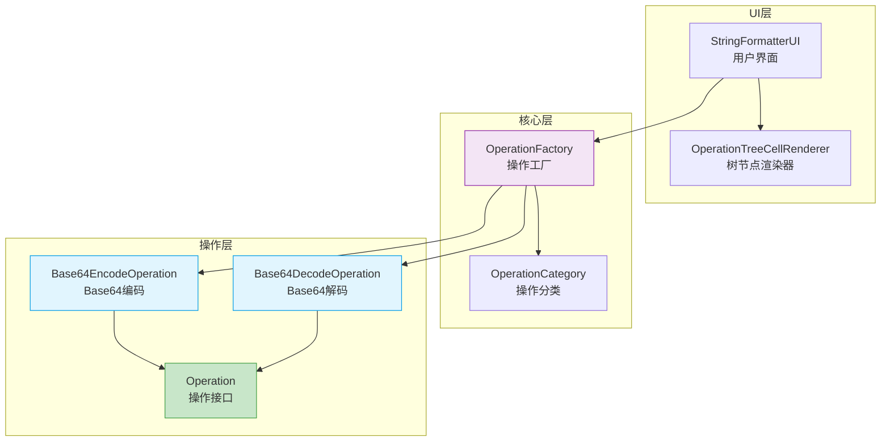
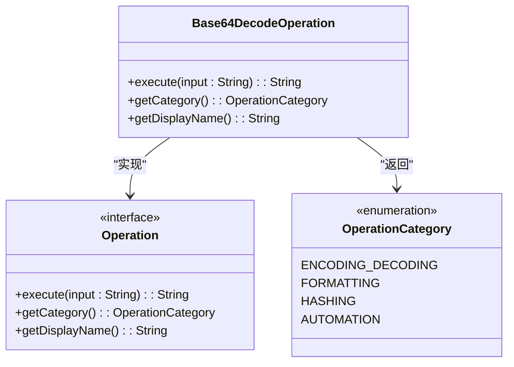
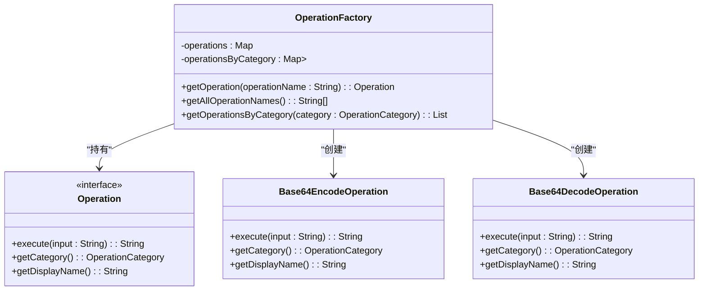
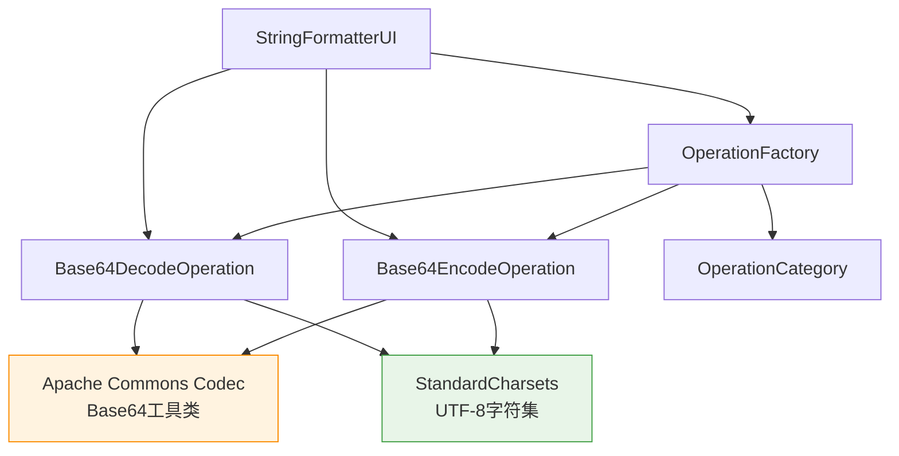

# Base64编解码

<cite>
**Referenced Files in This Document**   
- [Base64EncodeOperation.java](file://src/main/java/org/oxff/operation/Base64EncodeOperation.java)
- [Base64DecodeOperation.java](file://src/main/java/org/oxff/operation/Base64DecodeOperation.java)
- [OperationFactory.java](file://src/main/java/org/oxff/core/OperationFactory.java)
- [Operation.java](file://src/main/java/org/oxff/operation/Operation.java)
- [OperationCategory.java](file://src/main/java/org/oxff/core/OperationCategory.java)
- [StringFormatterUI.java](file://src/main/java/org/oxff/ui/StringFormatterUI.java)
</cite>

## 目录
1. [简介](#简介)
2. [核心组件](#核心组件)
3. [架构概览](#架构概览)
4. [详细组件分析](#详细组件分析)
5. [依赖分析](#依赖分析)
6. [性能考虑](#性能考虑)
7. [故障排除指南](#故障排除指南)
8. [结论](#结论)

## 简介
本文档深入分析了`Base64EncodeOperation`和`Base64DecodeOperation`的实现原理。文档详细描述了`Base64EncodeOperation`如何利用Apache Commons Codec库的`Base64.encodeBase64String`方法将UTF-8字节数组转换为Base64字符串；以及`Base64DecodeOperation`如何在try-catch块中安全调用`decodeBase64`方法，处理非法输入并返回用户友好的错误信息。文档还结合代码说明了其字符集一致性（UTF-8）和异常封装策略，解释了该操作在数据传输、HTTP认证等场景中的典型应用，并对比了与其他Base64实现的兼容性。最后，文档强调了`OperationFactory`如何统一管理这些操作实例。

## 核心组件

`Base64EncodeOperation`和`Base64DecodeOperation`是实现Base64编解码功能的核心组件。`Base64EncodeOperation`通过调用Apache Commons Codec库的`Base64.encodeBase64String`方法，将输入字符串以UTF-8编码转换为字节数组，再编码为Base64字符串。`Base64DecodeOperation`则在try-catch块中安全地调用`decodeBase64`方法，处理非法输入并返回用户友好的错误信息。这两个操作都实现了`Operation`接口，确保了统一的执行模式和分类管理。

**Section sources**
- [Base64EncodeOperation.java](file://src/main/java/org/oxff/operation/Base64EncodeOperation.java#L7-L25)
- [Base64DecodeOperation.java](file://src/main/java/org/oxff/operation/Base64DecodeOperation.java#L7-L30)

## 架构概览

**Diagram sources**
- [Base64EncodeOperation.java](file://src/main/java/org/oxff/operation/Base64EncodeOperation.java#L7-L25)
- [Base64DecodeOperation.java](file://src/main/java/org/oxff/operation/Base64DecodeOperation.java#L7-L30)
- [OperationFactory.java](file://src/main/java/org/oxff/core/OperationFactory.java#L9-L60)
- [Operation.java](file://src/main/java/org/oxff/operation/Operation.java#L7-L26)
- [OperationCategory.java](file://src/main/java/org/oxff/core/OperationCategory.java#L7-L20)
- [StringFormatterUI.java](file://src/main/java/org/oxff/ui/StringFormatterUI.java#L1-L547)

## 详细组件分析

### Base64编码操作分析

`Base64EncodeOperation`类实现了`Operation`接口，负责将输入字符串编码为Base64格式。该操作使用Apache Commons Codec库的`Base64.encodeBase64String`方法，确保了编码的准确性和兼容性。输入字符串首先被转换为UTF-8字节数组，然后进行Base64编码。这种实现方式保证了字符集的一致性，避免了编码转换过程中的乱码问题。

**Diagram sources**
- [Base64EncodeOperation.java](file://src/main/java/org/oxff/operation/Base64EncodeOperation.java#L7-L25)
- [Operation.java](file://src/main/java/org/oxff/operation/Operation.java#L7-L26)
- [OperationCategory.java](file://src/main/java/org/oxff/core/OperationCategory.java#L7-L20)

**Section sources**
- [Base64EncodeOperation.java](file://src/main/java/org/oxff/operation/Base64EncodeOperation.java#L7-L25)

### Base64解码操作分析

`Base64DecodeOperation`类同样实现了`Operation`接口，负责将Base64字符串解码为原始字符串。该操作在try-catch块中安全地调用`decodeBase64`方法，能够处理非法输入并返回用户友好的错误信息。解码后的字节数组使用UTF-8字符集转换为字符串，确保了字符集的一致性。异常处理机制将技术性错误信息包装为用户可理解的中文提示，提升了用户体验。

**Diagram sources**
- [Base64DecodeOperation.java](file://src/main/java/org/oxff/operation/Base64DecodeOperation.java#L7-L30)
- [Operation.java](file://src/main/java/org/oxff/operation/Operation.java#L7-L26)
- [OperationCategory.java](file://src/main/java/org/oxff/core/OperationCategory.java#L7-L20)

**Section sources**
- [Base64DecodeOperation.java](file://src/main/java/org/oxff/operation/Base64DecodeOperation.java#L7-L30)

### 操作工厂分析

`OperationFactory`类作为操作实例的统一管理器，通过静态代码块初始化所有操作实例，并按名称和分类进行组织。该工厂模式实现了操作实例的集中管理和快速查找，避免了重复创建对象的开销。`getOperation`方法根据操作名称返回相应的操作实例，`getOperationsByCategory`方法则返回特定分类下的所有操作，支持按分类浏览功能。

**Diagram sources**
- [OperationFactory.java](file://src/main/java/org/oxff/core/OperationFactory.java#L9-L60)
- [Operation.java](file://src/main/java/org/oxff/operation/Operation.java#L7-L26)
- [Base64EncodeOperation.java](file://src/main/java/org/oxff/operation/Base64EncodeOperation.java#L7-L25)
- [Base64DecodeOperation.java](file://src/main/java/org/oxff/operation/Base64DecodeOperation.java#L7-L30)

**Section sources**
- [OperationFactory.java](file://src/main/java/org/oxff/core/OperationFactory.java#L9-L60)

## 依赖分析

**Diagram sources**
- [Base64EncodeOperation.java](file://src/main/java/org/oxff/operation/Base64EncodeOperation.java#L7-L25)
- [Base64DecodeOperation.java](file://src/main/java/org/oxff/operation/Base64DecodeOperation.java#L7-L30)
- [OperationFactory.java](file://src/main/java/org/oxff/core/OperationFactory.java#L9-L60)
- [StringFormatterUI.java](file://src/main/java/org/oxff/ui/StringFormatterUI.java#L1-L547)

**Section sources**
- [Base64EncodeOperation.java](file://src/main/java/org/oxff/operation/Base64EncodeOperation.java#L7-L25)
- [Base64DecodeOperation.java](file://src/main/java/org/oxff/operation/Base64DecodeOperation.java#L7-L30)
- [OperationFactory.java](file://src/main/java/org/oxff/core/OperationFactory.java#L9-L60)

## 性能考虑

`Base64EncodeOperation`和`Base64DecodeOperation`的实现具有良好的性能特征。由于使用了Apache Commons Codec库的优化实现，编码和解码操作的时间复杂度均为O(n)，其中n为输入字符串的长度。操作实例通过`OperationFactory`单例模式管理，避免了重复创建对象的开销。UTF-8字符集的使用确保了编码效率，特别是在处理ASCII字符时，Base64编码的膨胀率仅为33%。异常处理机制虽然增加了少量开销，但通过try-catch块的合理使用，确保了程序的健壮性而不显著影响正常情况下的性能。

## 故障排除指南

当Base64解码操作失败时，系统会返回"Base64解码错误: "前缀的用户友好错误信息。常见问题包括：输入字符串包含非法Base64字符、输入长度不符合Base64编码规则、或输入为空字符串。对于编码操作，由于输入为普通字符串，通常不会出现错误。如果遇到界面无法执行操作的问题，请检查`OperationFactory`是否正确初始化了所有操作实例，以及`StringFormatterUI`是否正确获取了操作名称。日志功能可以帮助追踪操作执行过程和错误详情。

**Section sources**
- [Base64DecodeOperation.java](file://src/main/java/org/oxff/operation/Base64DecodeOperation.java#L11-L19)
- [StringFormatterUI.java](file://src/main/java/org/oxff/ui/StringFormatterUI.java#L350-L390)

## 结论

`Base64EncodeOperation`和`Base64DecodeOperation`通过利用Apache Commons Codec库实现了高效、可靠的Base64编解码功能。两个操作都严格使用UTF-8字符集，确保了字符集的一致性。`Base64DecodeOperation`的异常处理机制提供了用户友好的错误信息，增强了用户体验。`OperationFactory`作为统一的操作管理器，通过工厂模式实现了操作实例的集中管理和快速查找。这种设计模式不仅提高了代码的可维护性，还支持了系统的可扩展性，便于未来添加新的操作类型。整体实现具有良好的性能特征和健壮性，适用于数据传输、HTTP认证等多种应用场景。