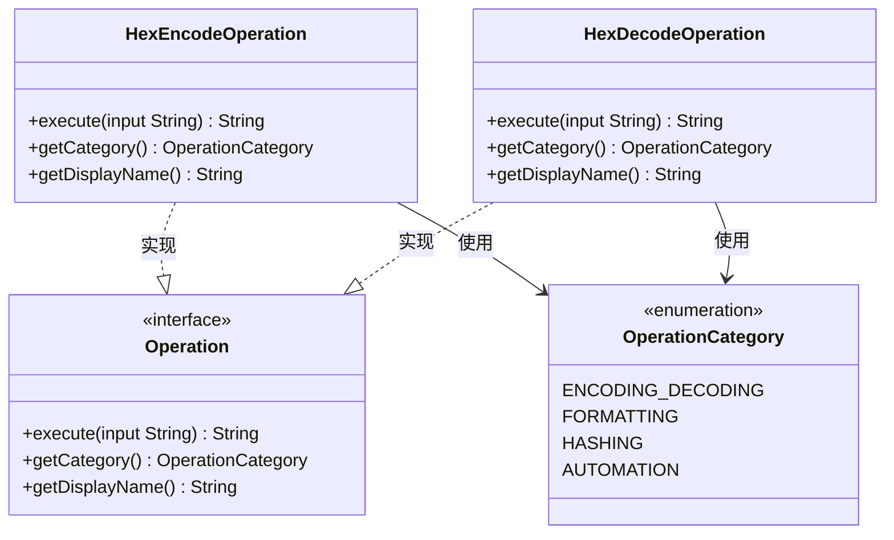

# Hex编解码

<cite>
**Referenced Files in This Document**   
- [HexEncodeOperation.java](file://src/main/java/org/oxff/operation/HexEncodeOperation.java)
- [HexDecodeOperation.java](file://src/main/java/org/oxff/operation/HexDecodeOperation.java)
- [Operation.java](file://src/main/java/org/oxff/operation/Operation.java)
- [OperationCategory.java](file://src/main/java/org/oxff/core/OperationCategory.java)
</cite>

## 目录
1. [Hex编码实现细节](#hex编码实现细节)
2. [Hex解码实现细节](#hex解码实现细节)
3. [轻量级实现方式](#轻量级实现方式)
4. [应用场景](#应用场景)
5. [操作分类与集成](#操作分类与集成)

## Hex编码实现细节

`HexEncodeOperation`类实现了将输入字符串转换为大写十六进制字符串的功能。该实现不依赖任何外部库，通过手动遍历字节并转换为十六进制表示来完成编码过程。

在编码过程中，首先将输入字符串按照UTF-8字符集转换为字节数组。然后逐个处理每个字节，使用`Integer.toHexString(0xff & b)`方法将字节转换为十六进制字符串。由于单个字节的十六进制表示可能只有一位数字（当值小于16时），因此需要进行补零处理：如果生成的十六进制字符串长度为1，则在前面添加'0'字符，确保每个字节都用两位十六进制数表示。

编码完成后，将所有十六进制字符串连接起来，并转换为大写字母形式返回。整个过程通过`StringBuilder`高效地构建结果字符串，避免了频繁的字符串拼接操作带来的性能开销。

异常处理方面，整个编码过程被包裹在try-catch块中，捕获任何可能发生的异常，并返回包含错误信息的友好错误消息。

**Section sources**
- [HexEncodeOperation.java](file://src/main/java/org/oxff/operation/HexEncodeOperation.java#L10-L26)

## Hex解码实现细节

`HexDecodeOperation`类负责将十六进制字符串解码回原始字符串。该实现包含了完整的预处理、验证和解析流程。

解码过程首先对输入进行预处理，使用正则表达式`\\s+`移除所有空白字符（包括空格、制表符等），确保输入的纯净性。接着进行两项关键的合法性验证：检查处理后的输入长度是否为偶数（因为每个字节需要两个十六进制字符表示），以及验证字符串是否仅包含有效的十六进制字符（0-9, A-F, a-f）。

只有通过所有验证的输入才会进入解析阶段。解析时，创建一个长度为输入长度一半的字节数组（因为每两个十六进制字符表示一个字节）。然后逐对处理十六进制字符，使用`String.substring`方法提取每对字符，再通过`Integer.parseInt(hexPair, 16)`将其解析为对应的字节值。

最终，将解析得到的字节数组按照UTF-8字符集转换为字符串返回。与编码操作类似，解码过程也包含了完整的异常处理机制，确保在任何错误情况下都能返回有意义的错误信息。

**Section sources**
- [HexDecodeOperation.java](file://src/main/java/org/oxff/operation/HexDecodeOperation.java#L10-L36)

## 轻量级实现方式

Hex编解码操作采用不依赖外部库的轻量级实现方式，完全基于Java标准库中的基础类和方法构建。这种设计确保了代码的简洁性、可移植性和低依赖性。

编码和解码逻辑都直接使用了Java内置的类型转换功能：`Integer.toHexString()`用于字节到十六进制字符串的转换，`Integer.parseInt()`用于十六进制字符串到字节的解析。字符编码处理则依赖于`StandardCharsets.UTF_8`常量，确保了跨平台的一致性。

通过实现统一的`Operation`接口，这两个操作被设计为可插拔的组件，具有高度的模块化特性。每个操作都提供了清晰的执行方法、分类信息和显示名称，便于在用户界面中展示和调用。

**Section sources**
- [HexEncodeOperation.java](file://src/main/java/org/oxff/operation/HexEncodeOperation.java#L9-L37)
- [HexDecodeOperation.java](file://src/main/java/org/oxff/operation/HexDecodeOperation.java#L9-L47)
- [Operation.java](file://src/main/java/org/oxff/operation/Operation.java#L7-L26)

## 应用场景

Hex编码在多个技术领域具有重要应用价值。在调试过程中，Hex编码常用于查看和分析二进制数据，将不可见的字节序列转换为可读的十六进制表示，便于开发人员检查数据内容和结构。

在网络协议分析中，Hex编码被广泛用于表示和传输原始数据包。许多网络协议规范使用Hex格式描述数据帧结构，安全工具和网络抓包软件也通常以Hex形式显示捕获的数据，方便技术人员进行协议逆向和故障排查。

Hex编码与Base16编码在本质上是等价的，都是将二进制数据以每4位为一组的方式转换为十六进制表示。这种编码方式具有直观、无歧义的特点，是二进制数据文本表示的标准方法之一。

## 操作分类与集成

Hex编解码操作通过实现`Operation`接口被集成到统一的操作管理体系中。该体系采用分类管理机制，所有操作都归属于特定的分类。

根据代码实现，Hex编码和解码操作都被归类到`ENCODING_DECODING`（编解码）类别中。这一分类决策由`getCategory()`方法返回`OperationCategory.ENCODING_DECODING`常量实现，确保了操作在用户界面中的合理组织和展示。

每个操作还提供了用户友好的显示名称（"Hex编码"和"Hex解码"），通过`getDisplayName()`方法返回，便于最终用户识别和选择。这种统一的接口设计使得新的操作可以轻松添加到系统中，同时保持一致的用户体验。

**Diagram sources**
- [HexEncodeOperation.java](file://src/main/java/org/oxff/operation/HexEncodeOperation.java#L9-L37)
- [HexDecodeOperation.java](file://src/main/java/org/oxff/operation/HexDecodeOperation.java#L9-L47)
- [Operation.java](file://src/main/java/org/oxff/operation/Operation.java#L7-L26)
- [OperationCategory.java](file://src/main/java/org/oxff/core/OperationCategory.java#L6-L20)

**Section sources**
- [HexEncodeOperation.java](file://src/main/java/org/oxff/operation/HexEncodeOperation.java#L28-L36)
- [HexDecodeOperation.java](file://src/main/java/org/oxff/operation/HexDecodeOperation.java#L38-L46)
- [OperationCategory.java](file://src/main/java/org/oxff/core/OperationCategory.java#L6-L20)