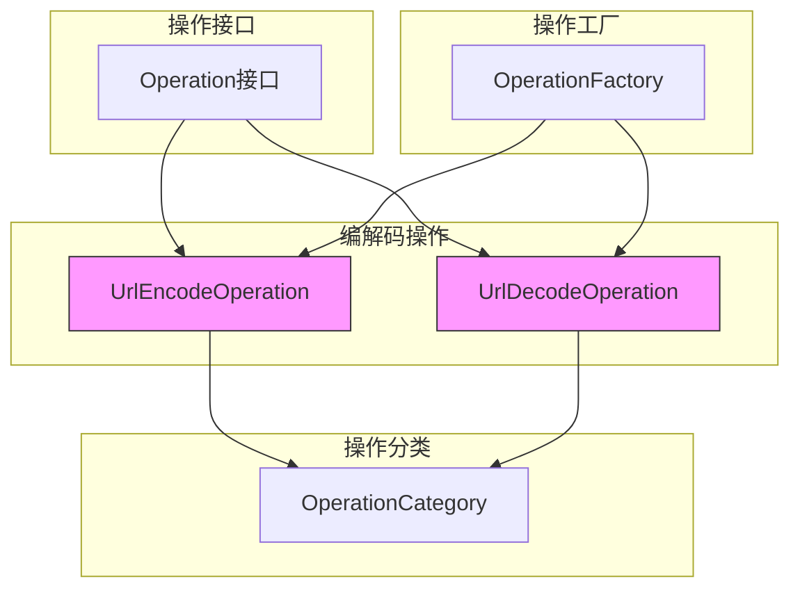
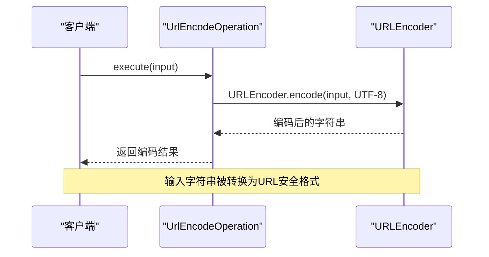
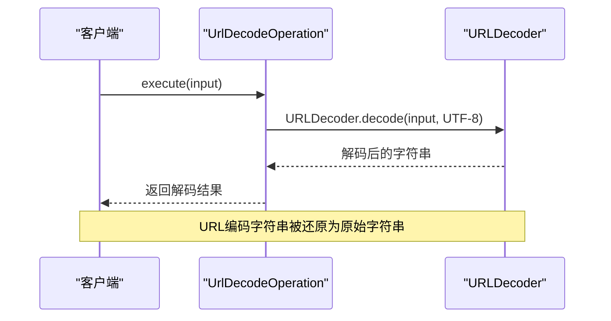
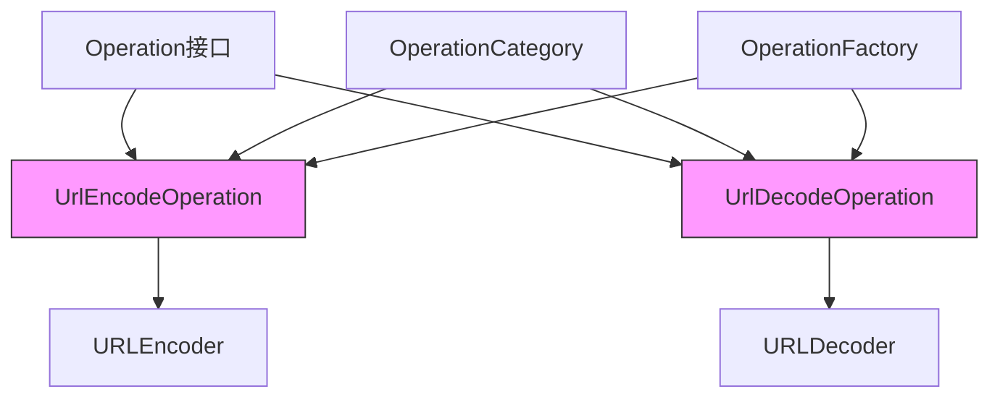

# URL编解码

<cite>
**Referenced Files in This Document**   
- [UrlEncodeOperation.java](file://src/main/java/org/oxff/operation/UrlEncodeOperation.java)
- [UrlDecodeOperation.java](file://src/main/java/org/oxff/operation/UrlDecodeOperation.java)
- [Operation.java](file://src/main/java/org/oxff/operation/Operation.java)
- [OperationFactory.java](file://src/main/java/org/oxff/core/OperationFactory.java)
- [OperationCategory.java](file://src/main/java/org/oxff/core/OperationCategory.java)
</cite>

## 目录
1. [简介](#简介)
2. [核心组件](#核心组件)
3. [架构概述](#架构概述)
4. [详细组件分析](#详细组件分析)
5. [依赖分析](#依赖分析)
6. [性能考虑](#性能考虑)
7. [故障排除指南](#故障排除指南)
8. [结论](#结论)

## 简介
本文档详细解析了UrlEncodeOperation和UrlDecodeOperation的实现机制。这两个操作类提供了URL安全的编码和解码功能，是系统中编解码功能的重要组成部分。文档将深入分析其实现原理、接口契约、注册机制以及实际应用场景。

## 核心组件

[In-depth analysis of core components with code snippets and explanations]

**Section sources**
- [UrlEncodeOperation.java](file://src/main/java/org/oxff/operation/UrlEncodeOperation.java#L10-L25)
- [UrlDecodeOperation.java](file://src/main/java/org/oxff/operation/UrlDecodeOperation.java#L10-L25)

## 架构概述

[Comprehensive visualization and explanation of the system architecture]



**Diagram sources**
- [UrlEncodeOperation.java](file://src/main/java/org/oxff/operation/UrlEncodeOperation.java#L10-L25)
- [UrlDecodeOperation.java](file://src/main/java/org/oxff/operation/UrlDecodeOperation.java#L10-L25)
- [Operation.java](file://src/main/java/org/oxff/operation/Operation.java#L7-L26)
- [OperationFactory.java](file://src/main/java/org/oxff/core/OperationFactory.java#L15-L28)
- [OperationCategory.java](file://src/main/java/org/oxff/core/OperationCategory.java#L7-L21)

## 详细组件分析

[Thorough analysis of each key component with diagrams, code snippet paths, and explanations]

### UrlEncodeOperation 分析
UrlEncodeOperation 类实现了 URL 编码功能，使用 Java 内置的 URLEncoder 和 UTF-8 字符集来确保特殊字符被正确转义。

#### 实现机制
```mermaid
classDiagram
class Operation {
<<interface>>
+execute(input : String) : String
+getCategory() : OperationCategory
+getDisplayName() : String
}
class UrlEncodeOperation {
+execute(input : String) : String
+getCategory() : OperationCategory
+getDisplayName() : String
}
Operation <|-- UrlEncodeOperation
UrlEncodeOperation --> "UTF-8" : 使用
UrlEncodeOperation --> "URLEncoder" : 使用
note right of UrlEncodeOperation
使用 URLEncoder.encode(input, StandardCharsets.UTF_8)
实现 URL 安全编码
end note
```

**Diagram sources**
- [UrlEncodeOperation.java](file://src/main/java/org/oxff/operation/UrlEncodeOperation.java#L10-L25)
- [Operation.java](file://src/main/java/org/oxff/operation/Operation.java#L7-L26)

#### 执行流程


**Diagram sources**
- [UrlEncodeOperation.java](file://src/main/java/org/oxff/operation/UrlEncodeOperation.java#L11-L14)

### UrlDecodeOperation 分析
UrlDecodeOperation 类实现了 URL 解码功能，通过 URLDecoder.decode 方法进行解码处理，并自动处理编码异常。

#### 实现机制
```mermaid
classDiagram
class Operation {
<<interface>>
+execute(input : String) : String
+getCategory() : OperationCategory
+getDisplayName() : String
}
class UrlDecodeOperation {
+execute(input : String) : String
+getCategory() : OperationCategory
+getDisplayName() : String
}
Operation <|-- UrlDecodeOperation
UrlDecodeOperation --> "UTF-8" : 使用
UrlDecodeOperation --> "URLDecoder" : 使用
note right of UrlDecodeOperation
使用 URLDecoder.decode(input, StandardCharsets.UTF_8)
实现URL解码处理
end note
```

**Diagram sources**
- [UrlDecodeOperation.java](file://src/main/java/org/oxff/operation/UrlDecodeOperation.java#L10-L25)
- [Operation.java](file://src/main/java/org/oxff/operation/Operation.java#L7-L26)

#### 执行流程


**Diagram sources**
- [UrlDecodeOperation.java](file://src/main/java/org/oxff/operation/UrlDecodeOperation.java#L11-L14)

### 统一接口契约分析
```mermaid
classDiagram
class Operation {
<<interface>>
+execute(input : String) : String
+getCategory() : OperationCategory
+getDisplayName() : String
}
class UrlEncodeOperation {
+execute(input : String) : String
+getCategory() : OperationCategory
+getDisplayName() : String
}
class UrlDecodeOperation {
+execute(input : String) : String
+getCategory() : OperationCategory
+getDisplayName() : String
}
Operation <|-- UrlEncodeOperation
Operation <|-- UrlDecodeOperation
UrlEncodeOperation --> "ENCODING_DECODING" : 分类
UrlDecodeOperation --> "ENCODING_DECODING" : 分类
note right of UrlEncodeOperation
显示名称 : "URL编码"
end note
note right of UrlDecodeOperation
显示名称 : "URL解码"
end note
```

**Diagram sources**
- [UrlEncodeOperation.java](file://src/main/java/org/oxff/operation/UrlEncodeOperation.java#L10-L25)
- [UrlDecodeOperation.java](file://src/main/java/org/oxff/operation/UrlDecodeOperation.java#L10-L25)
- [Operation.java](file://src/main/java/org/oxff/operation/Operation.java#L7-L26)

**Section sources**
- [UrlEncodeOperation.java](file://src/main/java/org/oxff/operation/UrlEncodeOperation.java#L10-L25)
- [UrlDecodeOperation.java](file://src/main/java/org/oxff/operation/UrlDecodeOperation.java#L10-L25)

## 依赖分析

[Analysis of dependencies between components with visualization]



**Diagram sources**
- [Operation.java](file://src/main/java/org/oxff/operation/Operation.java#L7-L26)
- [UrlEncodeOperation.java](file://src/main/java/org/oxff/operation/UrlEncodeOperation.java#L10-L25)
- [UrlDecodeOperation.java](file://src/main/java/org/oxff/operation/UrlDecodeOperation.java#L10-L25)
- [OperationFactory.java](file://src/main/java/org/oxff/core/OperationFactory.java#L15-L28)
- [OperationCategory.java](file://src/main/java/org/oxff/core/OperationCategory.java#L7-L21)

**Section sources**
- [OperationFactory.java](file://src/main/java/org/oxff/core/OperationFactory.java#L15-L28)

## 性能考虑

[General performance discussion without specific file analysis]
[No sources needed since this section provides general guidance]

## 故障排除指南

[Analysis of error handling code and debugging utilities]

**Section sources**
- [UrlEncodeOperation.java](file://src/main/java/org/oxff/operation/UrlEncodeOperation.java#L11-L14)
- [UrlDecodeOperation.java](file://src/main/java/org/oxff/operation/UrlDecodeOperation.java#L11-L14)

## 结论

[Summary of findings and recommendations]
[No sources needed since this section summarizes without analyzing specific files]