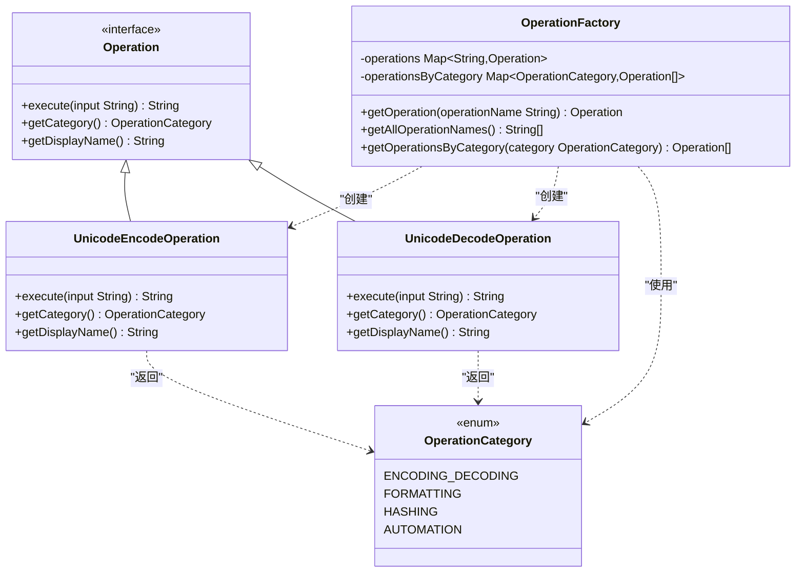

# Unicode编解码

<cite>
**Referenced Files in This Document**   
- [UnicodeEncodeOperation.java](file://src/main/java/org/oxff/operation/UnicodeEncodeOperation.java)
- [UnicodeDecodeOperation.java](file://src/main/java/org/oxff/operation/UnicodeDecodeOperation.java)
- [OperationFactory.java](file://src/main/java/org/oxff/core/OperationFactory.java)
- [Operation.java](file://src/main/java/org/oxff/operation/Operation.java)
- [OperationCategory.java](file://src/main/java/org/oxff/core/OperationCategory.java)
</cite>

## 目录
1. [Unicode编码操作](#unicode编码操作)
2. [Unicode解码操作](#unicode解码操作)
3. [操作注册与分类管理](#操作注册与分类管理)

## Unicode编码操作

`UnicodeEncodeOperation`类实现了将字符串中的非ASCII字符转换为Unicode转义序列的逻辑。该操作遍历输入字符串的每个字符，对于ASCII字符（Unicode码点小于128）保持原样输出，而对于非ASCII字符则转换为以`\u`为前缀的小写十六进制形式。

该实现采用有限状态机式的字符串扫描算法，通过简单的字符数组遍历完成编码过程。对于每个非ASCII字符，使用`String.format("%04x", (int) c)`将其Unicode码点格式化为四位小写十六进制数，确保了格式的规范性。这种编码方式与Java字符串转义和JSON字符串处理标准完全兼容，使得编码后的字符串可以直接在Java代码或JSON数据中使用。

该功能在实际应用中具有重要价值：在Java开发中，可用于处理包含非ASCII字符的字符串常量，确保代码的可移植性；在JSON数据处理中，可保证特殊字符的安全传输，避免解析错误；在国际化应用中，可统一处理多语言文本的存储和传输。

**Section sources**
- [UnicodeEncodeOperation.java](file://src/main/java/org/oxff/operation/UnicodeEncodeOperation.java#L7-L30)
- [Operation.java](file://src/main/java/org/oxff/operation/Operation.java#L7-L26)

## Unicode解码操作

`UnicodeDecodeOperation`类实现了将Unicode转义序列还原为原始字符的逻辑。该操作采用基于索引的字符串扫描算法，从左到右逐字符处理输入字符串。当检测到`\u`前缀且后续有足够的字符时，尝试解析接下来的四位十六进制数。

解码过程采用有限状态机模式：首先检查当前位置是否为`\u`前缀，然后使用`Integer.parseInt(..., 16)`将后续四位字符解析为十六进制整数。如果解析成功，则将得到的码点转换为字符并追加到结果中，同时将索引前进6位（跳过整个`\uXXXX`序列）；如果解析失败（如格式错误或非十六进制字符），则捕获`NumberFormatException`异常，并将当前字符原样保留，索引仅前进1位。

这种异常处理机制确保了操作的健壮性：即使输入字符串中包含格式不正确的Unicode转义序列，操作也不会中断，而是将其作为普通文本处理，保证了数据的完整性。该实现与标准Unicode转义完全兼容，能够正确处理Java和JSON中的Unicode转义序列。

**Section sources**
- [UnicodeDecodeOperation.java](file://src/main/java/org/oxff/operation/UnicodeDecodeOperation.java#L7-L39)
- [Operation.java](file://src/main/java/org/oxff/operation/Operation.java#L7-L26)

## 操作注册与分类管理

`UnicodeEncodeOperation`和`UnicodeDecodeOperation`通过`OperationFactory`工厂类进行集中注册和管理。在`OperationFactory`的静态初始化块中，这两个操作实例被创建并加入全局操作映射。

所有操作按两种方式组织：首先，通过`operations`映射以显示名称为键进行索引，支持通过`getOperation(String operationName)`方法快速查找；其次，通过`operationsByCategory`映射按分类组织，支持通过`getOperationsByCategory(OperationCategory category)`方法获取特定分类下的所有操作。

这两个Unicode操作均被归类于`OperationCategory.ENCODING_DECODING`（编解码）分类，这使得用户界面可以根据分类对操作进行逻辑分组展示。这种注册机制实现了操作的集中管理、按需获取和分类组织，为系统的可扩展性提供了基础架构。

**Diagram sources**
- [UnicodeEncodeOperation.java](file://src/main/java/org/oxff/operation/UnicodeEncodeOperation.java#L7-L30)
- [UnicodeDecodeOperation.java](file://src/main/java/org/oxff/operation/UnicodeDecodeOperation.java#L7-L39)
- [OperationFactory.java](file://src/main/java/org/oxff/core/OperationFactory.java#L9-L60)
- [Operation.java](file://src/main/java/org/oxff/operation/Operation.java#L7-L26)
- [OperationCategory.java](file://src/main/java/org/oxff/core/OperationCategory.java#L4-L20)

**Section sources**
- [OperationFactory.java](file://src/main/java/org/oxff/core/OperationFactory.java#L9-L60)
- [OperationCategory.java](file://src/main/java/org/oxff/core/OperationCategory.java#L4-L20)