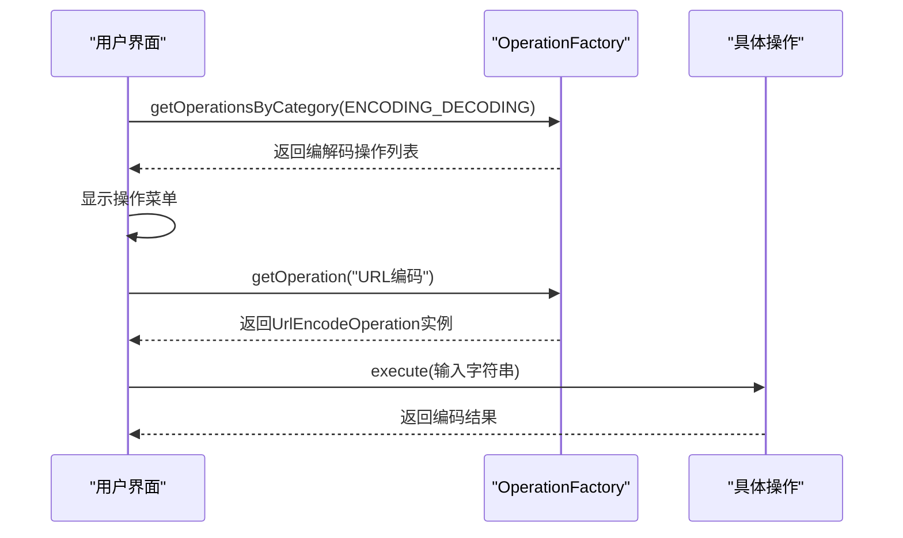

# 编解码操作

<cite>
**本文档引用的文件**
- [UrlEncodeOperation.java](file://src/main/java/org/oxff/operation/UrlEncodeOperation.java)
- [UrlDecodeOperation.java](file://src/main/java/org/oxff/operation/UrlDecodeOperation.java)
- [Base64EncodeOperation.java](file://src/main/java/org/oxff/operation/Base64EncodeOperation.java)
- [Base64DecodeOperation.java](file://src/main/java/org/oxff/operation/Base64DecodeOperation.java)
- [Base32EncodeOperation.java](file://src/main/java/org/oxff/operation/Base32EncodeOperation.java)
- [Base32DecodeOperation.java](file://src/main/java/org/oxff/operation/Base32DecodeOperation.java)
- [HexEncodeOperation.java](file://src/main/java/org/oxff/operation/HexEncodeOperation.java)
- [HexDecodeOperation.java](file://src/main/java/org/oxff/operation/HexDecodeOperation.java)
- [UnicodeEncodeOperation.java](file://src/main/java/org/oxff/operation/UnicodeEncodeOperation.java)
- [UnicodeDecodeOperation.java](file://src/main/java/org/oxff/operation/UnicodeDecodeOperation.java)
- [Operation.java](file://src/main/java/org/oxff/operation/Operation.java)
- [OperationCategory.java](file://src/main/java/org/oxff/core/OperationCategory.java)
- [OperationFactory.java](file://src/main/java/org/oxff/core/OperationFactory.java)
</cite>

## 目录
1. [简介](#简介)
2. [核心组件](#核心组件)
3. [编解码实现机制](#编解码实现机制)
4. [统一操作管理架构](#统一操作管理架构)
5. [异常处理策略](#异常处理策略)
6. [使用场景示例](#使用场景示例)
7. [结论](#结论)

## 简介
本文档全面解析uiTools项目中各类编解码操作的实现原理。重点阐述URL、Base64、Base32、Hex和Unicode等编码格式的实现机制，以及这些操作如何通过统一接口进行管理。所有编解码操作均归类于OperationCategory.ENCODING_DECODING分类，使用UTF-8字符集进行处理，确保跨平台兼容性。

## 核心组件

**编解码操作接口**
所有编解码操作均实现Operation接口，该接口定义了三个核心方法：execute用于执行具体操作，getCategory返回操作分类，getDisplayName返回操作的显示名称。

**操作分类**
OperationCategory枚举定义了ENCODING_DECODING("编解码")分类，所有编解码操作均归属于此类，便于在用户界面中统一组织和展示。

**操作工厂**
OperationFactory负责初始化和管理所有操作实例，通过静态代码块预加载所有编解码操作，并按名称和分类建立索引，实现高效的运行时查找。

**Section sources**
- [Operation.java](file://src/main/java/org/oxff/operation/Operation.java#L4-L26)
- [OperationCategory.java](file://src/main/java/org/oxff/core/OperationCategory.java#L5-L20)
- [OperationFactory.java](file://src/main/java/org/oxff/core/OperationFactory.java#L9-L60)

## 编解码实现机制

### URL编解码
UrlEncodeOperation和UrlDecodeOperation分别使用Java内置的URLEncoder和URLDecoder工具类进行URL安全编码与解码。两者均指定UTF-8字符集，确保非ASCII字符的正确处理。URL编码将特殊字符转换为%xx格式，而解码则将其还原。

### Base64编解码
Base64EncodeOperation和Base64DecodeOperation基于Apache Commons Codec库实现。编码过程先将输入字符串按UTF-8编码为字节数组，再通过Base64.encodeBase64String方法转换为Base64字符串。解码过程则相反，先解码Base64字符串为字节数组，再按UTF-8解码为字符串。

### Base32编解码
Base32EncodeOperation和Base32DecodeOperation同样使用Apache Commons Codec的Base32实现。与Base64不同，Base32使用32个字符（A-Z和2-7）进行编码，具有更好的人类可读性和抗错误能力。实现机制与Base64类似，但使用Base32类进行编解码。

### Hex编解码
HexEncodeOperation将每个字节转换为两位十六进制数，结果转换为大写格式。编码前将输入字符串按UTF-8编码为字节数组。HexDecodeOperation则进行反向操作，先清理输入中的空格，验证输入格式（长度为偶数且仅含十六进制字符），然后每两个字符解析为一个字节。

### Unicode编解码
UnicodeEncodeOperation遍历输入字符串的每个字符，ASCII字符（<128）保持不变，非ASCII字符转换为\uXXXX格式的Unicode转义序列。UnicodeDecodeOperation则识别\uxxxx模式，将其解析为对应的Unicode字符，其他字符保持不变。

```mermaid
classDiagram
class Operation {
<<interface>>
+execute(input : String) : String
+getCategory() : OperationCategory
+getDisplayName() : String
}
class UrlEncodeOperation {
+execute(input : String) : String
+getCategory() : OperationCategory
+getDisplayName() : String
}
class UrlDecodeOperation {
+execute(input : String) : String
+getCategory() : OperationCategory
+getDisplayName() : String
}
class Base64EncodeOperation {
+execute(input : String) : String
+getCategory() : OperationCategory
+getDisplayName() : String
}
class Base64DecodeOperation {
+execute(input : String) : String
+getCategory() : OperationCategory
+getDisplayName() : String
}
class Base32EncodeOperation {
+execute(input : String) : String
+getCategory() : OperationCategory
+getDisplayName() : String
}
class Base32DecodeOperation {
+execute(input : String) : String
+getCategory() : OperationCategory
+getDisplayName() : String
}
class HexEncodeOperation {
+execute(input : String) : String
+getCategory() : OperationCategory
+getDisplayName() : String
}
class HexDecodeOperation {
+execute(input : String) : String
+getCategory() : OperationCategory
+getDisplayName() : String
}
class UnicodeEncodeOperation {
+execute(input : String) : String
+getCategory() : OperationCategory
+getDisplayName() : String
}
class UnicodeDecodeOperation {
+execute(input : String) : String
+getCategory() : OperationCategory
+getDisplayName() : String
}
Operation <|-- UrlEncodeOperation
Operation <|-- UrlDecodeOperation
Operation <|-- Base64EncodeOperation
Operation <|-- Base64DecodeOperation
Operation <|-- Base32EncodeOperation
Operation <|-- Base32DecodeOperation
Operation <|-- HexEncodeOperation
Operation <|-- HexDecodeOperation
Operation <|-- UnicodeEncodeOperation
Operation <|-- UnicodeDecodeOperation
```

**Diagram sources**
- [Operation.java](file://src/main/java/org/oxff/operation/Operation.java#L4-L26)
- [UrlEncodeOperation.java](file://src/main/java/org/oxff/operation/UrlEncodeOperation.java#L7-L25)
- [UrlDecodeOperation.java](file://src/main/java/org/oxff/operation/UrlDecodeOperation.java#L7-L25)
- [Base64EncodeOperation.java](file://src/main/java/org/oxff/operation/Base64EncodeOperation.java#L7-L25)
- [Base64DecodeOperation.java](file://src/main/java/org/oxff/operation/Base64DecodeOperation.java#L7-L30)
- [Base32EncodeOperation.java](file://src/main/java/org/oxff/operation/Base32EncodeOperation.java#L7-L26)
- [Base32DecodeOperation.java](file://src/main/java/org/oxff/operation/Base32DecodeOperation.java#L7-L31)
- [HexEncodeOperation.java](file://src/main/java/org/oxff/operation/HexEncodeOperation.java#L7-L37)
- [HexDecodeOperation.java](file://src/main/java/org/oxff/operation/HexDecodeOperation.java#L7-L47)
- [UnicodeEncodeOperation.java](file://src/main/java/org/oxff/operation/UnicodeEncodeOperation.java#L7-L30)
- [UnicodeDecodeOperation.java](file://src/main/java/org/oxff/operation/UnicodeDecodeOperation.java#L7-L39)

## 统一操作管理架构

**Diagram sources**
- [OperationFactory.java](file://src/main/java/org/oxff/core/OperationFactory.java#L9-L60)
- [Operation.java](file://src/main/java/org/oxff/operation/Operation.java#L4-L26)

**Section sources**
- [OperationFactory.java](file://src/main/java/org/oxff/core/OperationFactory.java#L9-L60)

## 异常处理策略

Base64DecodeOperation、Base32DecodeOperation和HexDecodeOperation等解码操作均采用try-catch异常捕获机制。当输入格式无效时，捕获异常并返回包含错误信息的友好提示字符串，而非抛出异常，确保用户界面的稳定性。HexDecodeOperation还包含预验证逻辑，检查输入长度是否为偶数以及是否仅包含十六进制字符，提供更精确的错误反馈。

**Section sources**
- [Base64DecodeOperation.java](file://src/main/java/org/oxff/operation/Base64DecodeOperation.java#L7-L30)
- [Base32DecodeOperation.java](file://src/main/java/org/oxff/operation/Base32DecodeOperation.java#L7-L31)
- [HexDecodeOperation.java](file://src/main/java/org/oxff/operation/HexDecodeOperation.java#L7-L47)

## 使用场景示例

**Web参数编码**
在构建URL查询参数时，使用URL编码确保特殊字符（如空格、&、=等）的安全传输。例如，将"hello world&name=john"编码为"hello%20world%26name%3Djohn"。

**数据传输编码**
在需要通过文本通道传输二进制数据时，使用Base64编码。常见于API认证（如Basic Auth）、JSON数据中的图片数据、电子邮件附件等场景。

**配置文件处理**
使用Hex编码表示二进制密钥或哈希值，在配置文件中保持可读性。Unicode编码则用于在源代码或配置中表示非ASCII字符。

**数据校验**
Hex解码可用于将十六进制表示的哈希值转换为字节进行比较，Base64解码用于解析从外部系统接收的编码数据。

## 结论
uiTools项目中的编解码操作实现了统一的接口设计和分类管理，各具体实现充分利用了Java标准库和Apache Commons Codec等成熟工具，确保了功能的正确性和可靠性。通过OperationFactory的集中管理，实现了操作的可扩展性和易用性。所有操作均采用UTF-8字符集，保证了国际化支持。异常处理机制提升了用户体验，使工具更加健壮。