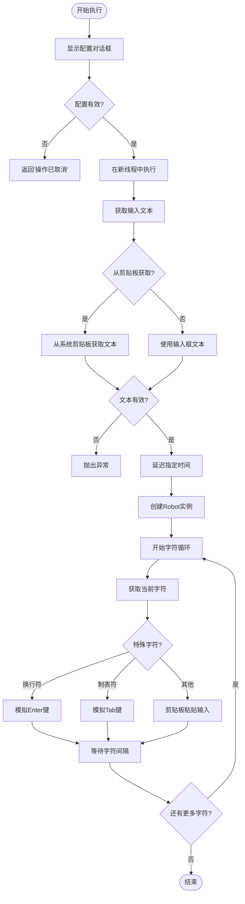
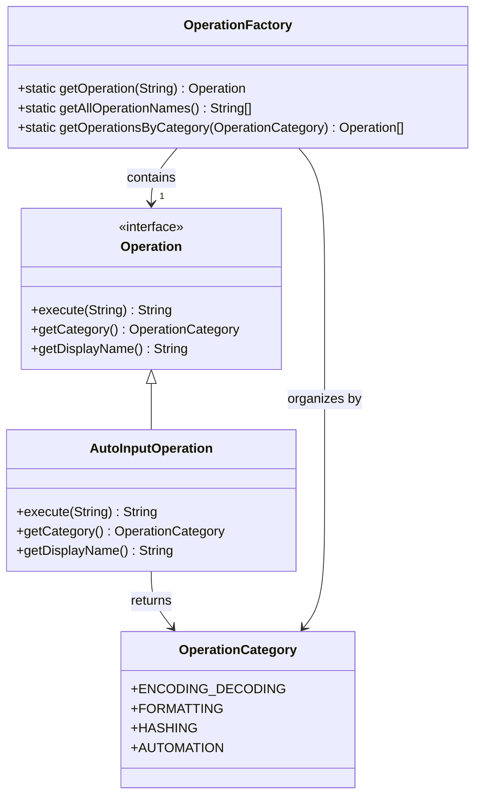

# 自动化操作

<cite>
**Referenced Files in This Document**   
- [AutoInputOperation.java](file://src/main/java/org/oxff/operation/AutoInputOperation.java)
- [OperationFactory.java](file://src/main/java/org/oxff/core/OperationFactory.java)
- [OperationCategory.java](file://src/main/java/org/oxff/core/OperationCategory.java)
- [Operation.java](file://src/main/java/org/oxff/operation/Operation.java)
- [StringFormatterUI.java](file://src/main/java/org/oxff/ui/StringFormatterUI.java)
</cite>

## 目录
1. [功能实现与执行逻辑](#功能实现与执行逻辑)
2. [线程安全考虑](#线程安全考虑)
3. [权限限制与安全策略](#权限限制与安全策略)
4. [异常处理机制](#异常处理机制)
5. [注册方式与分类归属](#注册方式与分类归属)
6. [应用场景与安全风险](#应用场景与安全风险)
7. [使用建议与替代方案](#使用建议与替代方案)

## 功能实现与执行逻辑

AutoInputOperation类实现了Operation接口，通过Java的Robot类模拟键盘输入，将输入字符串自动键入当前焦点窗口。该操作的核心功能是通过图形用户界面配置参数，然后在后台线程中执行自动化输入任务。

执行逻辑从`execute`方法开始，首先调用`showConfigDialog`方法显示配置对话框，允许用户设置延迟时间、字符间隔、输入来源等参数。配置完成后，操作在SwingUtilities.invokeLater()调用的新线程中执行，以避免阻塞用户界面。这种设计确保了即使在执行长时间的自动化输入时，用户界面仍能保持响应。

`performAutoInput`方法是实际执行自动化输入的核心。该方法首先根据配置决定从输入框还是剪贴板获取文本内容。获取文本后，程序会按照配置的延迟时间进行等待，然后创建Robot实例。对于文本中的每个字符，程序会根据字符类型采取不同的输入策略：对于换行符('\n')和制表符('\t')，直接使用keyPress和keyRelease方法模拟按键；对于其他字符，则采用更可靠的剪贴板粘贴方式，即先将单个字符放入剪贴板，然后模拟Ctrl+V快捷键进行粘贴。



**Diagram sources**
- [AutoInputOperation.java](file://src/main/java/org/oxff/operation/AutoInputOperation.java#L16-L192)

**Section sources**
- [AutoInputOperation.java](file://src/main/java/org/oxff/operation/AutoInputOperation.java#L16-L192)

## 线程安全考虑

AutoInputOperation在设计上充分考虑了线程安全问题。由于Robot类的操作可能需要较长时间（特别是当输入大量文本或设置较长的字符间隔时），直接在UI线程中执行会导致界面冻结，影响用户体验。因此，该操作采用了SwingUtilities.invokeLater()方法将自动化输入任务提交到事件调度线程（Event Dispatch Thread）中异步执行。

这种设计模式确保了UI线程不会被长时间阻塞，用户可以在启动自动化输入后立即与其他界面元素进行交互。同时，通过在事件调度线程中执行Robot操作，避免了多线程环境下可能出现的竞态条件。异常处理也被封装在SwingUtilities.invokeLater()的回调中，确保任何执行过程中的异常都能在UI线程中被捕获并以对话框形式展示给用户，而不会导致应用程序崩溃。

值得注意的是，虽然操作本身在事件调度线程中执行，但配置对话框的创建和显示是在调用线程中完成的。这种设计确保了用户配置的原子性——用户必须先完成配置才能继续，避免了并发配置冲突的可能性。

**Section sources**
- [AutoInputOperation.java](file://src/main/java/org/oxff/operation/AutoInputOperation.java#L25-L35)

## 权限限制与安全策略

AutoInputOperation的实现依赖于java.awt.Robot类，该类在创建实例时会受到操作系统的安全策略限制。根据Java文档，创建Robot实例需要"createRobot"权限，如果当前安全管理器（SecurityManager）不允许此操作，将会抛出SecurityException异常。

此外，Robot类的使用还受到平台配置的限制。在无头环境（headless environment）中，即没有图形显示设备的系统中，GraphicsEnvironment.isHeadless()方法会返回true，此时创建Robot实例会抛出AWTException异常。这意味着该功能在服务器环境或没有图形界面的系统中无法使用。

现代操作系统通常具有防止未经授权的自动化输入的安全机制。例如，macOS的"辅助功能"权限、Windows的用户账户控制（UAC）以及Linux的X11安全策略都可能阻止程序模拟键盘输入。用户可能需要手动授予应用程序相应的权限才能正常使用此功能。这些安全限制是必要的，因为自动化输入功能如果被滥用，可能会被用于恶意目的，如自动填写表单、执行未经授权的操作等。

**Section sources**
- [AutoInputOperation.java](file://src/main/java/org/oxff/operation/AutoInputOperation.java#L149-L150)

## 异常处理机制

AutoInputOperation实现了完善的异常处理机制，确保在各种异常情况下都能提供有意义的反馈并保持应用程序的稳定性。异常处理主要分为两个层面：在performAutoInput方法内部的异常抛出和在execute方法中的异常捕获与处理。

在performAutoInput方法中，程序会主动检查各种可能的错误情况并抛出异常。例如，当配置为从剪贴板获取文本但剪贴板中没有可用的文本数据时，会抛出带有明确信息的异常；当要输入的文本为空或null时，也会抛出相应的异常。这些异常检查确保了在执行自动化输入之前，所有必要的条件都已满足。

在execute方法中，通过SwingUtilities.invokeLater()提交的任务被包裹在try-catch块中，能够捕获performAutoInput方法抛出的任何异常。捕获异常后，程序会使用JOptionPane.showMessageDialog()在UI线程中显示错误对话框，向用户报告具体的错误信息。这种设计确保了即使自动化输入执行失败，也不会导致应用程序崩溃，同时为用户提供了清晰的错误反馈。

```mermaid
graph TD
A[performAutoInput] --> B{检查剪贴板数据}
B --> |不可用| C[抛出异常: "剪贴板中没有文本数据"]
A --> D{检查输入文本}
D --> |为空| E[抛出异常: "没有要输入的文本"]
A --> F[创建Robot实例]
F --> |失败| G[抛出AWTException/SecurityException]
H[execute方法] --> I[SwingUtilities.invokeLater]
I --> J[try-catch块]
J --> K[捕获异常]
K --> L[JOptionPane显示错误]
```

**Diagram sources**
- [AutoInputOperation.java](file://src/main/java/org/oxff/operation/AutoInputOperation.java#L28-L33)
- [AutoInputOperation.java](file://src/main/java/org/oxff/operation/AutoInputOperation.java#L130-L181)

**Section sources**
- [AutoInputOperation.java](file://src/main/java/org/oxff/operation/AutoInputOperation.java#L25-L35)
- [AutoInputOperation.java](file://src/main/java/org/oxff/operation/AutoInputOperation.java#L128-L181)

## 注册方式与分类归属

AutoInputOperation通过OperationFactory进行注册和管理，这是整个应用程序操作系统的中心枢纽。在OperationFactory的静态初始化块中，所有操作实例被创建并添加到全局操作映射中。AutoInputOperation作为数组中的最后一个元素被实例化，其显示名称作为键存储在operations映射中，使其能够通过OperationFactory.getOperation()方法根据名称查找。

该操作被归类到AUTOMATION（自动化操作）类别中，这是通过实现getCategory()方法并返回OperationCategory.AUTOMATION枚举值来实现的。OperationCategory枚举定义了四种操作类别：ENCODING_DECODING（编解码）、FORMATTING（格式化）、HASHING（哈希）和AUTOMATION（自动化操作）。这种分类机制使得用户界面能够按类别组织和显示操作，提高了用户体验。

在用户界面中，StringFormatterUI类通过调用OperationFactory.getOperationsByCategory()方法获取特定类别的所有操作，并在操作树中按类别组织显示。这种设计模式实现了操作的注册、分类和展示的完全解耦，使得添加新的操作只需实现Operation接口并在OperationFactory中注册即可，无需修改其他代码。



**Diagram sources**
- [OperationFactory.java](file://src/main/java/org/oxff/core/OperationFactory.java#L6-L60)
- [OperationCategory.java](file://src/main/java/org/oxff/core/OperationCategory.java#L2-L20)
- [Operation.java](file://src/main/java/org/oxff/operation/Operation.java#L7-L26)
- [AutoInputOperation.java](file://src/main/java/org/oxff/operation/AutoInputOperation.java#L16-L192)

**Section sources**
- [OperationFactory.java](file://src/main/java/org/oxff/core/OperationFactory.java#L16-L60)
- [OperationCategory.java](file://src/main/java/org/oxff/core/OperationCategory.java#L2-L20)
- [AutoInputOperation.java](file://src/main/java/org/oxff/operation/AutoInputOperation.java#L43-L46)

## 应用场景与安全风险

AutoInputOperation的主要应用场景是自动化测试辅助和重复性数据输入任务。在软件测试领域，该功能可以用于自动化UI测试，模拟用户输入大量测试数据，验证应用程序在各种输入条件下的行为。对于需要频繁输入相似内容的用户，如客服人员、数据录入员等，该功能可以显著提高工作效率，减少重复劳动。

然而，该功能也伴随着显著的安全风险。由于它能够模拟键盘输入到任何具有焦点的窗口，如果被恶意使用，可能被用于自动化表单提交、密码猜测攻击或其他未经授权的操作。特别是在没有适当权限控制的情况下，该功能可能被滥用为一种键盘记录器或自动化攻击工具。

为了降低安全风险，建议在使用此功能时采取以下措施：明确告知用户该功能的潜在风险；在执行前要求用户确认目标窗口；限制输入速度以模拟人类输入模式；避免在处理敏感信息的环境中使用。开发者也应该考虑实现更严格的权限控制，如要求用户在首次使用时明确授权，或限制该功能只能在特定的应用程序窗口内使用。

**Section sources**
- [AutoInputOperation.java](file://src/main/java/org/oxff/operation/AutoInputOperation.java#L12-L192)

## 使用建议与替代方案

使用AutoInputOperation时，建议遵循以下最佳实践：首先，在执行自动化输入前，确保目标应用程序窗口已正确聚焦；其次，合理设置延迟时间和字符间隔，避免过快的输入速度导致目标应用程序无法正确处理输入；最后，对于包含特殊字符的文本，建议先在安全环境中测试，确保所有字符都能正确输入。

作为替代方案，可以考虑使用更安全的自动化技术。例如，对于Web应用程序，可以使用Selenium等浏览器自动化框架，这些框架通过浏览器的API进行操作，比模拟键盘输入更可靠且更安全。对于桌面应用程序，可以考虑使用应用程序提供的API或自动化接口，而不是低级别的键盘模拟。此外，现代操作系统提供的辅助功能API（如Windows的UI Automation或macOS的Accessibility API）也提供了更安全、更可靠的自动化途径。

在某些情况下，简单的剪贴板操作可能比完整的键盘模拟更合适。例如，如果只需要输入一段文本，直接将文本复制到剪贴板并提示用户粘贴，可能比自动模拟Ctrl+V更安全且更容易被用户接受。这种渐进式的自动化方法可以在提高效率的同时，最大限度地减少安全风险。

**Section sources**
- [AutoInputOperation.java](file://src/main/java/org/oxff/operation/AutoInputOperation.java#L16-L192)
- [StringFormatterUI.java](file://src/main/java/org/oxff/ui/StringFormatterUI.java#L450-L460)