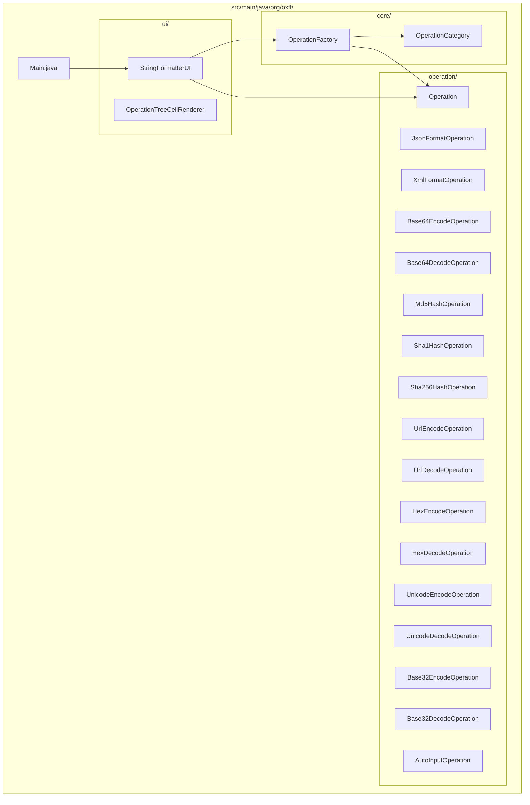
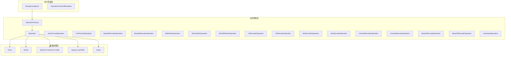
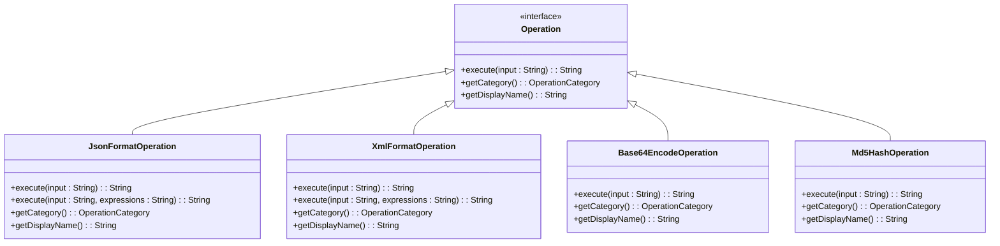
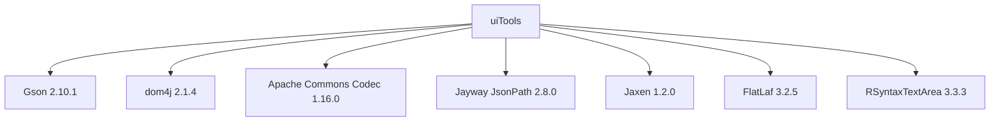

# 项目概述

<cite>
**本文档引用文件**   
- [Main.java](file://src/main/java/org/oxff/Main.java)
- [Operation.java](file://src/main/java/org/oxff/operation/Operation.java)
- [OperationFactory.java](file://src/main/java/org/oxff/core/OperationFactory.java)
- [OperationCategory.java](file://src/main/java/org/oxff/core/OperationCategory.java)
- [StringFormatterUI.java](file://src/main/java/org/oxff/ui/StringFormatterUI.java)
- [JsonFormatOperation.java](file://src/main/java/org/oxff/operation/JsonFormatOperation.java)
- [XmlFormatOperation.java](file://src/main/java/org/oxff/operation/XmlFormatOperation.java)
- [Base64EncodeOperation.java](file://src/main/java/org/oxff/operation/Base64EncodeOperation.java)
- [Md5HashOperation.java](file://src/main/java/org/oxff/operation/Md5HashOperation.java)
- [README.md](file://README.md)
</cite>

## 目录
1. [简介](#简介)
2. [项目结构](#项目结构)
3. [核心组件](#核心组件)
4. [架构概述](#架构概述)
5. [详细组件分析](#详细组件分析)
6. [依赖分析](#依赖分析)
7. [性能考虑](#性能考虑)
8. [故障排除指南](#故障排除指南)
9. [结论](#结论)

## 简介
uiTools 是一个功能强大的基于 Java Swing 的图形界面工具，专为处理字符串格式化、编解码操作以及 XML/JSON 数据的 XPath 和 JSONPath 表达式提取而设计。该项目旨在为开发者提供一个一体化的解决方案，用于处理日常开发中的各种数据处理任务，如 API 响应处理、调试数据和安全编码等。工具支持多种核心功能，包括 JSON 和 XML 格式化与数据提取、各种编解码操作（如 Base64、URL、Unicode 和 Hex 编解码）以及哈希计算（MD5、SHA1、SHA256）。通过直观的三面板布局设计，用户可以轻松地在输入、表达式和输出区域之间进行操作，极大地提高了工作效率。

## 项目结构
uiTools 项目的结构清晰，遵循了典型的 Java 项目组织方式。项目主要分为四个核心目录：core、operation、ui 和主类文件。core 目录包含核心类，如 OperationFactory 和 OperationCategory，负责操作的工厂模式实现和分类管理。operation 目录包含了所有具体操作的实现类，每个类都实现了 Operation 接口，提供了特定的字符串处理功能。ui 目录包含了用户界面组件，如 StringFormatterUI 和 OperationTreeCellRenderer，负责构建和管理图形用户界面。主类 Main.java 作为程序的入口点，负责初始化应用程序并启动用户界面。

**图示来源**
- [Main.java](file://src/main/java/org/oxff/Main.java#L1-L27)
- [StringFormatterUI.java](file://src/main/java/org/oxff/ui/StringFormatterUI.java#L1-L514)
- [OperationFactory.java](file://src/main/java/org/oxff/core/OperationFactory.java#L1-L61)
- [OperationCategory.java](file://src/main/java/org/oxff/core/OperationCategory.java#L1-L21)
- [Operation.java](file://src/main/java/org/oxff/operation/Operation.java#L1-L27)

## 核心组件
uiTools 的核心组件包括 Operation 接口、OperationFactory 工厂类、OperationCategory 枚举以及各种具体的操作实现类。Operation 接口定义了所有字符串操作的基本契约，包括 execute 方法用于执行操作，getCategory 方法用于获取操作分类，以及 getDisplayName 方法用于获取操作的显示名称。OperationFactory 类作为工厂模式的实现，负责创建和管理所有操作实例，通过静态初始化块将所有操作注册到内部映射中，从而实现操作的集中管理和动态获取。OperationCategory 枚举定义了操作的分类，包括编解码、格式化、哈希和自动化操作，为用户提供了清晰的操作分类视图。

**组件来源**
- [Operation.java](file://src/main/java/org/oxff/operation/Operation.java#L1-L27)
- [OperationFactory.java](file://src/main/java/org/oxff/core/OperationFactory.java#L1-L61)
- [OperationCategory.java](file://src/main/java/org/oxff/core/OperationCategory.java#L1-L21)

## 架构概述
uiTools 的整体架构采用分层设计，将用户界面、业务逻辑和数据处理分离，确保了代码的可维护性和可扩展性。用户界面层由 StringFormatterUI 类实现，负责构建和管理图形用户界面，处理用户交互事件。业务逻辑层由 OperationFactory 类和各种操作实现类组成，负责执行具体的字符串处理操作。数据处理层依赖于外部库，如 Gson 用于 JSON 处理，dom4j 用于 XML 处理，Apache Commons Codec 用于编解码操作，Jayway JsonPath 用于 JSONPath 表达式处理，Jaxen 用于 XPath 表达式处理。这种分层架构使得每个组件的职责明确，便于独立开发和测试。

**图示来源**
- [StringFormatterUI.java](file://src/main/java/org/oxff/ui/StringFormatterUI.java#L1-L514)
- [OperationFactory.java](file://src/main/java/org/oxff/core/OperationFactory.java#L1-L61)
- [Operation.java](file://src/main/java/org/oxff/operation/Operation.java#L1-L27)
- [JsonFormatOperation.java](file://src/main/java/org/oxff/operation/JsonFormatOperation.java#L1-L123)
- [XmlFormatOperation.java](file://src/main/java/org/oxff/operation/XmlFormatOperation.java#L1-L127)
- [Base64EncodeOperation.java](file://src/main/java/org/oxff/operation/Base64EncodeOperation.java#L1-L26)
- [Md5HashOperation.java](file://src/main/java/org/oxff/operation/Md5HashOperation.java#L1-L24)

## 详细组件分析
### Operation 接口分析
Operation 接口是 uiTools 项目的核心抽象，定义了所有字符串操作的基本行为。通过实现此接口，各种具体操作类可以提供统一的调用方式，使得 OperationFactory 能够以多态的方式处理不同类型的操作。接口的 execute 方法接收一个字符串输入并返回处理结果，getCategory 方法返回操作的分类，getDisplayName 方法返回操作的显示名称。这种设计模式使得添加新的操作变得非常简单，只需实现 Operation 接口并将其注册到 OperationFactory 中即可。

**图示来源**
- [Operation.java](file://src/main/java/org/oxff/operation/Operation.java#L1-L27)
- [JsonFormatOperation.java](file://src/main/java/org/oxff/operation/JsonFormatOperation.java#L1-L123)
- [XmlFormatOperation.java](file://src/main/java/org/oxff/operation/XmlFormatOperation.java#L1-L127)
- [Base64EncodeOperation.java](file://src/main/java/org/oxff/operation/Base64EncodeOperation.java#L1-L26)
- [Md5HashOperation.java](file://src/main/java/org/oxff/operation/Md5HashOperation.java#L1-L24)

### StringFormatterUI 分析
StringFormatterUI 类是 uiTools 项目的用户界面核心，负责构建和管理图形用户界面。该类使用 Swing 框架创建了一个直观的三面板布局，包括操作分类树、输入/表达式/输出区域和日志面板。通过 OperationFactory 获取所有操作并构建操作分类树，用户可以方便地浏览和选择所需的操作。输入/表达式/输出区域支持丰富的快捷键操作和剪贴板功能，提高了用户的操作效率。日志面板记录了所有操作的执行情况，便于用户追踪和调试。

**组件来源**
- [StringFormatterUI.java](file://src/main/java/org/oxff/ui/StringFormatterUI.java#L1-L514)

## 依赖分析
uiTools 项目依赖于多个外部库，这些库为项目提供了强大的数据处理能力。Gson 用于 JSON 处理，支持 JSON 格式化和解析；dom4j 用于 XML 处理，支持 XML 格式化和 XPath 表达式提取；Apache Commons Codec 用于编解码操作，支持 Base64、Base32、URL、Unicode 和 Hex 编解码；Jayway JsonPath 用于 JSONPath 表达式处理，支持从 JSON 数据中提取特定字段；Jaxen 用于 XPath 表达式处理，支持从 XML 数据中提取特定字段；FlatLaf 用于提供现代化的界面主题，提升了用户界面的美观度；RSyntaxTextArea 用于提供语法高亮的代码编辑器，增强了代码的可读性。

**图示来源**
- [pom.xml](file://pom.xml#L1-L39)
- [README.md](file://README.md#L40-L90)

## 性能考虑
uiTools 项目在设计时充分考虑了性能因素。通过使用高效的外部库，如 Gson 和 dom4j，确保了 JSON 和 XML 处理的高性能。OperationFactory 使用静态初始化块将所有操作实例化并存储在内存中，避免了每次调用时的重复实例化开销。StringFormatterUI 类使用 Swing 的事件驱动模型，确保了用户界面的响应性和流畅性。此外，项目支持多表达式批量处理，允许用户一次输入多个表达式，每行一个，批量提取数据，从而提高了数据处理的效率。

## 故障排除指南
### 常见问题
**Q: XPath 表达式返回空结果**  
A: 检查 XML 格式是否正确，确认 XPath 语法无误，注意命名空间问题。

**Q: JSONPath 表达式报错**  
A: 确保 JSON 格式有效，检查 JSONPath 语法是否符合规范。

**Q: 程序无法启动**  
A: 确认 Java 版本为 11 或更高，检查 JAR 文件是否完整。

**Q: 表达式输入区域不可见**  
A: 选择 JSON 或 XML 格式化操作后，表达式输入区域会自动显示。

**问题来源**
- [README.md](file://README.md#L233-L256)

## 结论
uiTools 项目通过其强大的功能和直观的用户界面，为开发者提供了一个高效的数据处理工具。项目采用分层架构和工厂模式，确保了代码的可维护性和可扩展性。通过依赖于多个成熟的外部库，项目实现了高性能的数据处理能力。无论是处理 API 响应、调试数据还是进行安全编码，uiTools 都能提供便捷的解决方案。未来，项目可以通过添加更多操作类型和优化用户界面进一步提升用户体验。